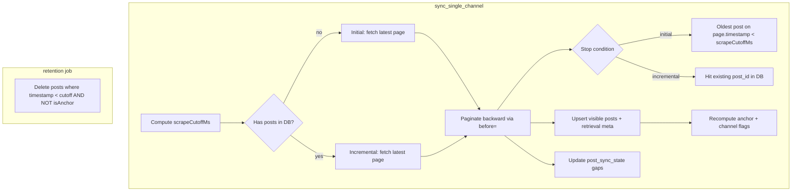

# Backward sync and coverage tracking

## Confirmed decisions

| Topic | Choice |
|-------|--------|
| Scrape stop bound | `max(retentionCutoff, globalStartTime)` via existing [`compute_effective_global_start_time_ms`](backend/app/jobs/settings.py) + retention days |
| `postRetentionDays = 0` | Use global start time as stop bound (not unbounded history) |
| Anchor post | Newest visible post with `timestamp < scrapeCutoff`; stored as real `Post` row with `isAnchor=true` |
| Gap confirmation | `post_sync_state` rows for IDs between two stored visible neighbors once both neighbors were seen via overlapping page fetches |
| Migration | Lazy — new logic applies on next sync; no bulk resync |
| Post metadata | `retrievedAt`, `retrievalJobId`, `retrievalPass` (`initial` \| `incremental`), `retrievalSource` — set on **first save only** |

## Architecture



## 1. Schema and migration

**Alembic migration** (new revision under [`backend/app/alembic/versions/`](backend/app/alembic/versions/)):

### `Post` ([`backend/app/models_tg.py`](backend/app/models_tg.py))
- `is_anchor: bool = False` (indexed with `channel_name` for retention queries)
- `retrieved_at: int | None` (ms, set once)
- `retrieval_job_id: str | None`
- `retrieval_pass: str | None` — `initial` | `incremental`
- `retrieval_source: str | None`

### `Channel`
- `history_complete_to_cutoff: bool = True` — `False` when oldest stored visible post has `timestamp >= scrapeCutoff` (channel history does not reach cutoff)
- `anchor_post_id: int | None` — denormalized pointer; cleared/reassigned each sync
- `oldest_stored_post_timestamp: int | None` — updated each sync

### New `PostSyncState` table
```python
# tg_post_sync_state — unique (channel_name, post_id)
state: str  # only "confirmed_gap" for now
confirmed_at: int  # ms
confirmed_job_id: str | None
user_id: UUID | None
```

**API serialization** — extend [`_channel_to_camel`](backend/app/api/routes/data.py) and `_post_to_camel` (same file) for new fields. Update [`frontend/src/types.ts`](frontend/src/types.ts).

---

## 2. Scrape cutoff helper

Add `compute_scrape_cutoff_ms(sync_settings, retention_settings, *, now_ms)` in [`backend/app/jobs/settings.py`](backend/app/jobs/settings.py):

```python
retention_cutoff = now - post_retention_days * day_ms if post_retention_days > 0 else 0
global_start = compute_effective_global_start_time_ms(sync_settings, retention_settings, now_ms=now)
# When retention=0, global_start is the bound (per your choice)
return max(retention_cutoff, global_start) if (retention_cutoff > 0 or global_start > 0) else 0
```

`scrapeCutoffMs == 0` means backward until no more pages (only when both retention and global start resolve to 0).

---

## 3. Scraper: backward pagination

Extend [`backend/app/services/scraper.py`](backend/app/services/scraper.py) with a dedicated function (keep existing `scrape_channel` for channel-info / legacy callers):

**`scrape_channel_page(channel_name, *, before_id: int | None, proxies, ...)`**
- `before_id is None` → fetch `https://t.me/s/{channel}` (latest window)
- else → `https://t.me/s/{channel}?before={before_id}`
- Return: `{ posts, latestId, channelMeta, nextBeforeId, telemetry }` where `nextBeforeId` is the smallest post ID on the page (for next backward step), or `None` if no more pages

**Important:** `_parse_posts_from_html` currently filters `post_id < start_id` — backward mode must pass `start_id=0` or add a flag to disable lower-bound filtering.

**Do not** use `resolve_start_time_to_id` in the main sync path anymore ([`sync_orchestrator.py`](backend/app/services/sync_orchestrator.py) lines 285–305). Keep the function in scraper for now (tests, optional admin tooling) but remove orchestrator dependency.

---

## 4. Sync orchestrator rewrite

Refactor [`sync_single_channel`](backend/app/services/sync_orchestrator.py) core loop:

### Determine mode
- `has_existing_posts` = any `Post` for channel (visible only; anchors count)
- `retrieval_pass` = `initial` if no posts else `incremental`

### Backward loop
1. Fetch latest page (`before_id=None`)
2. For each page (newest → oldest within page):
   - Upsert posts via enhanced [`bulk_upsert_posts_impl`](backend/app/services/posts.py) — pass retrieval metadata; **do not overwrite** `retrieved_*` on existing rows
   - Run gap detection (section 5)
3. Paginate: `before_id = min(post.id on page) - 1` or use `nextBeforeId` from parser
4. **Stop (initial):** oldest post on current page has `timestamp < scrapeCutoffMs`, OR no next page, OR job cancelled / iteration limit ([`settings.SCRAPER_ITERATION_LIMIT`](backend/app/core/config.py))
5. **Stop (incremental):** any post on page already exists in DB (by `channel_name + post_id`), OR same exhaustion limits

After loop:
- Call **anchor + coverage update** (section 6)
- Update channel metadata from latest page response (display name, photo, etc.) — same as today
- Language detection — unchanged

Remove `current_max_id` forward loop and `needs_start_id_resolve` block.

---

## 5. Gap detection (`post_sync_state`)

New service [`backend/app/services/post_sync_state.py`](backend/app/services/post_sync_state.py):

**`record_gaps_from_page(session, channel_name, page_post_ids, job_id, user_id)`**

For each page fetch, track `page_min_id` / `page_max_id` and the set of visible IDs on that page.

Mark `confirmed_gap` when **both** hold:
1. Missing ID `g` lies strictly between two visible post IDs `a < g < b`
2. Posts `a` and `b` are visible in DB **and** both were present on page fetches that overlap this sync session’s loaded ID ranges (implement by tracking `session_seen_ids` per sync and checking bracketing neighbors exist in DB)

On incremental sync, when the walk hits the first existing DB post at the tail, also evaluate gaps between the lowest new post ID on the connecting page and that known post.

**Queries** must exclude `post_sync_state` from feed/RAG/embeddings — only `Post` rows with text are content.

Optional admin/debug endpoint later; not required for v1.

---

## 6. Anchor and channel coverage

New helper in [`backend/app/services/channels.py`](backend/app/services/channels.py) or `post_sync_state.py`:

**`update_channel_coverage(session, channel, scrape_cutoff_ms)`**

1. Clear `is_anchor` on any prior anchor for this channel (`Post.is_anchor = False` where `channel_name` matches)
2. Find newest visible post with `timestamp < scrape_cutoff_ms` → set `is_anchor=True`, `channel.anchor_post_id`
3. Compute `oldest_stored_post_timestamp` = min timestamp among visible posts
4. Set `history_complete_to_cutoff = (oldest_stored_post_timestamp < scrape_cutoff_ms)` when `scrape_cutoff_ms > 0`; if `scrape_cutoff_ms == 0`, set `True` (unbounded backfill completed when pages exhausted)
5. If no post exists before cutoff but channel has posts, keep oldest post(s) as-is; `anchor_post_id = None`; `history_complete_to_cutoff = False`

---

## 7. Retention job change

Update [`backend/app/jobs/retention.py`](backend/app/jobs/retention.py):

```python
stmt = select(Post).where(
    col(Post.timestamp) < cutoff,
    col(Post.is_anchor) == False,  # keep anchor
)
```

After deletion, if anchor was removed accidentally (edge case), next sync will re-establish it.

Also delete `PostSyncState` rows for deleted post IDs / prune gaps with `post_id` below oldest remaining visible post (optional cleanup in same job).

---

## 8. Posts upsert

Extend [`bulk_upsert_posts_impl`](backend/app/services/posts.py):

```python
# New optional keys: retrievalJobId, retrievalPass, retrievalSource
# On insert: set retrieved_at=now, all retrieval fields
# On update: update text/date/timestamp/forwarded fields only; never touch retrieved_* or is_anchor (anchor set by coverage helper)
```

---

## 9. Downstream query guards

Ensure content queries only return visible posts (anchors **are** visible and shown in feed — they are real posts):

| Location | Change |
|----------|--------|
| [`list_posts`](backend/app/api/routes/data.py) | No filter needed if only visible posts in `tg_posts` |
| [`embeddings.py`](backend/app/services/embeddings.py) | Skip `is_anchor` posts? **Recommend skip** — anchor is boundary marker, not content for RAG |
| [`auto_summary.py`](backend/app/jobs/auto_summary.py) | Exclude `is_anchor` from summaries |
| [`translation_batch.py`](backend/app/jobs/translation_batch.py) | Exclude `is_anchor` |
| Frontend [`getPostsByDateRange`](frontend/src/lib/repository.ts) | No change if API unchanged |

---

## 10. Bulk tools and legacy paths

| File | Action |
|------|--------|
| [`bulk_channels.py`](backend/app/services/bulk_channels.py) | Remove or repurpose `bulk_reresolve_start_ids` — start_id no longer drives sync; keep `bulk_reset_sync` (clear posts + `post_sync_state` + trigger sync) |
| [`bulk_reresolve_start_ids.py`](backend/scripts/bulk_reresolve_start_ids.py) | Deprecate script; document `bulk_reset_sync` instead |
| Settings UI [`SettingsView.tsx`](frontend/src/components/SettingsView.tsx) | Replace "Bulk Start ID Fix" with "Bulk re-sync" or remove if redundant |
| [`ChannelCard.tsx`](frontend/src/components/ChannelCard.tsx) | Show `historyCompleteToCutoff` warning badge; de-emphasize manual `startId` (advanced mode only or remove) |

---

## 11. Frontend UX

- [`Channel`](frontend/src/types.ts): `historyCompleteToCutoff`, `anchorPostId`, `oldestStoredPostTimestamp`
- [`ChannelCard.tsx`](frontend/src/components/ChannelCard.tsx): amber/info badge when `historyCompleteToCutoff === false` — "History does not reach retention window"
- Optional tooltip on anchor post in advanced/debug view (not required v1)
- [`Post`](frontend/src/types.ts): retrieval fields (for debugging in advanced mode if desired)

---

## 12. Tests

| Area | Files |
|------|-------|
| Scrape cutoff helper | New `backend/tests/jobs/test_scrape_cutoff.py` |
| Backward scraper | Extend [`test_resolve_start_time.py`](backend/tests/api/test_resolve_start_time.py) or new `test_scraper_backward.py` with mocked HTML |
| Sync orchestrator | Rewrite affected cases in [`test_sync_jobs.py`](backend/tests/api/test_sync_jobs.py) — remove start_id resolve assertions; add initial/incremental backward stop tests |
| Anchor + retention | New `backend/tests/jobs/test_retention_anchor.py` — anchor survives cleanup |
| Gap state | New `backend/tests/services/test_post_sync_state.py` |
| Coverage flags | Test channel with young history → `historyCompleteToCutoff=false` |

---

## 13. Rollout / lazy migration behavior

- Existing channels keep current posts until next sync
- First sync after deploy runs **incremental** mode (posts exist) → fetches new head, walks back until hits known IDs; does **not** automatically backfill deep history unless user triggers reset/sync-all
- To get full backward backfill on old channels: user uses existing "Reset & Sync" ([`ChannelGrid.tsx`](frontend/src/components/ChannelGrid.tsx)) which should also clear `post_sync_state` and reset coverage fields

**Update `executeResetAndSync` / bulk reset** to delete `PostSyncState` rows and clear `anchor_post_id`, `history_complete_to_cutoff` on channel before re-queueing sync.

---

## 14. Out of scope (explicit)

- Auto-follow channels still only get DB row on forward discovery — separate follow-up to queue their first sync
- `start_id` / `start_time` columns remain for backward compatibility but are no longer written by sync (manual UI edit can be deprecated)
- No per-post network telemetry duplication (stays in sync logs)
