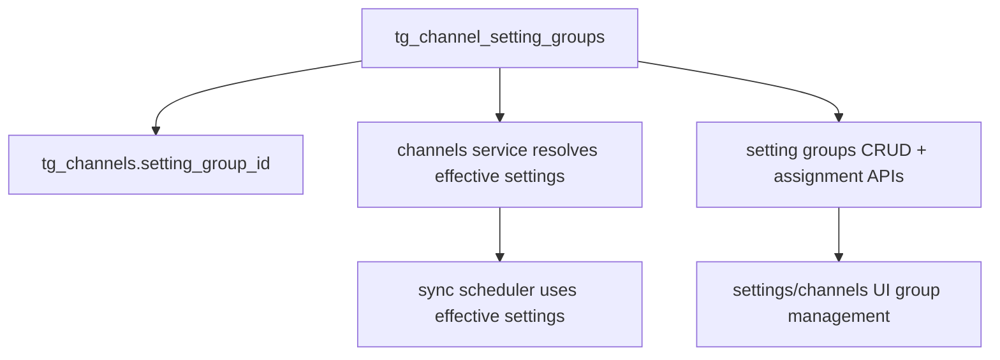

# Strict-Inheritance Setting Groups Plan

## Confirmed Product Decisions
- **Inheritance model:** strict inheritance, **no per-channel overrides**.
- **Membership:** each channel belongs to **exactly one** setting group.
- **Default group:** built-in `default`, **editable** and **not deletable**.
- **Custom group deletion:** **blocked when non-empty**, with actionable user guidance.
- **Inherited fields (v1):**
  - `regularSyncEnabled`
  - `dynamicSyncEnabled`
  - `autoSyncIntervalMinutes`
  - `dynamicSyncExpectedPosts`
  - `autoFollowForwarded`
  - `isFrozen`
  - `isUnavailableOnWebView`
- **Not inherited:** `language` stays per-channel and is assigned automatically by existing code (not managed via setting groups).

## Architecture Changes

## Backend Plan
- **Data model + migration**
  - Add new SQLModel table in [`/Users/hossein/local_projects/tg_summarizer_migrate_to_fastapi/backend/app/models_tg.py`](/Users/hossein/local_projects/tg_summarizer_migrate_to_fastapi/backend/app/models_tg.py): `ChannelSettingGroup` with `id`, `name`, inherited setting columns, `is_default`, timestamps, `user_id`.
  - Add `setting_group_id` FK-like reference column to `Channel` (nullable in migration step, then backfilled, then non-null).
  - Alembic migration in [`/Users/hossein/local_projects/tg_summarizer_migrate_to_fastapi/backend/alembic/versions`](/Users/hossein/local_projects/tg_summarizer_migrate_to_fastapi/backend/alembic/versions):
    - Create `tg_channel_setting_groups`.
    - Seed `default` group per operator scope.
    - Backfill all `tg_channels.setting_group_id` to default.
    - Enforce non-null constraint.
- **Effective settings resolution**
  - Add helper service module (new) to resolve inherited values from group for channels.
  - Refactor channel serialization in [`/Users/hossein/local_projects/tg_summarizer_migrate_to_fastapi/backend/app/services/channels.py`](/Users/hossein/local_projects/tg_summarizer_migrate_to_fastapi/backend/app/services/channels.py) to expose:
    - `settingGroupId`
    - `effectiveSyncAndOperationalSettings` (or flattened effective fields) for UI/runtime use.
  - Ensure channel write paths reject direct updates to inherited fields and return clear 400 errors.
- **Scheduler/sync integration**
  - Update due-check paths that currently read fields directly from channel objects (e.g., [`/Users/hossein/local_projects/tg_summarizer_migrate_to_fastapi/backend/app/services/sync_schedule.py`](/Users/hossein/local_projects/tg_summarizer_migrate_to_fastapi/backend/app/services/sync_schedule.py)) so scheduling always uses effective inherited values.
  - Update recompute logic in [`/Users/hossein/local_projects/tg_summarizer_migrate_to_fastapi/backend/app/services/channels.py`](/Users/hossein/local_projects/tg_summarizer_migrate_to_fastapi/backend/app/services/channels.py) to run on **group setting updates** and **channel group move** events.
- **APIs**
  - Add setting-group endpoints (new route module under existing API structure):
    - `GET /data/setting-groups`
    - `POST /data/setting-groups`
    - `PUT /data/setting-groups/{id}`
    - `DELETE /data/setting-groups/{id}` with guard: reject if `is_default` or group has channels; return guidance.
    - `PATCH /data/channels/bulk-setting-group` for bulk reassignment.
  - Keep existing channel endpoints compatible by returning effective values while preventing direct inherited-field mutation.

## Frontend Plan
- **Types + API client**
  - Add new API layer in [`/Users/hossein/local_projects/tg_summarizer_migrate_to_fastapi/frontend/src/api`](/Users/hossein/local_projects/tg_summarizer_migrate_to_fastapi/frontend/src/api) for setting groups CRUD + bulk reassignment.
  - Extend channel types to include `settingGroupId` and effective inherited values.
- **Settings UI**
  - Extend settings screens in [`/Users/hossein/local_projects/tg_summarizer_migrate_to_fastapi/frontend/src/components/SettingsView.tsx`](/Users/hossein/local_projects/tg_summarizer_migrate_to_fastapi/frontend/src/components/SettingsView.tsx) and related settings components:
    - Group list + create/edit forms.
    - Default group clearly marked as non-deletable.
    - Delete flow for custom groups shows blocking message when non-empty and explains how to move channels first.
- **Channels UI bulk assignment**
  - Add bulk “move selected channels to group” action in channel management surface (existing Channels tab/action system).
  - Display each channel’s current group.
  - Remove/disable direct edits for inherited fields at channel row/detail level.

## Validation and Safety
- **Unit tests (backend)**
  - Effective settings resolver.
  - Guardrails: cannot delete default; cannot delete non-empty custom group; cannot patch inherited fields directly on channel.
  - Scheduler uses effective values after group updates/moves.
- **Integration/API tests**
  - Migration/backfill behavior on existing data.
  - Bulk group reassignment correctness and transaction safety.
- **Frontend tests**
  - Group CRUD flows.
  - Blocked delete UX messaging.
  - Bulk move action updates channel group and effective settings in UI.

## Rollout Sequence
1. Migration + model + backend resolver.
2. Backend APIs and channel mutation guards.
3. Scheduler path refactor to effective settings.
4. Frontend setting-group management + bulk reassignment UX.
5. Test pass (backend + frontend + targeted e2e sync behavior checks).