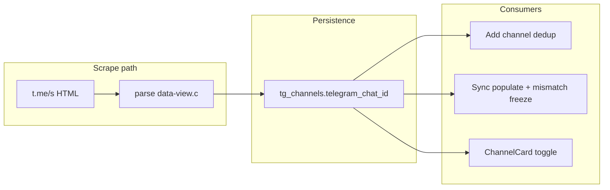

# Channel Telegram Chat ID (v1)

## Agreed decisions

| Topic | Choice |
|---|---|
| Rename handling | Store + dedup only; no auto-rename cascade in v1 |
| Duplicate on add | Select/highlight existing channel instead of creating |
| UI | ChannelCard badge behind a Settings toggle (same pattern as subscribers) |
| Writability | Server-only — scrape/sync populates; reject client PUT/import |
| ID mismatch on sync | Move channel to **Frozen** group + sync log warning |
| Bot API fallback | None — stays null until a page with messages is scraped |

## Architecture



**Not changing:** `Channel.id`, `Channel.name`, or `Post.channel_name` remain username-based. Scraping still uses `t.me/s/{name}`.

## 1. Database + model

**New column** on `tg_channels`:

- `telegram_chat_id` — `BIGINT`, nullable
- Partial unique index: `(user_id, telegram_chat_id)` WHERE `telegram_chat_id IS NOT NULL` (per-operator dedup)

**Files:**

- [`backend/app/models_tg.py`](backend/app/models_tg.py) — add field with `sa_column=Column(BigInteger, nullable=True)`
- New Alembic revision after head `n6o7p8q9r0s1` (e.g. `o7p8q9r0s1t2_add_channel_telegram_chat_id.py`)

## 2. Scrape extraction

Add a small parser in [`backend/app/services/scraper.py`](backend/app/services/scraper.py):

```python
def _extract_telegram_chat_id(soup: BeautifulSoup) -> int | None:
    # First .tgme_widget_message[data-view] → base64 JSON → field "c"
```

Wire it into:

- `_parse_scrape_channel_page` — include `telegramChatId` in response dict
- `get_channel_info` — same (needed for add-channel dedup before first sync)
- Optionally `_parse_channel_meta` via a shared helper so channel-info and page scrape stay DRY

**Tests:** new `backend/tests/services/test_telegram_chat_id.py` using live fixtures ([`backend/tests/fixtures/live/telegram_387.html`](backend/tests/fixtures/live/telegram_387.html) → `-1005640892`, [`durov_522.html`](backend/tests/fixtures/live/durov_522.html) → `-1006503122`).

## 3. Server-only field guards

**Backend** — new `SERVER_MANAGED_CHANNEL_FIELDS = frozenset({"telegram_chat_id"})` in [`backend/app/services/channels.py`](backend/app/services/channels.py):

- Reject in `apply_channel_fields` (same pattern as inherited fields)
- Strip from `Channel(...)` kwargs on create in `upsert_channel` and [`data_import_export.py`](backend/app/services/data_import_export.py)

**Frontend** — add `telegramChatId` to stripped list in [`frontend/src/api/data.ts`](frontend/src/api/data.ts) `channelWritePayload` (alongside inherited fields).

**Serialization** — add to [`backend/app/services/serialization.py`](backend/app/services/serialization.py):

- `_CAMEL_OVERRIDES`: `"telegram_chat_id": "telegramChatId"`
- `channel_to_camel`: include `telegramChatId` when not null

## 4. Sync orchestrator behavior

In [`backend/app/services/sync_orchestrator.py`](backend/app/services/sync_orchestrator.py) page-processing block (~line 528):

**Populate (first time):**

- If `response.telegramChatId` present and `channel.telegram_chat_id` is null → set it
- Before commit, check no *other* channel in operator scope has same ID; if conflict → freeze current channel (see below) + log, skip setting ID

**Mismatch (stored vs scraped):**

- If `channel.telegram_chat_id` is set and scraped ID differs → call `bulk_assign_setting_group` to move channel to built-in **Frozen** group ([`get_or_create_frozen_group`](backend/app/services/channel_setting_groups.py)), write `upsert_sync_log` with `status: "failed"` and `error` explaining chat ID mismatch (stored vs scraped), stop further sync for that channel on this pass

**Note:** Freeze uses setting-group reassignment (same as ChannelCard freeze button), not a direct `is_frozen` column write.

## 5. Add-channel dedup (select existing)

In [`frontend/src/lib/channels/add-channel.ts`](frontend/src/lib/channels/add-channel.ts):

1. After `api.channelInfo`, read `telegramChatId` from response
2. If present, find `ctx.channels.find(c => c.telegramChatId === id)`
3. If match:
   - Toast: e.g. *"Already following this channel as @existing"*
   - `setSelectedChannels` add existing `name`
   - Scroll to `[data-channel-name="..."]` (reuse pattern from [`useChannelEntityFlow.ts`](frontend/src/lib/commands/useChannelEntityFlow.ts))
   - Return `{ ok: true, channelName: existing.name }` without `upsertChannel`

**Limitation (document in code comment):** dedup only works when the channel-info page has at least one message widget. Empty/unavailable channels still rely on username dedup only until first successful scrape.

## 6. Frontend types + UI toggle

**Types:** [`frontend/src/types.ts`](frontend/src/types.ts) — `telegramChatId?: number`

**Settings toggle** (mirror subscribers):

- [`frontend/src/contexts/SettingsContext.tsx`](frontend/src/contexts/SettingsContext.tsx) — `showChannelTelegramChatId` + localStorage key `showChannelTelegramChatId`
- [`frontend/src/components/SettingsView.tsx`](frontend/src/components/SettingsView.tsx) — toggle row near "Show Subscribers"
- [`frontend/src/lib/commands/settings-schema.ts`](frontend/src/lib/commands/settings-schema.ts) + [`types.ts`](frontend/src/lib/commands/types.ts) + [`useCommandRegistry.ts`](frontend/src/hooks/useCommandRegistry.ts) — wire for command palette
- [`frontend/src/components/ChannelCard.tsx`](frontend/src/components/ChannelCard.tsx) — badge when `showChannelTelegramChatId && channel.telegramChatId` (monospace, tooltip "Telegram chat ID")
- [`frontend/src/components/ChannelGrid.tsx`](frontend/src/components/ChannelGrid.tsx) — pass toggle if grid header shows metadata chips

**Default:** toggle off (opt-in, like subscribers).

## 7. API / OpenAPI

Regenerate OpenAPI client after backend schema exposure (`bun run generate-client` in frontend). No new endpoints.

## 8. Tests

| Layer | What |
|---|---|
| Backend unit | Parser from fixtures; PUT rejects `telegramChatId`; sync populates; mismatch freezes + sync log |
| Backend API | `channelInfo` returns `telegramChatId` for fixture-backed scrape test (mock fetch) |
| Frontend unit | `channelWritePayload` strips `telegramChatId`; add-channel dedup helper if extracted |
| Playwright (optional) | Toggle shows ID on seeded channel after sync — only if easy to seed with mock |

## 9. Out of scope (v1, per agreement)

- Username rename detection / post cascade
- Bot API `getChat` fallback
- Using chat ID as primary key or scrape URL
- Import/export write of `telegramChatId`

## Risk notes

- **Username recycling:** mismatch freeze is the safety net when `@handle` points at a different channel than before.
- **Concurrent duplicate adds:** unique index + sync-time conflict handler prevents silent corruption.
- **Palette freeze commands** ([`useChannelEntityFlow.ts`](frontend/src/lib/commands/useChannelEntityFlow.ts)) still PUT `isFrozen` directly — pre-existing issue, not introduced by this work.
