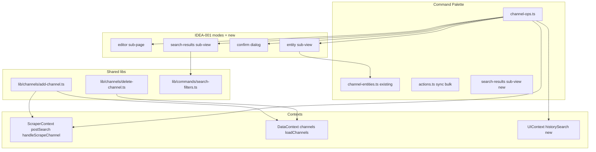

# Command Palette — Channel Ops & Search Plan

Extend the TG Summarizer command palette (`Cmd/Ctrl+Shift+P`) with operator-facing **channel lifecycle** and **content search** commands. Builds on IDEA-001 infrastructure ([`frontend/src/lib/commands/`](frontend/src/lib/commands/), [`useCommandRegistry`](frontend/src/hooks/useCommandRegistry.ts)).

**Plan only — no implementation in this document.**

Detail idea stub: [IDEA-005](../docs/ideas-log/ideas/IDEA-005-command-palette-channel-ops-search.md)

---

## Overview & goals

### Problem

IDEA-001 shipped navigation, settings, bulk sync, and Raycast-style channel **selection/freeze** flows. Operators still reach for the Channels grid or Posts/History toolbars for common actions:

- Add a channel by `@handle`
- Delete or sync **one** channel (not all / selected batch)
- Find and open a specific post or summary without leaving the palette

Freeze/unfreeze single channels **already work** via palette entity sub-views — do not re-implement.

### Goals

1. Register the **5 new commands** (add, delete, sync, search posts, search summaries) with palette conventions: groups, keywords, offline hints, `requiresConfirmation` where destructive.
2. **DRY** — extract shared channel mutation helpers from [`ChannelGrid.tsx`](frontend/src/components/ChannelGrid.tsx) / [`ChannelCard.tsx`](frontend/src/components/ChannelCard.tsx); palette stays thin.
3. **Reuse IDEA-001 patterns** — `entity-root` for pick-channel-then-act; `editor` sub-page for free-form input (add channel, search queries); new **`search-results`** sub-view for in-palette post/summary pick lists.
4. **Extensibility** — `channel-ops.ts` (+ optional registry) so future ops (bulk delete, reset & sync, tag edit) register without bloating `channel-entities.ts`.
5. Align with existing bulk commands (`sync-selected`, `freeze-selected-channels`, IDEA-004 copy/export) — complementary, not overlapping labels.
6. **Search commands** show filtered results **inside the palette**; picking a row navigates to the Posts or History tab and focuses the item.

### Non-goals

- Re-implementing freeze/unfreeze (IDEA-001 complete)
- Navigate + filter only (no in-palette results) — **rejected**; search commands use in-palette result lists
- Semantic / embedding search from palette (separate future commands)
- `Reset & Sync` per channel (UI exists on ChannelCard; optional follow-up)
- Bulk delete selected channels (ChannelGrid only today)
- Backend API changes
- Publishing CRUD, NL assistant, open-post-by-ID beyond scroll-to-picked-result (IDEA-001 deferred)

---

## Current state (codebase audit)

### Palette commands today

| User command | Palette status | Existing UI / API | Notes |
|--------------|----------------|-------------------|-------|
| **Freeze channel** | **Full** | [`channel-entities.ts`](frontend/src/lib/commands/channel-entities.ts) `freeze-channel` → [`runEntityChannelAction`](frontend/src/lib/commands/useChannelEntityFlow.ts) | Entity sub-view; `upsertChannel`; no confirm |
| **Unfreeze channel** | **Full** | `unfreeze-channel` entity flow | Same pattern |
| **Add channel** | **Missing** | [`ChannelGrid.handleAddChannel`](frontend/src/components/ChannelGrid.tsx) (~L329–431) | `api.channelInfo` → `upsertChannel` → `addToSyncQueue`; inline input on Channels tab |
| **Delete channel** | **Missing** | [`ChannelGrid.executeDeleteChannel`](frontend/src/components/ChannelGrid.tsx) | Confirm modal in grid; `deleteChannel(id)` + `clearChannelPosts(name)` + `loadChannels` |
| **Sync channel** | **Partial** | Palette: `sync-selected` / `sync-all` in [`actions.ts`](frontend/src/lib/commands/actions.ts); single: [`ChannelCard`](frontend/src/components/ChannelCard.tsx) `addToSyncQueue(channel, "Manual (Single Sync)")` | `ScraperContext.handleScrapeChannel` not on `CommandContext` |
| **Search posts** | **Missing** | `postSearch` in [`ScraperContext`](frontend/src/contexts/ScraperContext.tsx); UI in [`PostFilter`](frontend/src/components/PostFilter.tsx) | Text filter + optional semantic search; palette has no wiring |
| **Search summaries** | **Missing** | Local `searchQuery` in [`HistoryView`](frontend/src/components/HistoryView.tsx) only | Not in any context — palette cannot set it today |

### Related palette commands (not duplicates)

| Command | Group | Relationship |
|---------|-------|--------------|
| Search Channel | Channels | Navigate to Channels tab + scroll to card — **not** post/summary search |
| Sync Selected / Sync All | Sync | Batch sync; new **Sync Channel** = single entity pick |
| Freeze/Unfreeze Selected | Channels | Bulk + confirm; single freeze/unfreeze already exist |
| Copy/Export/Import channels | Copy/Export/Import | IDEA-004 data transfer; orthogonal to lifecycle ops |

---

## Command inventory (proposed)

Convention: **Confirm?** = `requiresConfirmation` schema flag.

| id | Label | Exists | UX pattern | API / repository | Confirm? | Offline |
|----|-------|--------|------------|------------------|----------|---------|
| `freeze-channel` | Freeze Channel | **Full** | entity-root → pick channel | `upsertChannel` | N | Works (API write + cache fallback) |
| `unfreeze-channel` | Unfreeze Channel | **Full** | entity-root → pick channel | `upsertChannel` | N | Same |
| `add-channel` | Add Channel | Missing | **editor** sub-page (`@handle` text input + Add) | `api.channelInfo`, `upsertChannel`, `addToSyncQueue` | N | **Disabled** — `channelInfo` requires server; hint "Server offline" |
| `delete-channel` | Delete Channel | Missing | entity-root → pick (all channels) → **confirm** dialog | `deleteChannel`, `clearChannelPosts`, `loadChannels`, `loadDBStats` | **Y** | Disabled — destructive server delete |
| `sync-channel` | Sync Channel | Partial | entity-root → pick channel (all channels incl. frozen) | `handleScrapeChannel` or `addToSyncQueue` | N | Disabled — same as `sync-selected` |
| `search-posts` | Search Posts | Missing | **editor** (query) → **search-results** sub-view → pick row → navigate Posts + focus post | Client filter on cached posts; clear semantic/related on Apply | N | **Works** — filters cached posts in range |
| `search-summaries` | Search Summaries | Missing | **editor** (query) → **search-results** sub-view → pick row → navigate History + focus summary | Client filter on `summariesHistory` | N | Works — history loaded in `DataContext` |

### Per-command detail

#### Add Channel (`add-channel`)

**Proposed UX:** Root command opens `editor` mode (same stack as settings free-form). Single-line input with `@` prefix styling optional. Apply:

1. Normalize handle (`trim`, strip `@`, take last path segment) — mirror ChannelGrid
2. Call shared `addChannelByName(name, ctx)`
3. Toast success; **stay open** on Add Channel editor to add another channel (clear input, keep palette focused)
4. Queue initial sync via `addToSyncQueue`

**Disabled when:** `isOffline` (reason: "Server offline — cannot fetch channel info")

**Extract from ChannelGrid:** `handleAddChannel` body → `frontend/src/lib/channels/add-channel.ts` accepting proxy/network settings slice from `CommandContext.settings`.

#### Delete Channel (`delete-channel`)

**Proposed UX:** `entity-root` with **all channels** — including frozen and unavailable (operator may delete any channel in the list). On pick → `requiresConfirmation: true` confirm step:

> Delete **@channelname** and all locally cached posts for this channel? Server data is removed.

On confirm: `deleteChannel(channel.id)`, `clearChannelPosts(channel.name)`, `loadChannels()`, `loadDBStats()`, remove from `selectedChannels`.

**Relationship to bulk:** ChannelGrid has bulk delete with separate confirm — **not** in palette today. Optional future: `delete-selected-channels` with confirm (out of scope v1).

#### Sync Channel (`sync-channel`)

**Proposed UX:** `entity-root`; candidates = **all channels including frozen** (operator may sync any channel). On pick: `handleScrapeChannel(channel, true, "Manual (Palette)")`.

**vs Sync Selected:** Palette bulk commands remain; single-channel avoids pre-selecting in grid. Frozen channels are included here (unlike `sync-selected` bulk rules).

**Optional follow-up:** `reset-and-sync-channel` entity + confirm (uses `api.bulkResetSync` + `clearChannelPosts`) — not in user list.

#### Search Posts (`search-posts`)

**Proposed UX (in-palette results):** Two-step flow using `editor` then new **`search-results`** sub-view.

1. **Editor step:** Query text input. **Apply allowed when empty** — empty Apply clears the post search filter.
2. **On Apply:**
   - `setPostSearch(query)` (empty string clears filter)
   - **Clear semantic/related modes** if active (`setSemanticSearchQuery("")`, `setRelatedPostSearch(null)`) so text search does not conflict
   - Run same client filter logic as [`PostFilter`](frontend/src/components/PostFilter.tsx) / `handleFilterPosts` on cached posts in range
   - Push **`search-results`** sub-view with pickable post rows (channel name, date snippet, truncated text; cap ~50 rows with "show more in Posts tab" footer if needed)
3. **On pick:** `setActiveTab("posts")`, scroll/highlight the post in feed, close palette (or back to root — prefer **close on pick** for navigation commands)
4. **Back from results:** Return to editor with query preserved

**Empty query behavior:** Apply with empty query clears `postSearch` and semantic/related state; results list shows unfiltered posts in current date range (same cap).

**Semantic variant (out of scope):** `search-posts-semantically` when embeddings enabled — separate command later.

#### Search Summaries (`search-summaries`)

**Proposed UX (in-palette results):** Same `editor` → **`search-results`** pattern as posts.

1. Lift `historySearchQuery` + `setHistorySearchQuery` to **`UIContext`** (prefer **UIContext** — parallel to date range)
2. Refactor [`HistoryView`](frontend/src/components/HistoryView.tsx) to consume context instead of `useState`
3. **Editor step:** Query text input. **Apply allowed when empty** — empty Apply clears the history search filter.
4. **On Apply:**
   - `setHistorySearchQuery(query)` (empty string clears filter)
   - Filter `summariesHistory` using existing HistoryView `useMemo` logic (channels, text, prompt, model, note)
   - Push **`search-results`** sub-view with pickable summary rows (channel, date, prompt/model snippet)
5. **On pick:** `setActiveTab("history")`, select/highlight summary via existing `handleSelectHistorySummary` path, close palette
6. **Back from results:** Return to editor with query preserved

Filter logic stays shared between HistoryView and palette search helper — single source of truth.

---

## Architecture



### 1. Reuse Raycast entity flows

Extend [`EntityFlowType`](frontend/src/lib/commands/types.ts):

```ts
| "sync-channel"
| "delete-channel"
```

Extend [`getEntityCandidates`](frontend/src/lib/commands/useChannelEntityFlow.ts) and [`runEntityChannelAction`](frontend/src/lib/commands/useChannelEntityFlow.ts) — **or** move channel-pick flows to `lib/channels/channel-entity-flow.ts` if file grows.

**Delete channel:** Pick in `entity` mode, then push `confirm` mode with channel payload stored on palette stack (extend provider to hold `confirmPayload?: Channel`).

**Sync / delete candidate pools:** Both use **all channels** from `DataContext` — including frozen and unavailable rows (no exclusion filters).

### 2. Editor sub-page for add / search

Reuse existing [`CommandPalette`](frontend/src/components/CommandPalette.tsx) `editor` mode (settings pattern in [`settings-schema.ts`](frontend/src/lib/commands/settings-schema.ts)):

| Command | Editor field | Validation |
|---------|--------------|------------|
| Add Channel | `text` — channel handle | Non-empty after normalize; duplicate name → toast error |
| Search Posts | `text` — search query | **Allow empty** — Apply clears filter and opens results list |
| Search Summaries | `text` — search query | **Allow empty** — Apply clears filter and opens results list |

### 3. Search — in-palette results (`search-results` mode)

**Decision (user-confirmed):** Search Posts and Search Summaries use **in-palette result lists** — pick a row to navigate and focus the item. Not navigate + filter only.

| Approach | Pros | Cons | **Decision** |
|----------|------|------|--------------|
| Navigate + apply filter | Minimal code; matches toolbar UX | User leaves palette without picking a specific item | **Rejected** |
| In-palette results | Raycast-native; pick-to-open without tab hunting | New sub-view mode + shared filter helpers; scroll-to-item on pick | **v1 default** |

**New palette mode:** Extend `CommandPalette` stack with `search-results` (alongside `entity`, `editor`, `confirm`):

```ts
type SearchResultsKind = "posts" | "summaries"

interface SearchResultsState {
  kind: SearchResultsKind
  query: string
  items: Post[] | SummaryHistoryEntry[]  // capped list
}
```

- Reuse fuzzy/text filter from `PostFilter` and HistoryView via `lib/commands/search-filters.ts`
- Row renderer: compact one-line preview + metadata; keyboard nav same as entity list
- On pick: navigate tab + scroll/highlight; on empty results: show empty state with hint to widen query or check date range

**Semantic / related clearing:** When applying text search (Apply in editor), always clear `semanticSearchQuery` and `relatedPostSearch` so modes do not stack.

### 4. Palette grouping

| Group | Commands |
|-------|----------|
| **Channels** | Add, Delete, existing select/freeze/search-channel, bulk ops |
| **Sync** | Sync Channel (new), Sync Selected, Sync All, Resume Auto-Sync |
| **Posts** | Search Posts (new); future: clear post search, semantic search |
| **Summaries** | Search Summaries (new); future: go to starred summary |

Keep IDEA-004 **Copy/Export/Import** groups unchanged.

### 5. Extensibility (`...`)

```ts
// frontend/src/lib/commands/channel-ops.ts
interface ChannelOpDef {
  id: string
  label: string
  kind: "entity-root" | "editor" | "search-results" | "action"
  entityFlow?: EntityFlowType
  searchResultsKind?: SearchResultsKind
  requiresConfirmation?: boolean
  disabled?: (ctx: CommandContext) => CommandDisabledState
  run: (ctx: CommandContext, payload?: unknown) => void | Promise<void>
}

export function buildChannelOpsCommands(): CommandDef[] { ... }
```

Register in [`useCommandRegistry`](frontend/src/hooks/useCommandRegistry.ts) after `buildChannelEntityCommands()`.

Future ops without new infrastructure: `refresh-channel-metadata`, `edit-channel-tags`, `reset-and-sync-channel`, `delete-selected-channels`.

### 6. CommandContext extensions

```ts
// types.ts additions
handleScrapeChannel: (channel: Channel, refresh?: boolean, source?: string) => Promise<void>
addToSyncQueue: (channel: Channel, source: string, onComplete?: () => void) => void
loadChannels: () => Promise<void>
loadDBStats?: () => Promise<void>  // delete channel refresh
setPostSearch: (q: string) => void
setSemanticSearchQuery: (q: string) => void
setRelatedPostSearch: (post: Post | null) => void
setHistorySearchQuery: (q: string) => void  // after UIContext lift
scrollToPost?: (postId: string) => void     // for search-results pick
selectHistorySummary?: (id: string) => void
```

Wire from `useScraper`, `useData`, `useUI` in `useCommandRegistry`.

### 7. Relationship to bulk commands

| Scenario | Prefer |
|----------|--------|
| Sync 1 channel | **Sync Channel** (new) |
| Sync current selection | **Sync Selected** (existing) |
| Sync everything | **Sync All** (existing) |
| Freeze 1 | **Freeze Channel** (existing) |
| Freeze many | Select channels → **Freeze Selected Channels** (existing) |
| Delete 1 | **Delete Channel** (new) |
| Delete many | UI bulk delete only (v1) |

Document in command `keywords` to improve fuzzy discovery (`single`, `one`, `bulk`).

---

## Phasing recommendation

**Ops first** — channel lifecycle commands ship before search (search needs new `search-results` mode).

### Phase 0 — No code (audit only)

- Document freeze/unfreeze as **shipped** (IDEA-001)

### Phase 1 — Channel ops (high value, clear APIs)

1. Extract `addChannelByName` shared helper
2. `add-channel` editor command (stay open on success)
3. `sync-channel` entity command + `CommandContext` scraper wiring (all channels incl. frozen)
4. `delete-channel` entity + confirm (all channels incl. frozen/unavailable)
5. Playwright: add channel smoke (mock `channelInfo` if needed), delete confirm visible

### Phase 2 — Search commands (in-palette results)

1. Lift `historySearchQuery` to `UIContext`; refactor HistoryView
2. Add `search-results` palette sub-view + `lib/commands/search-filters.ts`
3. `search-posts` + `search-summaries` editor → results → pick flows (empty Apply clears filter; clear semantic/related on post search Apply)
4. Playwright: palette search → results list visible → pick navigates tab

Phase 2 depends on Phase 1 only for shared `CommandContext` wiring — search can ship independently after ops.

---

## Files to touch

### Frontend (primary)

| File | Change |
|------|--------|
| `frontend/src/lib/channels/add-channel.ts` | **new** — extracted add logic + network telemetry |
| `frontend/src/lib/channels/delete-channel.ts` | **new** — single-channel delete orchestration |
| `frontend/src/lib/commands/channel-ops.ts` | **new** — add/sync/delete/search command defs |
| `frontend/src/lib/commands/search-filters.ts` | **new** — shared post/summary filter logic for palette results |
| `frontend/src/lib/commands/channel-entities.ts` | Add `sync-channel`, `delete-channel` entity roots **or** import from channel-ops |
| `frontend/src/lib/commands/useChannelEntityFlow.ts` | New flows; all-channel candidate pools for sync/delete |
| `frontend/src/lib/commands/types.ts` | Extend `EntityFlowType`, `CommandContext`, `SearchResultsKind` |
| `frontend/src/hooks/useCommandRegistry.ts` | Wire new context fields + `buildChannelOpsCommands()` |
| `frontend/src/components/CommandPaletteProvider.tsx` | `confirmPayload` for delete; `searchResultsState` for search pick |
| `frontend/src/components/CommandPalette.tsx` | Entity pick → confirm handoff; **search-results** sub-view rendering |
| `frontend/src/components/ChannelGrid.tsx` | Call shared `addChannelByName` / delete helper |
| `frontend/src/contexts/UIContext.tsx` | `historySearchQuery` + setter |
| `frontend/src/components/HistoryView.tsx` | Consume lifted search state |
| `frontend/src/lib/commands/index.ts` | Export `buildChannelOpsCommands` |

### Frontend tests

| File | Change |
|------|--------|
| `frontend/src/lib/channels/add-channel.test.ts` | **new** — normalize handle, duplicate detection |
| `frontend/src/lib/commands/search-filters.test.ts` | **new** — post/summary filter parity with UI |
| `frontend/tests/summarizer.spec.ts` | Palette add/sync/delete smoke; search in-palette results + pick navigation |

### Backend

| File | Change |
|------|--------|
| — | **None** — existing `channelInfo`, `deleteChannel`, sync job APIs |

---

## Test plan

### Unit (bun test)

| Case | Assert |
|------|--------|
| Normalize `@foo/bar` → `bar` | matches ChannelGrid behavior |
| `addChannelByName` duplicate | toast / early return |
| `getEntityCandidates("sync-channel")` | includes frozen channels |
| `getEntityCandidates("delete-channel")` | includes frozen and unavailable channels |
| Post search filter helper | matches PostFilter behavior for same query |
| Summary search filter helper | matches HistoryView behavior after context lift |
| Empty query Apply | clears `postSearch` / `historySearchQuery`; returns unfiltered capped list |

### Playwright

| Test | Steps | Assert |
|------|-------|--------|
| Sync channel entity | Open palette → Sync Channel → pick frozen channel | Sync job or queue indicator |
| Delete confirm | Delete Channel → pick unavailable → | Confirm dialog before delete |
| Search posts results | Search Posts → type query → Apply | In-palette result rows visible |
| Search posts pick | Pick a result row | Posts tab active; post scrolled/highlighted |
| Search posts empty | Search Posts → empty Apply | Filter cleared; unfiltered results or empty state |
| Search summaries | Search Summaries → Apply → pick | History tab; summary selected |
| Offline add disabled | offline mock → Add Channel | row disabled with reason |

### Manual

- Add channel offline vs online; add multiple channels without closing palette
- Delete channel with posts — posts cleared from feed
- Search posts with semantic mode previously active — text search clears semantic/related
- Sync frozen channel from palette
- Freeze/unfreeze regression — entity flows still work

---

## Risks

| Risk | Mitigation |
|------|------------|
| **Add channel duplication** | Single `addChannelByName`; ChannelGrid + palette both call it |
| **Delete without confirm** | Two-step entity → confirm; never call `deleteChannel` on pick alone |
| **History search lift** | Small refactor; ensure `handleSelectHistorySummary` restores `postSearch` but not history search unless saved on summary |
| **Search-results performance** | Cap rows (~50); debounce editor Apply; filter cached data only |
| **Scroll-to-post on pick** | Reuse or add `scrollToPost` helper; fallback: set filter + tab navigate |
| **CommandContext churn** | Stable deps in `useCommandRegistry` memo (lesson from jobToggles query reset) |
| **Palette noise** | Keywords `single`, `one`; group headers Channels / Sync / Posts / Summaries |

---

## Out of scope

- Freeze / unfreeze (done — IDEA-001)
- Navigate + filter only for search (rejected — in-palette results are v1)
- Semantic / RAG search from palette
- Bulk delete via palette
- Reset & sync single channel
- Backend changes
- IDEA-004 data transfer commands (separate plan)

---

## Decisions (user-confirmed, 2026-06-24)

1. **Search Posts / Search Summaries UX:** **In-palette result lists** (pick to open/navigate) — not navigate + filter only. New `search-results` sub-view after editor Apply.
2. **Add channel on success:** **Stay open** on Add Channel editor to add another (do not close palette).
3. **Delete channel pool:** **All channels** including frozen and unavailable.
4. **Search posts empty query:** **Allow empty Apply** to clear post search filter (and show unfiltered results list).
5. **Search summaries empty query:** **Allow empty Apply** to clear history search filter (and show unfiltered results list).
6. **Sync channel pool:** **All channels including frozen** (not non-frozen only).
7. **Semantic on text search:** **Clear semantic/related modes** when applying text search in Search Posts.
8. **Phasing:** **Ops first** — Phase 1: add/delete/sync; Phase 2: search posts/summaries (in-palette results).

---

## References

- [IDEA-001 command palette](docs/ideas-log/ideas/IDEA-001-command-palette.md)
- [IDEA-005 command palette channel ops & search](docs/ideas-log/ideas/IDEA-005-command-palette-channel-ops-search.md)
- [Command palette implementation plan](command_palette_implementation_ad418199.plan.md) — entity/editor/confirm patterns
- [Command palette data transfer plan](command_palette_data_export_import.plan.md) — registry extensibility style
- [`frontend/src/lib/commands/channel-entities.ts`](frontend/src/lib/commands/channel-entities.ts) — freeze/unfreeze shipped
- [`frontend/src/components/ChannelGrid.tsx`](frontend/src/components/ChannelGrid.tsx) — add/delete UI
- [`frontend/src/contexts/ScraperContext.tsx`](frontend/src/contexts/ScraperContext.tsx) — post search + sync
