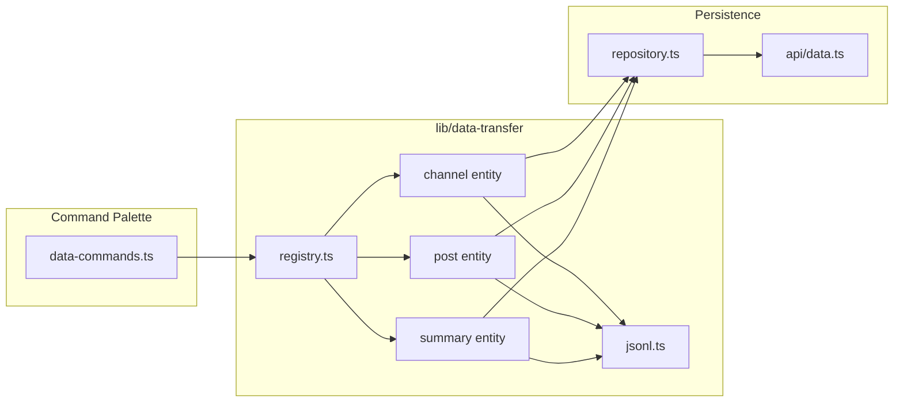

# Command Palette — Data Copy / Export / Import Plan

Granular data commands for the TG Summarizer command palette (`Cmd/Ctrl+Shift+P`). Builds on IDEA-001 infrastructure ([`frontend/src/lib/commands/`](frontend/src/lib/commands/), [`useCommandRegistry`](frontend/src/hooks/useCommandRegistry.ts)).

**Plan only — no implementation in this document.**

---

## Overview & goals

### Problem

Today the palette exposes only **full-database** export/import ([`actions.ts`](frontend/src/lib/commands/actions.ts) → IndexedDB `dbWorker`). Operators cannot quickly:

- Copy a channel name list to clipboard (for spreadsheets, scripts, sharing)
- Export/import a **subset** of channels, posts, or summaries as portable JSONL
- Act on **frozen** or **selected** channel sets without full DB round-trip

[`DatabaseManagement.tsx`](frontend/src/components/DatabaseManagement.tsx) offers table-level JSONL export with checkboxes, but it is buried in Settings and duplicates worker logic.

### Goals

1. Register **21 user-requested commands** (+ extensible pattern for future entities: embeddings, logs, bots, …).
2. **DRY** — one shared `lib/data-transfer/` module used by palette **and** Settings.
3. **Authoritative data** — reads/writes go through existing repository/API layer (Postgres + IndexedDB cache), not stale cache-only paths when online.
4. Match palette conventions: groups, `requiresConfirmation` on imports, toast feedback, offline disabled hints where API is required.
5. JSONL files are **human-diffable** and importable across instances.

### Non-goals

- Replacing full-database backup (`export-database` / `import-database` stay as-is).
- Server-side streaming export endpoints (defer unless profiling shows client choke).
- Publishing credentials export via palette (excluded per IDEA-001).
- New backend import/export routes unless client-side merge becomes unwieldy.
- CLI or admin-shell (`/_layout/*`) palette commands.

---

## Current state (codebase audit)

| Area | What exists today |
|------|-------------------|
| **Channel selection** | `selectedChannels: Set<string>` in [`DataContext`](frontend/src/contexts/DataContext.tsx), persisted to `localStorage` |
| **Post selection** | **Does not exist** — no `selectedPosts` or multi-select on [`PostCard`](frontend/src/components/PostCard.tsx) |
| **Summary selection** | **No multi-select** — `currentSummaryId` in [`UIContext`](frontend/src/contexts/UIContext.tsx) (loaded item only); `isStarred` per summary in [`HistoryView`](frontend/src/components/HistoryView.tsx) |
| **Full DB JSONL** | [`dbWorker.ts`](frontend/src/workers/dbWorker.ts): lines `{type:"metadata"}` + `{type:"store", storeName, data}`; import **replaces** IndexedDB |
| **Backend export** | `GET /api/v1/data/export` → single JSON object (not JSONL) via [`export_data`](backend/app/services/data_import_export.py) |
| **Backend import** | `POST /api/v1/data/import` → **merge/upsert** by entity id via [`import_data`](backend/app/services/data_import_export.py) |
| **Palette clipboard** | Per-item copy in Summary/Chat/Post views; [`useCopyToClipboard`](frontend/src/hooks/useCopyToClipboard.ts) hook; no list-copy commands |
| **Serializers** | [`channel_to_camel`](backend/app/services/serialization.py), [`post_to_camel`](backend/app/services/serialization.py), [`summary_to_camel`](backend/app/services/summaries.py) — camelCase API shape |

---

## Architecture decisions (proposed defaults)

### 1. Shared lib vs palette-only

**Decision: shared `frontend/src/lib/data-transfer/`**, consumed by:

- `lib/commands/data-commands.ts` (new palette schemas)
- `lib/commands/actions.ts` (refactor file picker / download helpers out)
- `components/DatabaseManagement.tsx` (optional follow-up: use same JSONL envelope for table export)

Palette remains thin: command defs + `CommandContext` wiring only.

### 2. Client-side JSONL vs backend APIs

**Decision: hybrid, API-first when online.**

| Operation | Source of truth | Mechanism |
|-----------|-----------------|-----------|
| **Copy** | In-memory context + API if needed | Filter `ctx.channels` / fetch posts or summaries via `repository` |
| **Export** | Server via `api.*` when online; IndexedDB fallback when offline | Client builds JSONL, `showSaveFilePicker` or blob download (reuse pattern from `runDatabaseExport`) |
| **Import** | `repository` upserts → API → cache | Parse JSONL client-side; per-record `upsertChannel` / `bulkUpsertPosts` / `saveSummary`; batch where API supports it |

Rationale: MEMORY.md — Postgres authoritative; palette should not export stale IndexedDB when API is reachable. Offline: disable import (or warn "server required") for entity imports that must persist; copy-from-cache still OK with hint.

**No new backend routes in v1** — existing [`listChannels`](backend/app/api/routes/data.py), [`getPosts`](backend/app/api/routes/data.py), [`listSummaries`](backend/app/api/routes/data.py), [`bulkUpsertPosts`](backend/app/api/routes/data.py), per-entity upserts suffice. Add `GET /data/export/{entity}` streaming only if all-posts export OOMs in browser.

### 3. JSONL envelope (entity files)

Distinct from full-DB `dbWorker` format. **Entity JSONL** — one JSON object per line:

```jsonl
{"type":"header","entity":"channel","schemaVersion":1,"exportedAt":1719158400000,"filter":"all"}
{"type":"record","entity":"channel","data":{"id":"…","name":"channelname","displayName":"…",…}}
{"type":"record","entity":"channel","data":{…}}
```

| Line `type` | Purpose |
|-------------|---------|
| `header` | Entity kind, schema version, export timestamp, filter label (`all` \| `selected` \| `frozen` \| `starred` …) |
| `record` | One entity payload in `data` (camelCase, matches API serializers) |

**Compatibility:** Importer accepts:

1. Entity JSONL (above) — primary
2. Full-DB JSONL `store` lines where `storeName` matches entity — best-effort for files exported from DatabaseManagement
3. Single-line JSON array — **reject** with clear error (avoid silent misparsing)

Extensibility: `DataEntityDef` registry keyed by `entity` string; adding `embedding` later = new def + generated commands.

### 4. Copy list format

**Default: newline-separated channel names** (canonical `Channel.name`, one per line, no `@` prefix).

| Entity | Copy format (default) | Notes |
|--------|----------------------|-------|
| Channels | `name\nname\n…` | Sorted A→Z; optional future command variant for `displayName` |
| Posts | `channelName/postId` per line | e.g. `mychannel/12345` — stable composite key |
| Summaries | `summaryId` per line | UUID/string ids |

Alternatives documented for user decision (see Open questions): TSV with headers, JSON array string.

Use `navigator.clipboard.writeText` + success toast (same as Copy Prompt). No confirmation.

### 5. Import merge vs replace

| Scope | Behavior (proposed default) |
|-------|----------------------------|
| Entity import (channels/posts/summaries) | **Merge / upsert** by primary key (`channel.id` or `name`, `post` composite, `summary.id`) |
| Full DB import (existing) | **Replace** local IndexedDB — unchanged |
| Import frozen channels | Upsert channel rows; **set `isFrozen: true`** from file; do not unfreeze channels omitted from file |
| Import selected channels (see semantics below) | Only apply records that **match current selection** (intersection) |

No automatic delete of records missing from import file (import is additive/update, not sync-replace). Optional future: `import-mode: replace-entity` flag in header — out of scope v1.

### 6. Destructive import flows

All **import** commands: `requiresConfirmation: true` (consistent with IDEA-001 `import-database`).

Confirm copy should state:

- Entity type and filter (e.g. "Import up to N channel records from JSONL — existing records with matching ids will be updated")
- Merge behavior (not full wipe)
- Offline state if API unreachable

**Export** and **copy**: no confirmation (unless user later wants confirm for "export all posts" size warning).

### 7. Palette grouping

| Group | Commands |
|-------|----------|
| **Copy** | All clipboard commands |
| **Export** | All JSONL download commands |
| **Import** | All JSONL upload commands |

Keep existing **Data** group for clear-cache / full DB export / import. Keywords include entity + action synonyms (`backup`, `clipboard`, `jsonl`, `channels`, `posts`, `summaries`, `frozen`, `selected`).

### 8. "Selected" semantics (critical)

| Entity | Selection exists? | Proposed default for "selected" commands |
|--------|-------------------|------------------------------------------|
| **Channels** | Yes (`selectedChannels`) | Records where `channel.name ∈ selectedChannels` |
| **Posts** | **No** | **Default A:** posts whose `channelName ∈ selectedChannels` (respect UI date range if available in context). **Default B (alternative):** require new post multi-select UI — defer until user picks |
| **Summaries** | **No** | **Default A:** summaries where `summary.channels` intersects `selectedChannels`. **Default B:** starred only (`isStarred`). **Default C:** new History multi-select — defer |

**"Import selected channels"** — two plausible meanings; **proposed default: B2**

| Option | Meaning |
|--------|---------|
| A | Import file, then **set** `selectedChannels` to imported names |
| B1 | Import file rows only for channels **currently selected** (update selected subset) |
| **B2 (default)** | Import file rows whose `name` **matches current selection** (ignore other lines) |

Document B1/B2 in open questions.

### 9. Frozen channels

- **Copy / export frozen:** filter `channel.isFrozen === true`
- **Import frozen:** upsert channels from file; for each record with `isFrozen: true`, apply freeze; records without flag leave existing freeze state unchanged (do not mass-unfreeze omitted channels)

---

## JSONL schemas (per entity)

All `record.data` objects use **camelCase** matching API responses.

### Channel (`entity: "channel"`)

Fields (align [`channel_to_camel`](backend/app/services/serialization.py) + frontend [`Channel`](frontend/src/types.ts)):

| Field | Type | Required on import |
|-------|------|-------------------|
| `id` | string | yes (upsert key) |
| `name` | string | yes |
| `displayName` | string? | no |
| `photoUrl`, `bio`, `subscribers`, `photos`, `videos`, `files`, `links` | various | no |
| `startId`, `startTime`, `tags`, `lastUpdated` | | no |
| `isFrozen`, `isUnavailableOnWebView`, `autoFollowForwarded` | boolean | no |
| `language`, `followedAt`, `discoveredVia` | | no |
| `historyCompleteToCutoff`, `anchorPostId`, `oldestStoredPostTimestamp` | | no |

**Copy-only** commands may output names only (not full JSONL).

### Post (`entity: "post"`)

| Field | Type | Required |
|-------|------|------------|
| `id` | number | yes (post id within channel) |
| `channelName` | string | yes |
| `text`, `date`, `timestamp` | | yes for meaningful import |
| `forwardedFrom`, `forwardedFromName` | | no |
| `isAnchor`, `retrievedAt`, `retrievalJobId`, `retrievalPass`, `retrievalSource` | | no |

Import via `api.bulkUpsertPosts` in chunks (e.g. 500).

### Summary (`entity: "summary"`)

| Field | Type | Required |
|-------|------|------------|
| `id` | string | yes |
| `text`, `channels`, `startDate`, `endDate`, `language`, `timestamp` | | yes |
| `model`, `postCount` | | no |
| Extra fields (`chatMessages`, `isStarred`, `status`, `promptText`, `source`, …) | | no — stored in server `extra` via upsert |

---

## Command inventory

Convention: `requiresConfirmation` = **Y** only for imports.

### Copy (clipboard) — group `Copy`

| id | Label | Confirm? | Implementation |
|----|-------|----------|----------------|
| `copy-channels-all` | Copy List of All Channels | N | Filter all → `names.join("\n")` → clipboard |
| `copy-channels-selected` | Copy List of Selected Channels | N | `selectedChannels` → disabled if empty |
| `copy-channels-frozen` | Copy List of Frozen Channels | N | filter `isFrozen` |
| `copy-posts-all` | Copy List of All Posts | N | Fetch all posts (chunked); format `channel/id` lines — **heavy**; show progress toast |
| `copy-posts-selected` | Copy List of Selected Posts | N | **Blocked** — see selection semantics |
| `copy-summaries-all` | Copy List of All Summaries | N | `listSummaries` → ids joined |
| `copy-summaries-selected` | Copy List of Selected Summaries | N | **Blocked** — see selection semantics |

### Export (JSONL download) — group `Export`

| id | Label | Confirm? | Implementation |
|----|-------|----------|----------------|
| `export-channels-all` | Export List of All Channels | N | API list → entity JSONL → save file |
| `export-channels-selected` | Export List of Selected Channels | N | filter selection |
| `export-channels-frozen` | Export List of Frozen Channels | N | filter frozen |
| `export-posts-all` | Export List of All Posts | N | chunked fetch → JSONL; progress toast |
| `export-posts-selected` | Export List of Selected Posts | N | **Blocked** |
| `export-summaries-all` | Export List of All Summaries | N | `listSummaries` → JSONL |
| `export-summaries-selected` | Export List of Selected Summaries | N | **Blocked** |

### Import (JSONL upload) — group `Import`

| id | Label | Confirm? | Implementation |
|----|-------|----------|----------------|
| `import-channels-all` | Import List of All Channels | Y | file picker → parse → upsert each (merge) |
| `import-channels-selected` | Import List of Selected Channels | Y | parse → apply only rows matching selection |
| `import-channels-frozen` | Import List of Frozen Channels | Y | parse → upsert + set frozen from file |
| `import-posts-all` | Import List of All Posts | Y | parse → `bulkUpsertPosts` chunks |
| `import-posts-selected` | Import List of Selected Posts | Y | **Blocked** |
| `import-summaries-all` | Import List of All Summaries | Y | parse → `saveSummary` each |
| `import-summaries-selected` | Import List of Selected Summaries | Y | **Blocked** |

### Extensibility pattern (`...`)

```ts
// frontend/src/lib/data-transfer/registry.ts
interface DataEntityDef<T> {
  entity: "channel" | "post" | "summary" | string
  listAll: (ctx: CommandContext) => Promise<T[]>
  filterSelected?: (items: T[], ctx: CommandContext) => T[]
  filterFrozen?: (items: T[], ctx: CommandContext) => T[]
  toCopyLine: (item: T) => string
  upsertOne?: (item: T) => Promise<void>
  upsertMany?: (items: T[]) => Promise<void>
}

function buildDataCommands(def: DataEntityDef<unknown>): CommandDef[] {
  // generates copy-*/export-*/import-* triples
}
```

Register entities in `data-commands.ts`; palette gains new commands by adding one def (e.g. `embedding` later).

---

## Phasing recommendation

**Recommended: two phases** (posts/summaries "selected" blocked without decision).

### Phase 1 — Channels (ship first)

All 9 channel commands + shared `data-transfer` lib + refactor file helpers + tests.

Low risk: `selectedChannels` exists; frozen filter is trivial; import maps to `upsertChannel`.

### Phase 2 — Posts & summaries (all + selected)

Prerequisites:

1. User confirms **"selected" semantics** for posts/summaries (see Open questions), **or**
2. Implement **new selection UI** (post checkboxes + summary History multi-select)

Deliver: remaining 12 commands + chunked export for large post sets.

**Alternative:** single release if user picks Default A semantics for posts/summaries (derive from `selectedChannels` / channel intersection) — no new UI, but "selected posts" may not match user mental model.

---

## Files to touch

### Frontend (primary)

| File | Change |
|------|--------|
| `frontend/src/lib/data-transfer/types.ts` | JSONL line types, `DataEntityDef`, export filters |
| `frontend/src/lib/data-transfer/jsonl.ts` | read/write streams, parse header/records, validate |
| `frontend/src/lib/data-transfer/clipboard.ts` | copy with toast |
| `frontend/src/lib/data-transfer/download.ts` | save picker + blob fallback (extract from `actions.ts`) |
| `frontend/src/lib/data-transfer/upload.ts` | hidden file input promise |
| `frontend/src/lib/data-transfer/entities/channel.ts` | channel list/filter/upsert |
| `frontend/src/lib/data-transfer/entities/post.ts` | post fetch chunk + bulk upsert |
| `frontend/src/lib/data-transfer/entities/summary.ts` | summary list + upsert |
| `frontend/src/lib/data-transfer/registry.ts` | `buildDataCommands()` |
| `frontend/src/lib/commands/data-commands.ts` | **new** — register all data commands |
| `frontend/src/lib/commands/actions.ts` | refactor to use `data-transfer/download` + `upload` |
| `frontend/src/lib/commands/index.ts` | export `buildDataCommands` |
| `frontend/src/lib/commands/types.ts` | extend `CommandContext` if posts need date range / summaries list |
| `frontend/src/hooks/useCommandRegistry.ts` | spread `buildDataCommands()` |
| `frontend/src/components/DatabaseManagement.tsx` | optional: align JSONL envelope (follow-up) |

### Frontend tests

| File | Change |
|------|--------|
| `frontend/src/lib/data-transfer/jsonl.test.ts` | parse/write round-trip, invalid lines |
| `frontend/src/lib/data-transfer/entities/channel.test.ts` | filter all/selected/frozen, copy format |
| `frontend/tests/summarizer.spec.ts` | smoke: copy channels + export JSONL |

### Backend (minimal v1)

| File | Change |
|------|--------|
| — | **None required** if client uses existing CRUD/bulk endpoints |

### Backend (optional Phase 2+)

| File | Change |
|------|--------|
| `backend/app/api/routes/data.py` | `GET /posts/export` streaming if client OOM |
| `backend/app/services/data_import_export.py` | entity-scoped import helper if batch logic grows |

---

## Implementation sketch



### CommandContext extensions (Phase 2)

If using channel-derived "selected" without new UI:

```ts
// types.ts — optional fields
summariesHistory: Summary[]
postDateRange?: { startDate: number; endDate: number } // from UIContext
```

Wire from `useData()` / `useUI()` in `useCommandRegistry`.

### Offline behavior

```ts
disabled: (ctx) =>
  ctx.isOffline
    ? { disabled: true, reason: "Import requires server connection" }
    : { disabled: false }
```

Copy/export from in-memory `channels` may still work offline with hint "May not include latest server data".

---

## Test plan

### Unit (bun test)

| Case | Assert |
|------|--------|
| JSONL parse valid header + records | yields typed records |
| JSONL parse `store` legacy line | maps to channel entity |
| JSONL malformed line | throws actionable error |
| `filterChannels(selected)` | correct subset |
| `filterChannels(frozen)` | only `isFrozen` |
| `toCopyLines(channels)` | newline-separated sorted names |
| Import merge | mock upsert called per id, not delete others |

### Playwright smoke

| Test | Steps | Assert |
|------|-------|--------|
| Copy all channels | Open palette → "copy list of all channels" → run | clipboard (or stub) contains known channel name |
| Export selected channels | Select channel in UI → palette export selected | download triggered (or mock); filename `.jsonl` |
| Import confirm | Run import command | confirm dialog visible before file picker |
| Offline import disabled | offline mock → import command | row disabled with reason |

Extend [`summarizer.spec.ts`](frontend/tests/summarizer.spec.ts) — 2–3 cases; avoid full file I/O in CI if flaky (use `page.context().grantPermissions` + evaluate clipboard where supported).

### Manual

- Large post export (10k+ posts) — memory / progress toasts
- Import channel file on second instance — merge updates `displayName`, preserves unmentioned channels
- Frozen import — only listed channels change freeze state

---

## Risks

| Risk | Mitigation |
|------|------------|
| **All-posts export OOM** | Chunked API reads + streaming JSONL write; progress toasts; optional server stream later |
| **"Selected posts" ambiguity** | Phase 1 channels only; explicit user decision before Phase 2 |
| **Stale cache export** | API-first when online; refresh sync meta after import |
| **Import partial failure** | Continue with per-record try/catch; summary toast "Imported N, failed M" |
| **Clipboard denied** | Fallback toast + copy modal (pattern from PasteSummaryModal) |
| **Duplicate command noise** | 21 commands — rely on fuzzy search + keywords; consider prefix typing `export channels` |

---

## Out of scope

- Embeddings, translations, logs, bot credentials entity commands (extensible via registry later)
- Import delete/sync-replace mode
- Settings UI redesign (only shared lib reuse)
- Backend JSONL export endpoint
- Post/summary selection UI (unless user chooses Phase 2 Default B)

---

## Open questions for user

1. **Copy format:** Newline-separated names (default) vs TSV with `name,displayName,isFrozen` vs JSON array?
2. **"Selected posts":** Posts in selected channels (default A) vs new multi-select UI on PostCard (default B)?
3. **"Selected summaries":** Intersect `summary.channels` with `selectedChannels` (default A) vs starred-only vs History multi-select?
4. **"Import selected channels":** Apply file rows only when `name` matches current selection (default B2) vs update-only-selected-channels-from-any-file (B1) vs set selection after import (A)?
5. **Phase strategy:** Two-phase (channels first) vs single release with channel-derived "selected" for posts/summaries?
6. **Export posts/summaries offline:** Allow cache-only export with warning, or hard-disable when offline?

---

## References

- [IDEA-001 command palette](docs/ideas-log/ideas/IDEA-001-command-palette.md)
- [Command palette implementation plan](.cursor/plans/command_palette_implementation_ad418199.plan.md) (style reference)
- [`backend/app/services/data_import_export.py`](backend/app/services/data_import_export.py)
- [`frontend/src/lib/commands/actions.ts`](frontend/src/lib/commands/actions.ts) — existing export/import DB
- [`frontend/src/workers/dbWorker.ts`](frontend/src/workers/dbWorker.ts) — full DB JSONL format
- MEMORY.md — Postgres authoritative, import merge on server, palette confirmation conventions
