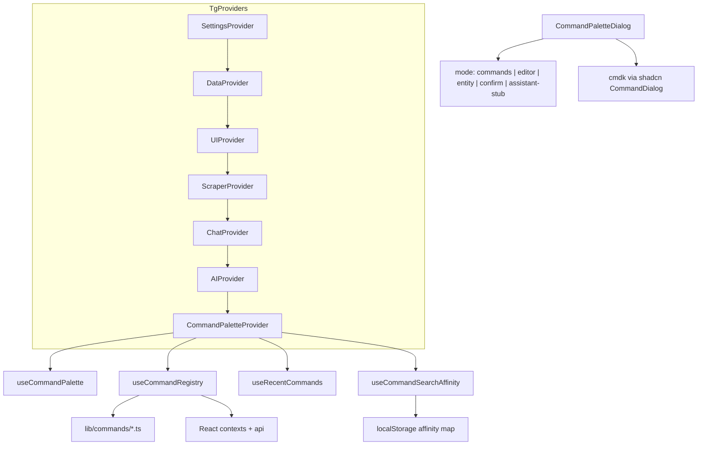

# IDEA-001 Command Palette — Implementation Plan (confirmed)

All decisions below come from explicit user answers. No assumptions beyond what is documented here.

---

## Confirmed requirements

| Topic | Decision |
|-------|----------|
| **Library** | `cmdk` + shadcn `command` component |
| **Scope** | TG Summarizer only (`/_tg/summarizer`) |
| **Shortcut** | `Cmd+Shift+P` (macOS) / `Ctrl+Shift+P` (Win/Linux) |
| **Header trigger** | Small icon button only (like theme/tour in [`App.tsx`](frontend/src/App.tsx)) |
| **Release strategy** | **Single release** — ship everything in this plan together (not phased PRs) |
| **Settings scope** | All `SettingsContext` mutables + 5 server job toggles; **exclude** Publishing CRUD |
| **Enum settings** | **Flat** searchable list: e.g. `Set AI Language → English`, `Set AI Language → Persian`, … |
| **Free-form settings** | **In-palette editor** sub-page (input / textarea / datetime + Apply) |
| **Boolean settings** | **Three commands each**: Toggle, Enable, Disable — all visible; **ON/OFF badge on the right** of every row |
| **Advanced settings** | **Auto-enable** `advancedMode` before applying network/Tor/translation commands |
| **Offline** | Show sync/scrape commands **disabled** with hint (not hidden); not the same as impossible-action hiding |
| **Embeddings** | **Two labeled commands**: `Enable Embeddings Feature` / `Disable Embeddings Feature` (via `setEmbeddingsEnabled`) AND `Enable Embeddings Background Job` / `Disable Embeddings Background Job` (via `api.updateJob`) |
| **Confirmation** | **Not** for sync all / sync selected. **Yes** for: bulk freeze, bulk unfreeze, clear cache, import DB, export DB. Per-command `requiresConfirmation: boolean` in schema — easy to flip per command later |
| **Confirm config** | Schema flag only (no env override, no Settings UI toggle) |
| **Recents** | Raycast-style: **Recent group only when search input is empty**; persist to `localStorage` (reverse-chronological by last use) |
| **Search learning** | Raycast-style: **track which search query led to which command**; boost ranking on future similar queries (frecency = frequency + recency) |
| **Channel entity** | **Full v1**: Raycast nested flows for search, select, deselect, freeze, unfreeze, auto-follow + bulk ops |
| **Open post** | **Deferred** — stub extension hook only |
| **NL assistant** | **Deferred** — stub mode placeholder; trigger TBD later |

Update [IDEA-001-command-palette.md](docs/ideas-log/ideas/IDEA-001-command-palette.md) and [IDEAS-LOG.md](docs/ideas-log/IDEAS-LOG.md) when implementation starts.

---

## Architecture



### Core types — [`frontend/src/lib/commands/types.ts`](frontend/src/lib/commands/types.ts)

```ts
type CommandKind =
  | "action"       // one-shot (navigate, sync, tour)
  | "boolean"      // toggle | enable | disable variants
  | "enum"         // flat set-value command
  | "editor"       // opens editor sub-page (number/text/datetime)
  | "entity-root"  // enters Raycast-style entity sub-flow
  | "assistant"    // stub only

type PaletteMode = "commands" | "editor" | "entity" | "confirm" | "assistant"

interface CommandDef {
  id: string
  kind: CommandKind
  label: string
  keywords: string[]
  group: string
  requiresConfirmation?: boolean  // drives confirm sub-step
  when?: (ctx: CommandContext) => boolean
  disabled?: (ctx: CommandContext) => { disabled: boolean; reason?: string }
  getBadge?: (ctx: CommandContext) => "ON" | "OFF" | null  // right-side badge
  run: (ctx: CommandContext, payload?: unknown) => void | Promise<void>
}
```

**Registry:** static schemas in `lib/commands/` + [`useCommandRegistry()`](frontend/src/hooks/useCommandRegistry.ts) binds setters inside [`TgProviders`](frontend/src/components/TgProviders.tsx) (after `AIProvider`). Mutations use existing [`SettingsContext`](frontend/src/contexts/SettingsContext.tsx) setters / [`useJobToggles`](frontend/src/hooks/useJobToggles.ts) — no duplicate `api.putSetting` in command files.

### Palette mode stack (Raycast-style navigation)

| Mode | When | UI |
|------|------|-----|
| `commands` | Default root | cmdk fuzzy list + optional Recent group |
| `entity` | User picks entity-root command (e.g. "Select Channel") | Filtered channel list; input filters candidates |
| `editor` | User picks free-form setting | Input/textarea/datetime + Apply / Back |
| `confirm` | `requiresConfirmation` command selected | "Are you sure?" + Confirm / Cancel |
| `assistant` | Stub | Placeholder text only |

**Back:** Escape closes palette; Backspace on empty input pops one stack level.

---

## Library and dependencies

- `cd frontend && bunx shadcn@latest add command`
- Pin `cmdk@^1.0.4` in [`package.json`](frontend/package.json) (React 19)
- Style with app tokens (`bg-app-card`, `border-app-ink`)

---

## File layout

```
frontend/src/
  components/
    CommandPalette.tsx
    CommandPaletteProvider.tsx
    CommandConfirmDialog.tsx       # confirm sub-step UI
  hooks/
    useCommandPalette.ts           # Cmd/Ctrl+Shift+P
    useCommandRegistry.ts
    useRecentCommands.ts           # localStorage read/write (empty-query recents)
    useCommandSearchAffinity.ts    # query→command learning + ranking boost
    useJobToggles.ts               # extracted from SettingsView
  lib/commands/
    rank-commands.ts               # merge cmdk filter score + affinity score
    useChannelEntityFlow.ts        # nested channel pickers
  lib/commands/
    types.ts
    navigate.ts
    actions.ts
    settings-schema.ts
    build-setting-commands.ts
    channel-entities.ts
    index.ts
  components/ui/command.tsx
```

---

## 1. Navigation and actions

**Navigate** (~14): derive from [`WORKSPACE_TABS`](frontend/src/constants.ts) + [`SETTINGS_TABS`](frontend/src/constants.ts) via [`useSummarizerTab`](frontend/src/hooks/useSummarizerTab.ts) / [`useSettingsSection`](frontend/src/hooks/useSettingsSection.ts).

**Actions** (no confirmation):

| Command | Source |
|---------|--------|
| Toggle theme | `setTheme` |
| Start guided tour | [`useGuidedTour`](frontend/src/hooks/useGuidedTour.ts) |
| Resume auto-sync | [`App.tsx`](frontend/src/App.tsx) banner logic |
| Sync selected | `ScraperContext.handleScrapeSelected` |
| Sync all | `ScraperContext.handleScrapeAll` |

**Offline:** sync commands use `disabled: () => ({ disabled: isOffline, reason: "Server offline" })` — row visible, not clickable.

**Impossible actions:** e.g. sync selected with 0 channels — `disabled` with reason (not hidden).

---

## 2. Settings — all SettingsContext fields

### Boolean (~22 settings × 3 commands ≈ 66 rows)

For each boolean field, register:

- `Toggle {Setting Name}` — flips value
- `Enable {Setting Name}` — sets `true`
- `Disable {Setting Name}` — sets `false`

Each row shows **ON/OFF badge on the right** via `getBadge` reading current context value.

Fields include: `showChannelBio`, `showChannelSubscribers`, `showChannelPhotos`, `showChannelVideos`, `showChannelFiles`, `showChannelLinks`, `advancedMode`, `autoSyncEnabled`, `proxyEnabled`, `torEnabled`, `torControlEnabled`, `torAutoRotate`, `embeddingsPaused`, `translationEnabled`, `autoTranslate`, etc. Theme uses enum flat commands instead of boolean trio.

### Enum — flat list

One command per option (all searchable together):

- `theme`: Light / Dark
- `globalStartTimeMode`: retention / relative / absolute
- `torMode`, `torRotationStrategy`
- `aiLanguage`, `translationTargetLanguage`: each `LANGUAGES` entry
- `selectedModel`, `translationModel`: each `MODELS` entry
- `postRetentionDays`, `logRetentionDays`: 0, 7, 14, 30, 90

### Free-form — editor sub-page

| Field | Editor |
|-------|--------|
| `autoSyncInterval`, `aiTemperature`, `syncConcurrency`, `proxyDefaultConcurrency`, `torControlPort`, `torRotationThreshold` | Number input + schema min/max |
| `globalStartTimeValue` | Days number (relative mode) or `datetime-local` (absolute mode) |
| `defaultProxyUrls`, `torProxyUrls` | Textarea |
| `proxyConcurrencyOverrides` | Per-URL: flat commands generated from parsed proxy list, or editor per URL |

**Advanced-only fields:** call `setAdvancedMode(true)` before applying.

Validation mirrors [`SettingsView.tsx`](frontend/src/components/SettingsView.tsx).

### Embeddings (two paths — user-confirmed labels)

| Command | Path |
|---------|------|
| Enable / Disable **Embeddings Feature** | `setEmbeddingsEnabled` |
| Enable / Disable **Embeddings Background Job** | `api.updateJob("embeddings", …)` via `useJobToggles` |

### Other job toggles (4)

`auto_sync`, `auto_summary`, `retention`, `translation_batch` — Enable/Disable via `useJobToggles` (extract from [`SettingsView.tsx`](frontend/src/components/SettingsView.tsx) lines 217–224).

Refresh job enabled state from `api.jobsStatus()` when palette opens.

---

## 3. Channel entity flows (Raycast nested — full v1)

Root **entity-root** commands enter `entity` mode with a typed filter input and dynamic `CommandItem` list.

| Root command | Candidate pool | Action on pick |
|--------------|----------------|----------------|
| **Search Channel** | All channels (name, displayName, tags) | Navigate to Channels tab; optional highlight (scroll to card if feasible) |
| **Select Channel** | Unselected, non-frozen | `setSelectedChannels` add |
| **Deselect Channel** | Currently selected | `setSelectedChannels` remove |
| **Freeze Channel** | Non-frozen, not `isUnavailableOnWebView` | [`ChannelCard.handleToggleFreeze`](frontend/src/components/ChannelCard.tsx) pattern |
| **Unfreeze Channel** | Frozen | same |
| **Toggle Auto-Follow on Channel** | All channels | `handleToggleAutoFollow` pattern from ChannelCard |

**Bulk root commands** (on `commands` page, not nested):

| Command | Source | `requiresConfirmation` |
|---------|--------|------------------------|
| Select all channels | `ChannelGrid.handleSelectAll` | false |
| Clear channel selection | `handleUnselectAll` | false |
| Freeze selected channels | `handleBulkFreeze` | **true** |
| Unfreeze selected channels | `handleBulkUnfreeze` | **true** |

Reuse channel matching from [`ChannelGrid`](frontend/src/components/ChannelGrid.tsx) `filteredChannels` logic. Channel identity = `channel.name`.

---

## 4. Confirmation flow

When user selects a command with `requiresConfirmation: true`:

1. Close fuzzy list → `confirm` mode
2. Show action label + short description
3. Confirm runs `run()`; Cancel returns to `commands`

**v1 confirmed list:**

- Bulk freeze selected
- Bulk unfreeze selected
- Clear cache (from Data Management actions)
- Import database
- Export database

**Not confirmed:** sync all, sync selected, single-channel freeze, toggles, enum changes, navigation.

Adding confirmation to any command later = set `requiresConfirmation: true` in schema only.

---

## 5. Ranking, recents & search learning (Raycast-style)

Two complementary mechanisms — same as Raycast’s “Recent” (empty query) + learned ranking (typed query).

### 5a. Recents (empty query only)

[`useRecentCommands.ts`](frontend/src/hooks/useRecentCommands.ts):

- On successful command run → push `commandId` + `lastUsedAt` to `localStorage` key `commandPaletteRecents`
- When palette opens and **input is empty** → render `Recent` `CommandGroup` at top, reverse-chronological
- When user types → hide Recent group
- Deduplicate: re-running moves entry to top
- No artificial cap (Raycast behavior); prune only if storage exceeds a safe max (e.g. 500 entries) by dropping oldest

### 5b. Search affinity (query → command learning)

[`useCommandSearchAffinity.ts`](frontend/src/hooks/useCommandSearchAffinity.ts) + [`rank-commands.ts`](frontend/src/lib/commands/rank-commands.ts):

**Record on every successful run** (root `commands` mode only — not entity sub-picks unless the root entity command is what was invoked):

```ts
type AffinityEntry = {
  query: string           // normalized: trim, lowercase, collapse whitespace
  commandId: string
  count: number           // times user picked this command after this query
  lastUsedAt: number      // ms epoch
}
// localStorage key: commandPaletteSearchAffinity
```

- When user selects a command, persist `{ query: currentInputNormalized, commandId, count++, lastUsedAt: now }`
- Merge duplicate `(query, commandId)` pairs; cap total entries (e.g. 1000) by evicting lowest `count * recencyWeight` entries

**Boost on next search** (when input is non-empty):

1. cmdk default filter produces candidate set + base relevance score (use `shouldFilter={false}` + custom filter if we need full control over ordering)
2. For each candidate, compute **affinity boost** from stored entries:

```ts
affinityBoost(commandId, inputQuery) =
  sum over entries where entry.commandId === commandId:
    similarity(inputQuery, entry.query)   // 0–1, substring or cmdk-style fuzzy
    * log1p(entry.count)                  // frequency (diminishing returns)
    * recencyDecay(entry.lastUsedAt)      // e.g. exp decay, ~7-day half-life
```

3. **Final score** = `cmdkScore + affinityBoost * AFFINITY_WEIGHT` (tune weight so learning nudges order without overriding strong literal matches)
4. Sort `CommandItem` list by final score descending before render

**Similarity rules** (explicit, no magic):

- Exact normalized query match → similarity `1.0`
- Input is prefix of stored query or vice versa → `0.8`
- Shared token overlap (split on spaces) → `0.5 * overlapRatio`
- Otherwise use same fuzzy scorer cmdk uses for labels (or simple `includes`)

**Entity sub-flows:** when user completes “Select Channel → @foo”, record affinity for the **root** command (`select-channel`) with query = what they typed at root before drilling, **not** the channel name sub-search (channel picks are entity-specific; optional future: separate `commandPaletteEntityAffinity` — out of scope for v1).

### 5c. cmdk integration

- Set `shouldFilter={false}` on root `Command` when custom ranking is active
- Implement `filterAndRank(commands, query, affinity)` in `rank-commands.ts`
- Empty query: skip affinity sort; show Recent group + default group order
- Non-empty query: hide Recent; apply filter + affinity sort

### 5d. Testing

| Case | Expected |
|------|----------|
| Type `sync`, pick “Sync Selected” 3 times | Next time typing `sync`, “Sync Selected” ranks above “Sync All” if cmdk scores are close |
| Type `dark`, pick “Toggle theme” once | Typing `dark` or `theme` boosts toggle theme |
| Clear `localStorage` | Ranking reverts to cmdk-only |
| Manual | Inspect `commandPaletteSearchAffinity` in DevTools after runs |

---

## 6. Deferred (stubs only)

### Open post

- Reserve `entity-root` kind `open-post` in types
- No UI wired in v1
- Future: post ID → Posts tab + scroll/highlight (requires new `PostFeed` scroll-to-post support — does not exist today)

### NL assistant

- Reserve `assistant` mode in provider
- Placeholder panel: "Natural language commands — coming soon"
- Trigger mechanism **not decided** — do not implement entry command or prefix detection

---

## 7. Shared concerns

### Keyboard

- `metaKey+shiftKey+p` / `ctrlKey+shiftKey+p` → toggle palette
- `preventDefault()` on shortcut only

### DRY

- Refactor [`SettingsView.tsx`](frontend/src/components/SettingsView.tsx) to use `useJobToggles`
- Channel mutations via `upsertChannel` + `setChannels` (same as ChannelCard/ChannelGrid)

### Testing

| Test | Assertion |
|------|-----------|
| Playwright: shortcut opens palette | Dialog visible |
| Playwright: "channels" → Enter | `tab=channels` in URL |
| Playwright: toggle theme via palette | Theme class/storage changes |
| Manual: setting change | Network shows `putSetting` / `saveNetworkSettings` |
| Manual: bulk freeze | Confirm dialog appears |

---

## Implementation order (single release)

1. Install cmdk + shadcn; types + provider + mode stack + recents + search affinity ranking
2. Navigation + actions + header icon + offline disabled
3. Settings schema (flat enums, boolean trios with badges, editor sub-page)
4. Job toggles + embeddings dual labels; refactor SettingsView
5. Channel entity flows + bulk ops + confirmation dialog
6. Assistant + open-post stubs
7. Playwright tests + IDEA doc update

---

## Out of scope

- Publishing bot/destination CRUD
- NL assistant execution
- Open post by ID (stub only)
- Admin template shell (`/_layout/*`) palette
- Env-based confirmation override
- Per-post selection model (does not exist in app today)
