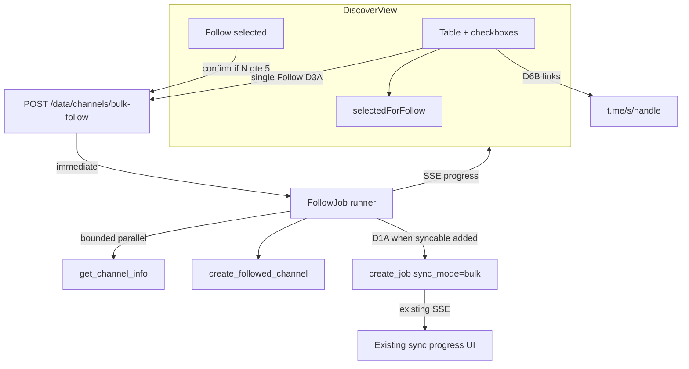

# Discover Tab: Web View Links + Backend Bulk Follow Job

## Goal

1. **Channel / Forwarded-by handles** link to Telegram web view.
2. **Multi-select + bulk Follow** via **one** frontend request to a **backend follow job** (not N sequential `channelInfo`/`upsert` calls).
3. After create, **one combined sync job** for syncable channels.

Closes MEMORY roadmap item *“Discover bulk follow”*.

---

## Locked decisions

| ID | Choice | Meaning |
|----|--------|---------|
| Hard constraint | Confirmed | Backend owns scrape+create; **no** sequential frontend loops |
| **D1** | **A** | One combined sync job after follow for syncable channels (`sync_mode="bulk"`) |
| **D2** | **A** | Store `discoveredVia` (sample forward metadata; existing Auto-Followed badge) |
| **D3** | **A** | Single-row Follow also uses bulk-follow API (1-element list) |
| **D4** | **A** | Bounded parallel scrapes inside the follow job (e.g. concurrency 3–5) |
| **D5** | **B** | Checkbox on all rows; **followed = disabled + checked** |
| **D6** | **B** | Links on **Channel** column **and** **Forwarded by** handles |
| **D7** | **B** | Confirm dialog when selection ≥ **5** (changeable if you want a different number) |
| **D8** | **B** | Fire-and-forget follow job + poll/SSE progress (not a long synchronous HTTP wait) |
| **D9** | **C** | No hard batch-size cap |
| **D10** | **A** | Add newly followed channel names to `DataContext.selectedChannels` |

Also locked earlier:

- Discover multi-select is **local** `Set` (follow intent) — distinct from workspace `selectedChannels` until D10 merges created names into workspace selection.

---

## Current behavior (baseline)

- Handles are plain text; per-row Follow → [`ScraperContext.addNewChannel`](frontend/src/contexts/ScraperContext.tsx) (frontend `channelInfo` + upsert + sync queue).
- Sync jobs already support create + SSE: [`scraper_jobs.py`](backend/app/services/scraper_jobs.py), [`GET /jobs/sync/{id}/events`](frontend/src/api/jobs.ts).
- Auto-follow create logic in [`_create_forwarded_channel`](backend/app/services/sync_orchestrator.py) is the pattern to reuse for persistence.

---

## Feature 1: Clickable handles (**D6B**)

Wrap with `telegramWebViewChannelUrl(name)` (same as [`ChannelCard`](frontend/src/components/ChannelCard.tsx)):

- **Channel** column: `@row.name` → link
- **Forwarded by** column: each `@entry.channelName` → link
- `target="_blank"` `rel="noopener noreferrer"`; `font-mono` + link styling; `data-testid` on Channel link

---

## Feature 2: Backend bulk-follow **job** (**D8B**)

### Why a job (not sync HTTP)

Scrapes can run long, especially with **D9C** (no max size). Matching the sync-job pattern avoids browser/proxy timeouts and enables progress UI.

### Endpoints (proposed)

| Method | Path | Role |
|--------|------|------|
| `POST` | `/api/v1/data/channels/bulk-follow` | Accept list; create follow job; `asyncio.create_task` runner; **return immediately** `{ followJobId }` |
| `GET` | `/api/v1/data/channels/bulk-follow/{followJobId}` | Snapshot status |
| `GET` | `/api/v1/data/channels/bulk-follow/{followJobId}/events` | SSE stream (mirror sync job events) |
| Optional | `POST` | `.../cancel` | Cancel in-flight scrapes |

Prefer implementing follow-job state next to or patterned after [`SyncJobState`](backend/app/services/scraper_jobs.py) (in-memory + optional DB persist if we want reload survival; v1 can be in-memory like early sync jobs if that matches current persistence level — prefer persist if sync jobs already persist).

### Request (`POST`)

```json
{
  "channels": [
    {
      "name": "somehandle",
      "discoveredVia": {
        "channelName": "source",
        "postId": 123,
        "timestamp": 1710000000000
      }
    }
  ],
  "proxyEnabled": false,
  "proxies": [],
  "torAutoRotate": false,
  "torRotationThreshold": 10
}
```

- Always include `discoveredVia` from Discover `samplePost` when available (**D2A**).
- Network fields mirror `ChannelInfoRequest`.

### Immediate response

```json
{ "followJobId": "…" }
```

### Follow job status (poll / SSE payload)

```json
{
  "followJobId": "…",
  "status": "running",
  "source": "Discover bulk follow",
  "total": 10,
  "completed": 4,
  "added": 2,
  "skipped": 1,
  "unavailable": 1,
  "failed": 0,
  "results": [
    { "name": "a", "status": "added" },
    { "name": "b", "status": "skipped", "reason": "already_followed" },
    { "name": "c", "status": "unavailable" },
    { "name": "d", "status": "pending" },
    { "name": "e", "status": "error", "error": "…" }
  ],
  "syncJobId": null,
  "createdAt": 0,
  "finishedAt": null
}
```

On terminal success/partial:

- Set `syncJobId` when at least one **syncable** channel was added (**D1A**): one `create_job` + `run_sync_job(..., sync_mode="bulk")`.
- `syncJobId` stays null if only skipped / unavailable / failed.

Per-name statuses: `pending` | `running` | `added` | `unavailable` | `skipped` | `error`.

### Background runner

1. Normalize + dedupe names.
2. Mark already-followed as `skipped` without scrape.
3. Remaining names: `get_channel_info` with **bounded concurrency (3–5)** (**D4A**) and request proxy/tor settings.
4. Persist via shared helper extracted from `_create_forwarded_channel` (default vs Restricted group, `followed_at`, `discovered_via`, schedules).
5. Emit per-channel status updates for SSE.
6. When all done: queue **one** sync job for syncable adds (**D1A**); set `syncJobId`; mark follow job completed.
7. `touch_sync(session, "channels")` as channels are created (so UI refresh picks them up).

**No hard max batch size** (**D9C**). Confirm dialog at ≥5 (**D7B**) is the main UX brake; operational risk of huge batches is accepted — consider showing the count in the confirm copy.

---

## Feature 3: Discover UI

### Selection (**D5B**)

| Element | Behavior |
|---------|----------|
| Row checkbox | All rows; **followed → checked + disabled** (not toggleable) |
| Unfollowed | Toggle into local `selectedForFollow: Set<string>` |
| Header checkbox | Select / deselect all **visible unfollowed**; indeterminate when partial |
| Bulk bar | “N selected”, **Follow selected**, **Clear** |
| Confirm (**D7B**) | If `N >= 5`, confirm (e.g. “Follow 12 channels?”); else start immediately |
| During job | Disable follow controls; show progress from SSE (`completed/total`, per-row status optional) |
| Offline | Disabled when `isOffline` |

Local selection ≠ workspace selection until creates succeed.

### Follow flow (single or bulk — **D3A**)

1. Build `channels[]` from names + each candidate’s `samplePost` as `discoveredVia`.
2. Pass network settings from Settings context.
3. `POST bulk-follow` → `followJobId`.
4. Subscribe to SSE (or poll); on each `added`/`unavailable`, optionally refresh channels.
5. When finished: summary toast from counts; prune Discover selection for non-error names; keep failed selected.
6. **D10A:** `setSelectedChannels(prev => add created names)`.
7. If `syncJobId` present, attach to existing sync job UI / SSE the same way bulk-reset / Sync Selected does.

Replace Discover usage of `addNewChannel` with this path (thin helper in ScraperContext or Discover hook wrapping the API).

---

## Architecture



---

## Testing

### Backend

- Follow job: mix new / already-followed / unavailable / scrape error; assert SSE/status transitions; `discoveredVia` persisted; Restricted vs default group.
- After success: exactly one `syncJobId` when ≥1 syncable add; none when only skipped/unavailable.
- Concurrency: in-flight scrapes ≤ bound; one failure isolated.

### Frontend unit

- Selection helpers: followed stay checked+disabled and excluded from follow payload; select-all unfollowed; prune; confirm threshold helper (`needsConfirm(n) => n >= 5`).

### E2E

- Channel + Forwarded-by links have `/s/` hrefs.
- Checkbox on followed row disabled+checked.
- Follow selected: **one** POST to bulk-follow; mock SSE completion; workspace selection gains new names.

### Manual smoke

1. Links open web view (both columns).
2. Select &lt;5 → Follow starts with no confirm; ≥5 → confirm.
3. Progress updates; channels appear; one sync job runs for available ones.
4. Single-row Follow uses same API.

---

## Files to touch

**Backend**

- [`backend/app/schemas/data.py`](backend/app/schemas/data.py) — request + job status models
- New service e.g. `backend/app/services/bulk_follow.py` (job state + runner) and/or extend [`scraper_jobs.py`](backend/app/services/scraper_jobs.py) patterns
- Shared create helper from [`sync_orchestrator.py`](backend/app/services/sync_orchestrator.py)
- [`backend/app/api/routes/data.py`](backend/app/api/routes/data.py) — POST/GET/SSE (and cancel if shipped)
- `backend/tests/api/test_bulk_follow.py`

**Frontend**

- [`frontend/src/api/data.ts`](frontend/src/api/data.ts) + SSE helper (reuse pattern from [`jobs.ts`](frontend/src/api/jobs.ts))
- [`DiscoverView.tsx`](frontend/src/components/DiscoverView.tsx)
- [`discover-selection.ts`](frontend/src/lib/posts/discover-selection.ts) + tests
- [`ScraperContext.tsx`](frontend/src/contexts/ScraperContext.tsx) — Discover Follow → bulk-follow job helper; deprecate Discover’s direct `addNewChannel` path for this tab
- [`summarizer.spec.ts`](frontend/tests/summarizer.spec.ts)
- [`MEMORY.md`](MEMORY.md)

**Out of scope**

- Sequential frontend `addNewChannel` loops
- Renaming “Auto-Followed” badge to “Discovered” (keep current copy; provenance still useful)
- Hard batch-size API cap
- Persisting Discover checkbox selection to `localStorage`

---

## Risks and mitigations

| Risk | Mitigation |
|------|------------|
| Huge batches (**D9C**) | Background job + SSE; confirm at ≥5 with count in copy; operator responsibility |
| Rate limits | Concurrency 3–5; reuse proxy/tor settings |
| Partial failures | Per-name results; keep failed selected; toast summary |
| Follow job lost on process restart | Prefer DB persistence of follow job like sync jobs if already in place; else document restart caveat for v1 |
| Workspace selection growth (**D10A**) | Intentional; user can deselect on Channels tab |
| Long-running follow then sync | Chain clearly in UI: follow progress → then existing sync job progress |

---

## Implementation order

1. ~~Lock D1–D10~~ (done).
2. Backend follow job + shared create helper + status/SSE + pytest.
3. Chain combined sync job on success.
4. Frontend API + SSE client.
5. Discover links + selection UI + confirm ≥5.
6. Wire Follow / bulk Follow; workspace selection update.
7. E2E + MEMORY.
