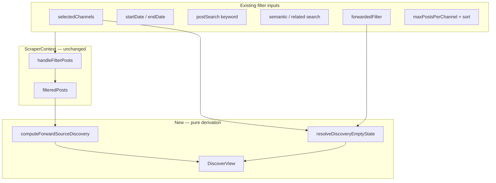

# Discover Tab v1 — Forward Source Discovery

## Goal

Surface **forward-source activity** in the current post scope: who gets forwarded, how often, and by which of your channels. Ship as a new action tab (`discover`) placed **after Tag, before Chat**. **Follow** is only available for channels you do not already follow.

## Architecture



**No backend changes.** Discovery reads [`filteredPosts`](frontend/src/contexts/ScraperContext.tsx) (already canonical for Summary/Tag/Chat) plus filter metadata from `useScraper` / `useData` / `useUI`.

### Aggregation rule (strict filter respect)

**Step 1 — gate on post type**

| `forwardedFilter` | Gate |
|---|---|
| `original` | **Empty** — show guide explaining forwards are required |
| `all`, `forwarded`, `unfollowed_forwarded` | Continue to step 2 |

**Step 2 — build forward post set from `filteredPosts`**

Always start from posts in `filteredPosts` that have `forwardedFrom` set. For `all` and `forwarded`, this includes forwards to **both followed and unfollowed** sources — stats are computed from the full forward set, not a pre-filtered unfollowed subset.

**Step 3 — which rows appear in the table**

| `forwardedFilter` | Rows shown |
|---|---|
| `all` | **All** unique `forwardedFrom` sources in scope (followed + unfollowed) |
| `forwarded` | **All** unique `forwardedFrom` sources in scope (followed + unfollowed) |
| `unfollowed_forwarded` | **Only** sources you do not follow yet (`filteredPosts` is already scoped this way) |

**Step 4 — per-row stats** (same formula for every visible row)

- `postCount` — posts in the forward post set where `forwardedFrom` matches this source
- `forwardedBy` — `{ channelName, count }[]` of your channels that forwarded it
- `forwardedByCount` — distinct forwarding channels
- `lastSeen` — max `timestamp`
- `displayName` — best `forwardedFromName` seen
- `isFollowed` — whether this source is already in your channel list

**Sort:** `forwardedByCount` desc → `postCount` desc → `lastSeen` desc. Optionally pin `isFollowed: false` rows above followed rows (implementation detail — default: sort by signal strength only).

**Follow action:** only when `isFollowed === false`. Reuse existing [`addNewChannel`](frontend/src/contexts/ScraperContext.tsx) with `discoveredVia: { channelName, postId, timestamp }` from the most recent contributing post. Followed rows show a **Following** badge (or no action) instead.

#### Example

Scope has 30 forward posts: 20 forward `@known` (already followed), 10 forward `@new`.

| Post filter | Rows shown | `@new` postCount | `@known` postCount |
|---|---|---|---|
| `all` or `forwarded` | `@new` + `@known` | 10 | 20 |
| `unfollowed_forwarded` | `@new` only | 10 | — |

---

## Files to change

### 1. Types and tab registration

| File | Change |
|---|---|
| [`frontend/src/types.ts`](frontend/src/types.ts) | Add `"discover"` to `TabType` union |
| [`frontend/src/constants.ts`](frontend/src/constants.ts) | Insert `{ id: "discover", label: "Discover", icon: "Compass" }` **after Tag, before Chat** |
| [`frontend/src/hooks/useSummarizerTab.ts`](frontend/src/hooks/useSummarizerTab.ts) | Add `"discover"` to `VALID_TABS` |
| [`frontend/src/routes/_tg/summarizer.tsx`](frontend/src/routes/_tg/summarizer.tsx) | Add `"discover"` to route `VALID_TABS` |
| [`frontend/src/App.tsx`](frontend/src/App.tsx) | Import `Compass` + `DiscoverView`; render when `activeTab === "discover"` |

Command palette navigation auto-updates via [`WORKSPACE_TABS`](frontend/src/constants.ts) in [`navigate.ts`](frontend/src/lib/commands/navigate.ts).

### 2. Pure aggregation logic

**New:** [`frontend/src/lib/posts/discover-forward-sources.ts`](frontend/src/lib/posts/discover-forward-sources.ts)

```typescript
export interface ForwardSourceCandidate {
  name: string
  displayName?: string
  postCount: number
  forwardedBy: { channelName: string; count: number }[]
  forwardedByCount: number
  lastSeen: number
  isFollowed: boolean
  samplePost: { channelName: string; postId: number; timestamp: number }
}

export type DiscoveryEmptyReason =
  | "original_only"
  | "no_channels_selected"
  | "no_posts_in_scope"
  | "no_forwards_in_scope"
  | "no_unfollowed_sources" // only when forwardedFilter === "unfollowed_forwarded"
  | "semantic_active" // informational banner only

export function computeForwardSourceDiscovery(
  filteredPosts: Post[],
  channels: Channel[],
  ctx: { forwardedFilter: ForwardedFilterValue; selectedChannelCount: number; semanticQuery?: string },
): { candidates: ForwardSourceCandidate[]; emptyReason?: DiscoveryEmptyReason }
```

**New:** [`frontend/src/lib/posts/discover-empty-state.ts`](frontend/src/lib/posts/discover-empty-state.ts) — maps `emptyReason` → title, body copy, and optional quick actions (e.g. `setForwardedFilter("all")`).

**Tests:** [`frontend/src/lib/posts/discover-forward-sources.test.ts`](frontend/src/lib/posts/discover-forward-sources.test.ts) — cover:
- `original_only` returns no candidates
- `all` / `forwarded`: includes followed + unfollowed sources; stats count all forward posts per source
- `unfollowed_forwarded`: only unfollowed sources in result set
- aggregation counts + `forwardedBy` breakdown
- case-insensitive handle dedup
- `isFollowed` flag correct per row
- `no_unfollowed_sources` empty reason when filter is `unfollowed_forwarded` and every forward source is already followed

Extend [`frontend/src/lib/posts/post-view.test.ts`](frontend/src/lib/posts/post-view.test.ts) only if re-exporting helpers; prefer dedicated test file.

### 3. Discover tab UI

**New:** [`frontend/src/components/DiscoverView.tsx`](frontend/src/components/DiscoverView.tsx)

Layout mirrors [`TagView`](frontend/src/components/TagView.tsx) (motion wrapper + card sections):

**A. Scope banner** — read-only summary of current context:
- Active channels count, date range, post-type filter label, keyword/semantic flags
- Total forward posts in scope + unique source count (+ unfollowed count when filter is `all`/`forwarded`)

**B. Results table** (when candidates exist):

| Channel | Posts | Forwarded by | Last seen | Actions |
|---|---|---|---|---|
| @foo (Display Name) | 23 | @a (12), @b (8), @c (3) | relative time | **Follow** · **View posts** |
| @bar (Already followed) | 15 | @a (15) | relative time | **Following** · **View posts** |

- **Follow** → only when `!isFollowed`; calls `addNewChannel(name, discoveredVia)`; disable if offline
- **Following** badge on `isFollowed` rows — no follow action
- **View posts** (optional v1 nice-to-have) → `setActiveTab("posts")`, set post filter appropriate for row (`unfollowed_forwarded` if `!isFollowed`, else `forwarded`), `setPostSearch(name)` to jump to examples

**C. Empty state panel** — reason-specific guide text with inline actions where possible:

| Reason | Guide (summary) | Quick action |
|---|---|---|
| `original_only` | Original posts have no forward metadata | Button: **Show all posts** / **Show forwarded only** (`setForwardedFilter`) |
| `no_channels_selected` | Select channels on Channels tab | Button: **Go to Channels** |
| `no_posts_in_scope` | Widen date range or clear search | Button: **Go to Posts** |
| `no_forwards_in_scope` | Scope has posts but none are forwards | Button: **Show forwarded only** |
| `no_unfollowed_sources` | Only when filter is **Unfollowed Forwarded** and every forward source is already followed | Button: **Show all forwards** (`setForwardedFilter("forwarded")`) |

When semantic search is active, show a subtle note: *"Based on semantic search results (up to 50 posts), not your full date-range corpus."*

### 4. Guided tour (light touch)

[`frontend/src/hooks/useGuidedTour.ts`](frontend/src/hooks/useGuidedTour.ts) — optional single step after Tag tab (`#tour-tab-discover`) describing filter-aware channel discovery. Skip if tour length is a concern.

### 5. E2E tests

[`frontend/tests/summarizer.spec.ts`](frontend/tests/summarizer.spec.ts):

- `discover` tab appears in `WORKSPACE_TABS` loop (existing tab smoke test picks it up automatically)
- `?tab=discover` loads and highlights tab
- **Empty-state regression:** Posts tab → select **Original Only** → Discover tab → expect guide text mentioning forwarded posts + quick-action button visible
- Offline: Follow button disabled (if straightforward with existing offline mock)

---

## Data flow (DiscoverView hooks)

```typescript
const { filteredPosts, forwardedFilter, setForwardedFilter, postSearch, semanticSearchQuery, addNewChannel } = useScraper()
const { channels, selectedChannels } = useData()
const { setActiveTab, startDate, endDate } = useUI()

const { candidates, emptyReason } = useMemo(
  () => computeForwardSourceDiscovery(filteredPosts, channels, {
    forwardedFilter,
    selectedChannelCount: selectedChannels.size,
    semanticQuery: semanticSearchQuery,
  }),
  [filteredPosts, channels, forwardedFilter, selectedChannels.size, semanticSearchQuery],
)
```

`filteredPosts` already re-computes when any filter changes via the existing `useEffect` in `ScraperContext` (line ~606), so Discover stays in sync without new context state.

---

## Explicit non-goals (v1)

- No new DB tables or API endpoints
- No bulk-follow (defer; can add row selection later)
- No auto-follow mode changes
- No separate discovery sidebar on Posts tab
- No extraction of `t.me` links from post bodies (forwards only)

---

## Verification checklist

1. `bun test frontend/src/lib/posts/discover-forward-sources.test.ts`
2. `bun run lint` (scoped files only)
3. Playwright: tab routing + Original-only empty state
4. Manual: select 2–3 channels → Posts filter **Forwarded** → Discover shows **all** forward sources (followed + unfollowed) with correct counts → Follow only on unfollowed rows → switch to **Unfollowed Forwarded** → table shrinks to unfollowed only
