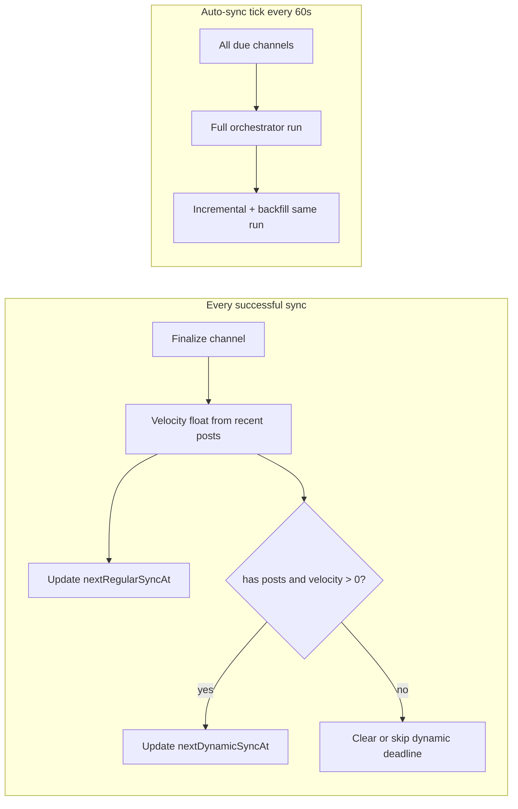
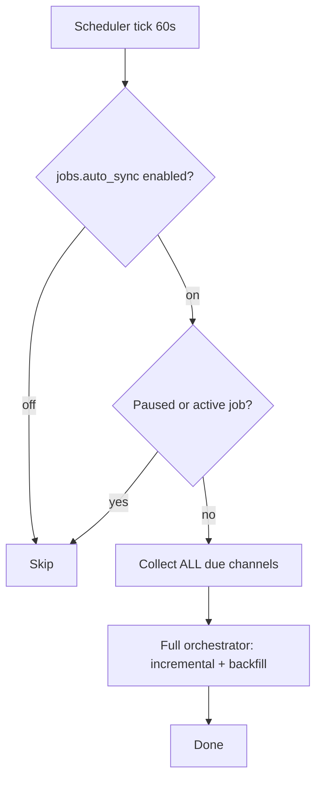

# Dynamic Channel Sync — Activity-Aware Scheduling

> Channel-level settings are the **source of truth**. Global Settings and bulk actions **write channel fields**; they do not drive runtime scheduling directly.

**Delivery:** One release — backend + frontend + palette + bulk API shipped together.

## Goals

- Optimize network requests: hot channels sync sooner, quiet channels less often.
- Support **two independent auto-sync modes** per channel: **regular** (fixed interval) and **dynamic** (activity-based). **Dynamic-only** channels are allowed (`regularSyncEnabled=false`, `dynamicSyncEnabled=true`).
- Manual sync (single channel or bulk) **always works**, regardless of auto-sync toggles. Manual sync **resets auto-sync timers** (recomputes both deadlines on success).
- **v1:** Ship per-channel deadlines + due selection; keep existing orchestrator behavior (incremental + backfill in the same run).
- **v1.1:** Defer two-pass priority (incremental-only due pass vs separate low-priority backfill pass).

## Problem today

Auto-sync in [`backend/app/jobs/auto_sync.py`](backend/app/jobs/auto_sync.py) uses one global interval for all channels:

```63:63:backend/app/jobs/auto_sync.py
        stale = [ch for ch in channels if (now - (ch.last_updated or 0)) >= interval_ms]
```

- `stats.velocity` (EMA posts/hour in [`channels.py`](backend/app/services/channels.py)) is UI-only
- `last_updated` serves double duty as display clock and scheduling clock

---

## Decisions (locked)

| Topic | Decision |
|-------|----------|
| **Source of truth** | Per-channel fields. Global Settings seed **new channels only**. Bulk/palette explicitly applies to existing channels. |
| **Global interval** | `regularSyncIntervalMinutes` in Settings is a template for new channels — **not** auto-propagated to existing. Migrate from legacy `autoSyncInterval` key. |
| **Two schedules** | `nextRegularSyncAt` + `nextDynamicSyncAt`; channel is due when **either** enabled schedule is due (earliest wins). |
| **Success hook** | Both applicable deadlines recomputed after **every** successful sync (auto, manual, backfill, pre-summary, initial add). |
| **Dynamic formula** | `hours = dynamicSyncExpectedPosts / velocity` (posts/hour, **float** internally); **no max cap** on dynamic interval. UI may display velocity as rounded int. |
| **Velocity / no posts** | Do **not** run dynamic sync for channels with **no posts at all**. If channel has posts, velocity must be **> 0** for dynamic scheduling; `nextDynamicSyncAt` only computed when `velocity > 0`. |
| **Dynamic-only channels** | Allowed — `regularSyncEnabled=false`, `dynamicSyncEnabled=true`. |
| **Expected posts default** | **15** (~one Telegram page of ~20 posts; batch requests efficiently). |
| **Regular as backup** | Operator can enable regular sync with long interval (e.g. 24h) alongside dynamic. |
| **Failure backoff** | **5 minutes**, applied only to schedule(s) that were **due** and triggered the attempt (`regular` \| `dynamic` \| `both`). **Scope:** scheduler auto-sync failures only — check `job.source` / `CHECK_SOURCE`; manual/pre-summary/other sync failures do **not** apply schedule backoff. |
| **Master kill switch** | **Removed** `sync.autoSyncEnabled`. Replace with prominent palette command **"Disable regular sync on all channels"** (bulk PATCH). Keep `jobs.auto_sync` toggle to pause the APScheduler tick (infrastructure). |
| **Per-tick cap** | **No cap** — sync all due channels in one job (same as today). |
| **Orchestrator v1** | Keep full orchestrator (incremental + backfill in same run). Ship deadlines + per-channel scheduling first. |
| **Partial backfill priority** | **Deferred to v1.1** — two-pass priority (incremental-only due pass vs separate low-priority backfill pass). |
| **UI surfaces** | ChannelCard inline controls (like Auto-Follow) + ChannelGrid bulk toolbar + command palette + Settings templates. |
| **Bulk at scale** | v1 adds `PATCH /api/v1/data/channels/bulk-sync-settings` for apply-to-all/selected. |
| **Manual sync UX** | Tooltip on ChannelCard: **"Manual sync resets auto-sync timers"**. |
| **Dynamic default at rollout** | **OFF** globally; opt in per channel or via bulk. |

---

## Plan refinement (batch 2)

| # | Topic | Locked decision |
|---|-------|-----------------|
| 1 | **Orchestrator v1** | Full orchestrator (incremental + backfill same run). Ship deadlines + per-channel scheduling. Two-pass priority → **v1.1**. |
| 2 | **Velocity zero / no posts** | Skip dynamic sync when channel has no posts. With posts, require `velocity > 0`. Store/compute velocity as **float**; UI may round. Dynamic deadline only when `velocity > 0`. |
| 3 | **Dynamic-only channels** | Allowed (`regularSyncEnabled=false`, `dynamicSyncEnabled=true`). |
| 4 | **Per-tick cap** | No cap — sync all due channels in one job. |
| 5 | **Backoff scope** | 5min backoff only for scheduler auto-sync failures (`job.source` / `CHECK_SOURCE`). |
| 6 | **Kill switch replacement** | Remove `sync.autoSyncEnabled`. Add palette **"Disable regular sync on all channels"** + keep `jobs.auto_sync`. |
| 7 | **ChannelCard UI** | Inline controls (like Auto-Follow). |
| 8 | **Bulk at scale** | v1: `PATCH /api/v1/data/channels/bulk-sync-settings`. |
| 9 | **Naming** | Rename global AppSetting key to `regularSyncIntervalMinutes` everywhere (migrate from `autoSyncInterval`). |
| 10 | **Delivery** | One release — backend + frontend + palette + bulk together. |
| 11 | **Manual sync UX** | ChannelCard tooltip: "Manual sync resets auto-sync timers". |

---

## Per-channel fields (new DB columns on `tg_channels`)

| DB column | API (camelCase) | Default | Role |
|-----------|-----------------|--------|------|
| `regular_sync_enabled` | `regularSyncEnabled` | `true` | Fixed-interval auto sync on/off |
| `dynamic_sync_enabled` | `dynamicSyncEnabled` | `false` | Activity-based auto sync on/off |
| `auto_sync_interval_minutes` | `autoSyncIntervalMinutes` | `60` | **Source of truth** for regular interval (minutes) |
| `dynamic_sync_expected_posts` | `dynamicSyncExpectedPosts` | `15` | Target ~N new posts before next dynamic sync |
| `next_regular_sync_at` | `nextRegularSyncAt` | `null` | Ms epoch; regular schedule deadline |
| `next_dynamic_sync_at` | `nextDynamicSyncAt` | `null` | Ms epoch; dynamic schedule deadline |

**Keep `last_updated`** for UI, pre-summary sync, auto-summary — unchanged.

**Do not add** per-channel `autoSyncEnabled` — use `regularSyncEnabled` instead.

---

## Global settings (AppSetting `sync`) — seeds only

Templates for **new channels**; not runtime source of truth:

| Key | Default | Role |
|-----|---------|------|
| `regularSyncIntervalMinutes` | `60` | Seed `autoSyncIntervalMinutes` on new channel add (**migrate from legacy `autoSyncInterval`**) |
| `dynamicSyncEnabledDefault` | `false` | Seed `dynamicSyncEnabled` on new channel add |
| `dynamicSyncExpectedPostsDefault` | `15` | Seed `dynamicSyncExpectedPosts` on new channel add |
| `syncFailureBackoffMinutes` | `5` | Backoff after failed scheduler auto-sync |

**Remove** `sync.autoSyncEnabled` from scheduler logic and Settings UI (replaced by bulk per-channel toggles + palette **"Disable regular sync on all channels"**).

**Remove** `dynamicSyncMaxIntervalMinutes` — no dynamic cap; use regular sync as backup.

**Rename** `autoSyncInterval` → `regularSyncIntervalMinutes` in AppSetting storage, seeds, runtime_config, palette editors, and tests.

---

## Scheduling logic

### When is a channel due?

```python
def is_channel_due(ch, now_ms) -> bool:
    if ch.is_frozen:
        return False
    if not ch.regular_sync_enabled and not ch.dynamic_sync_enabled:
        return False
    due_regular = ch.regular_sync_enabled and (
        ch.next_regular_sync_at is None or now_ms >= ch.next_regular_sync_at
    )
    # Dynamic due only when channel has posts and velocity > 0
    due_dynamic = (
        ch.dynamic_sync_enabled
        and ch.has_posts  # channel has at least one post
        and ch.velocity > 0  # float posts/hour
        and (ch.next_dynamic_sync_at is None or now_ms >= ch.next_dynamic_sync_at)
    )
    return due_regular or due_dynamic


def due_reason(ch, now_ms) -> str | None:
    """Returns 'regular', 'dynamic', 'both', or None."""
```

### Recompute after every successful sync

In [`sync_orchestrator.py`](backend/app/services/sync_orchestrator.py) `_finalize_channel_success`:

**Regular** (if `regularSyncEnabled`):

```
next_regular_sync_at = now + auto_sync_interval_minutes * 60_000
```

**Dynamic** (if `dynamicSyncEnabled`):

```
velocity = _velocity_from_timestamps(recent_post_timestamps)  # float posts/hour
if channel has no posts:
    next_dynamic_sync_at = null  # dynamic schedule inactive
elif velocity > 0:
    hours = dynamic_sync_expected_posts / velocity
    next_dynamic_sync_at = now + hours * 3_600_000
else:
    # has posts but velocity == 0 — leave next_dynamic_sync_at unchanged (not due)
```

### Failed sync

- **Do not** update `last_updated`.
- **Scheduler auto-sync only:** when `job.source` matches scheduler `CHECK_SOURCE`, push **+5 min** only on due schedule(s): regular due → `next_regular_sync_at`; dynamic due → `next_dynamic_sync_at`; both due → both.
- Auto-sync passes `due_reason` per channel into job metadata for the failure handler.
- Manual sync, pre-summary, and other non-scheduler sync failures **do not** apply schedule backoff.
- Keep global failure pause (`consecutiveFailures` / `autoSyncPauseUntil`) for catastrophic bursts.



---

## Auto-sync job ([`auto_sync.py`](backend/app/jobs/auto_sync.py))

### Tick flow (v1)



1. Replace flat `(now - last_updated) >= interval` with `is_channel_due()`.
2. **No per-tick cap** — enqueue all due channels in one job (same as today).
3. Pass `due_reason` per channel into job metadata for scheduler-only failure backoff.
4. Orchestrator runs incremental + backfill in the **same run** (existing behavior). Two-pass priority deferred to v1.1.

---

## Bulk sync settings API (v1)

`PATCH /api/v1/data/channels/bulk-sync-settings`

Apply sync settings to all channels or a selected subset (used by ChannelGrid toolbar, Settings "apply to all/selected", and palette bulk commands):

| Field | Type | Notes |
|-------|------|-------|
| `channelIds` | `string[]` \| `null` | `null` = all channels |
| `regularSyncEnabled` | `bool?` | Optional patch field |
| `dynamicSyncEnabled` | `bool?` | Optional patch field |
| `autoSyncIntervalMinutes` | `int?` | Optional patch field |
| `dynamicSyncExpectedPosts` | `int?` | Optional patch field |

Replaces parallel PUT-per-channel for bulk operations at scale.

---

## Pure function module

[`backend/app/services/sync_schedule.py`](backend/app/services/sync_schedule.py):

- `compute_next_regular_sync_at(now_ms, interval_minutes) -> int`
- `compute_next_dynamic_sync_at(now_ms, expected_posts, velocity: float) -> int | None`
- `is_channel_due(channel, now_ms) -> bool`
- `due_reason(channel, now_ms) -> str | None`
- `apply_failure_backoff(channel, now_ms, due_reason, backoff_minutes) -> None`

Unit tests: `backend/tests/services/test_sync_schedule.py`.

---

## Backend checklist

1. Alembic migration — 6 columns; backfill `next_regular_sync_at = (last_updated or now) + auto_sync_interval_minutes`; `next_dynamic_sync_at = null`
2. [`models_tg.py`](backend/app/models_tg.py) — fields
3. [`serialization.py`](backend/app/services/serialization.py) — camelCase
4. [`sync_orchestrator.py`](backend/app/services/sync_orchestrator.py) — recompute on success; scheduler-only due backoff on failure (`job.source` check)
5. [`auto_sync.py`](backend/app/jobs/auto_sync.py) — due selection; all due channels in one job; due_reason metadata
6. **New** `PATCH /api/v1/data/channels/bulk-sync-settings` endpoint
7. [`jobs/settings.py`](backend/app/jobs/settings.py) — seed keys; migrate `autoSyncInterval` → `regularSyncIntervalMinutes`; remove `autoSyncEnabled`
8. [`runtime_config.py`](backend/app/services/runtime_config.py) — expose seeds with renamed key
9. New channel add — seed from global templates
10. Remove `sync.autoSyncEnabled` from scheduler + Settings UI

---

## Frontend

### ChannelCard ([`ChannelCard.tsx`](frontend/src/components/ChannelCard.tsx))

**Inline controls** (same pattern as Auto-Follow):

- Toggle: **Regular sync** (`regularSyncEnabled`)
- Toggle: **Dynamic sync** (`dynamicSyncEnabled`)
- Number: **Interval (min)** (`autoSyncIntervalMinutes`)
- Number: **Expected posts** (`dynamicSyncExpectedPosts`, default 15)
- Read-only: **Next regular** / **Next dynamic** relative times
- Tooltip on manual sync button: **"Manual sync resets auto-sync timers"**

### ChannelGrid bulk toolbar ([`ChannelGrid.tsx`](frontend/src/components/ChannelGrid.tsx))

Bulk writes via `PATCH /api/v1/data/channels/bulk-sync-settings`:

- Enable / disable regular sync
- Enable / disable dynamic sync
- Set interval minutes
- Set expected posts

### Command palette

- Global seed editors: `regularSyncIntervalMinutes`, dynamic default, expected posts default
- Per-channel entity flow: toggles + numeric editors
- **Bulk:** "Enable regular sync (all)", "Disable dynamic sync (selected)", "Apply interval to all channels", etc.
- **Prominent:** **"Disable regular sync on all channels"** (replaces old global auto-sync kill switch)

### Settings tab

Template values for **new channels only**. Explicit "apply to all/selected" via bulk API (replaces old global auto-sync on/off).

---

## Tests

| Area | Cases |
|------|-------|
| `test_sync_schedule.py` | regular deadline, dynamic formula, due OR logic, no-posts skip, velocity=0 skip, float velocity, due_reason, failure backoff due-only |
| `test_scheduler_jobs.py` | due vs not-due; regular/dynamic off; dynamic-only; all due synced in one job; backoff only for scheduler source |
| orchestrator tests | success updates both next*; scheduler failure backoff due-only; manual sync no backoff |
| bulk-sync-settings | apply-to-all, apply-to-selected, partial field patch |
| `test_settings_defaults.py` | new seed keys; `autoSyncInterval` → `regularSyncIntervalMinutes` migration; `autoSyncEnabled` removed |
| `settings-schema.test.ts` | palette badges for new editors, bulk commands, disable-regular-sync-all |

---

## Out of scope (v1)

- Two-pass backfill priority (incremental-only due pass vs separate low-priority backfill pass) → **v1.1**
- `sync_mode` orchestrator flag for pass separation → **v1.1**
- Per-tick channel cap
- Dynamic interval max cap
- Peak-hour / day-of-week activity buckets
- Stored velocity column (compute float on the fly)
- Celery / separate scheduler process
- Changing pre-summary / auto-summary `lastUpdated` checks
- AIMD backoff on 429 (IDEA-003)

---

## v1.1 (deferred)

| Item | Description |
|------|-------------|
| **Two-pass backfill priority** | High-priority pass: incremental head sync for due channels only. Low-priority pass: partial-history backfill (`historyCompleteToCutoff === false`) only when proxy/worker capacity remains — round-robin cursor retained. |
| **`sync_mode` orchestrator flag** | Flag on orchestrator/job to distinguish incremental-only due pass from backfill pass, enabling clean pass separation in auto-sync tick. |

---

## Rollout notes

1. Ship with **dynamic OFF** by default — regular sync behavior close to today for existing channels after migration backfill.
2. Enable dynamic on hot channels first; use ChannelCard deadline hints.
3. Set regular sync to 24h on quiet channels as a safety net alongside dynamic.
4. Use bulk API / palette / grid to enable dynamic or adjust intervals at scale.
5. **One release:** backend deadlines + bulk API + frontend inline controls + palette + Settings apply actions land together.
