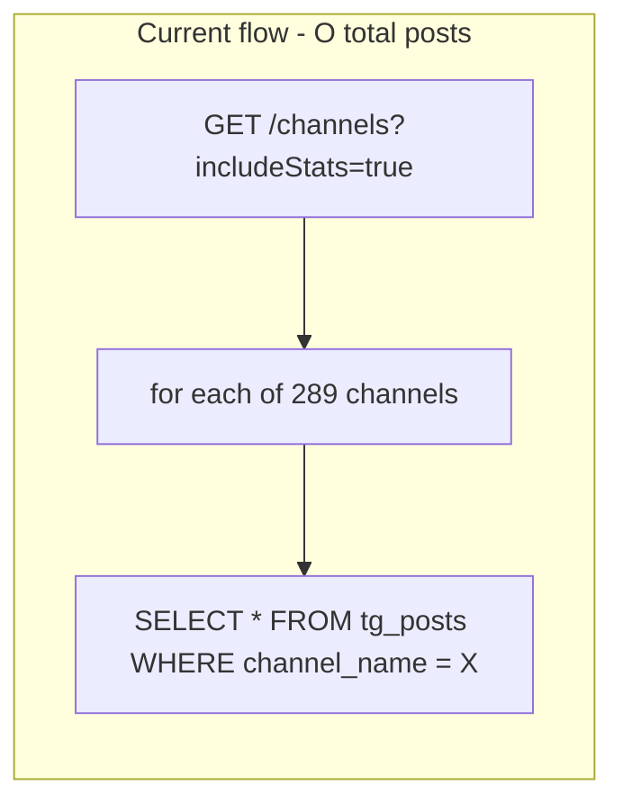
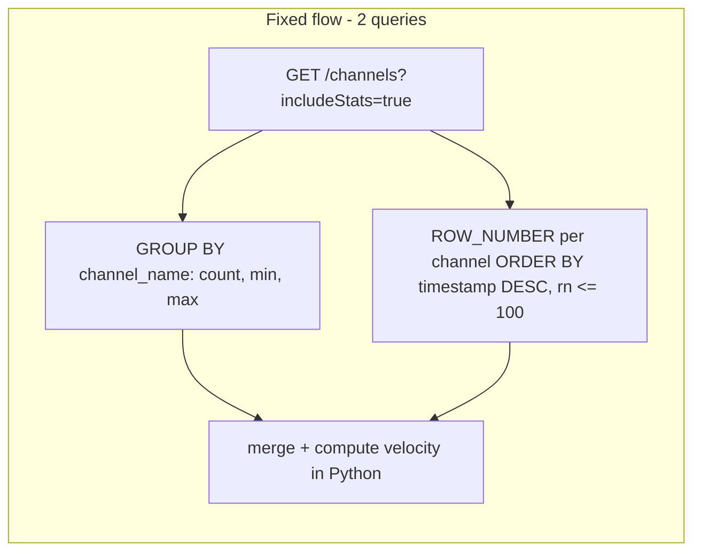

# Fix slow `GET /channels?includeStats=true`

## Root cause



[`compute_channel_stats`](backend/app/services/channels.py) loads **every post row** (including `text`) per channel. [`compute_channel_stats_batch`](backend/app/services/channels.py) loops 289 times. With 90-day retention this becomes 60s+.

Stats actually needed per channel (see [`ChannelStats`](frontend/src/types.ts)):

| Field | Current source | Cheap SQL equivalent |
|-------|----------------|----------------------|
| `count` | `len(posts)` | `COUNT(*)` |
| `minId` / `maxId` | min/max `post_id` | `MIN(post_id)`, `MAX(post_id)` |
| `velocity` | EMA on last 100 **timestamps** | top 100 `timestamp` values per channel (same as `sorted(all_ts)[-100:]`) |

## Target architecture



No API contract changes. Frontend keeps calling `includeStats=true` via [`listChannelsWithStats`](frontend/src/lib/repository.ts).

## Backend changes

### 1. Extract shared velocity helper

In [`backend/app/services/channels.py`](backend/app/services/channels.py), extract the EMA logic from `compute_channel_stats` into a pure function, e.g. `_velocity_from_timestamps(timestamps: list[int]) -> float`, preserving exact behavior (alpha=0.1, `datetime.utcnow()` for time-since-last, return `1/ema_diff`).

### 2. Replace batch stats with two SQL queries

Add `_fetch_channel_aggregates(session, channel_names)`:

```python
select(
    Post.channel_name,
    func.count().label("count"),
    func.min(Post.post_id).label("min_id"),
    func.max(Post.post_id).label("max_id"),
)
.where(col(Post.channel_name).in_(channel_names))
.group_by(Post.channel_name)
```

Add `_fetch_recent_timestamps_by_channel(session, channel_names, *, limit=100)` using SQLAlchemy window functions:

```python
rn = func.row_number().over(
    partition_by=Post.channel_name,
    order_by=col(Post.timestamp).desc(),
).label("rn")
# filter timestamp > 0, channel_name IN (...), rn <= 100
```

Group rows by `channel_name` in Python, sort each group's timestamps ascending, pass to `_velocity_from_timestamps`.

Rewrite `compute_channel_stats_batch` to:

1. Return `{}` early if `channel_names` is empty
2. Run both queries once
3. Build `{name: {count, minId, maxId, velocity}}` for channels with posts

Rewrite `compute_channel_stats` (single-channel endpoint `GET /channels/{id}/stats`) to delegate to the batch helper with one name — keeps one code path.

**Semantic note:** Top-100 by `timestamp DESC` is mathematically identical to `sorted(all_timestamps)[-100:]` used today. Channels with no posts or only `timestamp=0` rows return `None` / are omitted, same as now.

### 3. Keep `list_channels` unchanged at the route layer

[`list_channels`](backend/app/services/channels.py) already calls `compute_channel_stats_batch` when `include_stats=True`. No route or frontend changes required.

## Database index migration

Add Alembic migration creating a composite index on `tg_posts`:

```sql
CREATE INDEX ix_tg_posts_channel_name_timestamp
ON tg_posts (channel_name, timestamp DESC);
```

- Speeds the window query (`PARTITION BY channel_name ORDER BY timestamp DESC`)
- `channel_name` already has a single-column index ([`a1b2c3d4e5f6`](backend/app/alembic/versions/a1b2c3d4e5f6_add_tg_summarizer_tables.py)); the composite index replaces it for this access pattern (Postgres can still use the leading column for `channel_name` filters)

Migration file: new revision in [`backend/app/alembic/versions/`](backend/app/alembic/versions/).

## Tests

New file [`backend/tests/services/test_channel_stats.py`](backend/tests/services/test_channel_stats.py):

| Test | Asserts |
|------|---------|
| `test_batch_stats_count_min_max` | Seed 2 channels with known `post_id`/`timestamp`; batch returns correct `count`, `minId`, `maxId` |
| `test_batch_stats_velocity` | Seed monotonic timestamps; velocity > 0 and stable across single vs batch path |
| `test_batch_stats_empty_channel` | Channel with no posts omitted from result |
| `test_batch_stats_timestamp_zero_excluded` | Posts with `timestamp=0` ignored for velocity (matches `if p.timestamp`) |
| `test_single_channel_stats_delegates_to_batch` | `get_channel_stats` returns same shape as batch entry |

New API test in [`backend/tests/api/test_stats_logs.py`](backend/tests/api/test_stats_logs.py) (or dedicated `test_channels.py`):

- `PUT` a channel, `POST` a few posts via existing bulk-post route (or direct session seed)
- `GET /channels?includeStats=true` → 200, response includes `stats` with camelCase keys (`minId`, `maxId`, `velocity`)

Follow existing service test style from [`test_channel_coverage.py`](backend/tests/services/test_channel_coverage.py) (direct `Session(engine)` seeding).

## Verification

1. `cd backend && uv run pytest tests/services/test_channel_stats.py tests/api/test_stats_logs.py -q`
2. Manual: hit `GET /api/v1/data/channels?includeStats=true` with ~289 channels — expect **< 2s** (typically sub-second after index builds)
3. Channels tab should leave skeleton state quickly without other code changes

## Out of scope (follow-up, not in this plan)

- Frontend IndexedDB sequential `saveChannel` / `getChannelStats` loops in [`repository.ts`](frontend/src/lib/repository.ts) — smaller than the API fix; can batch in a separate PR
- `ChannelCard` `filteredPosts.filter(...)` per card — render optimization, unrelated to the 60s API wait
- Denormalized stats table / caching layer — unnecessary once SQL is fixed

## Risk / rollback

- Low risk: response shape unchanged; only computation path changes
- Index migration is additive (`CREATE INDEX CONCURRENTLY` not needed for typical staging volumes; standard Alembic `op.create_index` is fine)
- If velocity values differ in edge cases (timestamp ordering anomalies), batch path uses timestamp-based top-100 which is the intended metric for "activity rate"
