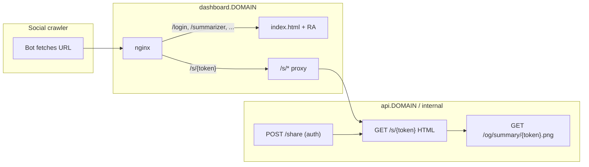

# Open Graph / Social Preview Meta (to perfection)

## Problem statement

This app is a **client-rendered SPA** (Vite + TanStack Router + nginx). Social crawlers (Facebook, Slack, Discord, LinkedIn, iMessage, Telegram link previews) **do not run JavaScript**. They only read the **initial HTML response**.

Today:
- [`frontend/index.html`](frontend/index.html) has `description` + favicons, but **no OG/Twitter tags**
- Route `head()` hooks exist (e.g. [`frontend/src/routes/_tg/summarizer.tsx`](frontend/src/routes/_tg/summarizer.tsx)) but only set `title`
- [`frontend/src/routes/__root.tsx`](frontend/src/routes/__root.tsx) renders `<HeadContent />` in the React tree **without a portal to `<head>`** — fine for in-browser tab titles, irrelevant for crawlers
- Summaries are auth-gated API resources ([`backend/app/api/routes/data.py`](backend/app/api/routes/data.py)); no public share URLs exist yet

Because you chose **future content sharing**, “perfection” requires **server-rendered HTML for share URLs**, not just client-side meta updates.



---

## Target OG spec (checklist)

Every public/share page should emit **both** Open Graph and Twitter Card tags, with **absolute URLs** (relative `og:image` breaks previews).

| Tag | App default | Share summary |
|-----|-------------|---------------|
| `og:title` | TG Summarizer | Summary headline (channels + date range) |
| `og:description` | App tagline | First ~200 chars of summary text (sanitized) |
| `og:image` | `/og-image.png` (1200×630) | `/og/summary/{token}.png` (generated) |
| `og:image:width/height/alt/type` | 1200, 630, alt text, `image/png` | same |
| `og:url` | canonical page URL | `https://dashboard…/s/{token}` |
| `og:type` | `website` | `article` |
| `og:site_name` |)
| `og:locale` | `en_US` | inherit |
| `twitter:card` | `summary_large_image` | same |
| `twitter:title/description/image/image:alt` | mirror OG | mirror OG |
| `link rel=canonical` | page URL | share URL |
| `meta name=description` | same as og:description | excerpt |
| JSON-LD | `WebApplication` | `Article` or `Report` |

Also add `meta name="robots"` policy: app shell routes `noindex` (private dashboard); share pages `noindex, nofollow` by default unless you later add a user-visible “make public/indexable” toggle.

---

## Phase 1 — Foundation (app-level previews)

**Goal:** Any pasted link to the dashboard shows a polished branded card, even before share links exist.

### 1.1 Central SEO module (frontend)

Add [`frontend/src/lib/seo.ts`](frontend/src/lib/seo.ts) with:
- Constants: `APP_NAME`, default title template, tagline, locale, default OG image path
- `getSiteUrl()` from new `VITE_SITE_URL` (fallback: `window.location.origin` in dev)
- `buildPageMeta({ title, description, path, image, type, noindex })` → TanStack Router `head()` shape (`meta` + `links`)

Wire into [`frontend/src/lib/env.ts`](frontend/src/lib/env.ts) + [`frontend/src/vite-env.d.ts`](frontend/src/vite-env.d.ts).

Env additions in [`.env.example`](.env.example) / [`frontend/.env.example`](frontend/.env.example):
```bash
VITE_SITE_URL=https://dashboard.example.com   # prod build
# optional: VITE_OG_TWITTER_SITE=@handle
```

Docker: pass `VITE_SITE_URL=https://dashboard.${DOMAIN}` as build arg in [`frontend/Dockerfile`](frontend/Dockerfile) + [`compose.yml`](compose.yml) (mirrors existing `FRONTEND_HOST` / backend [`Settings.FRONTEND_HOST`](backend/app/core/config.py)).

### 1.2 Branded OG image asset

Create **`frontend/public/og-image.png`** at **1200×630** (not the favicon scaled up):
- App palette from [`frontend/src/index.css`](frontend/src/index.css): `#141414`, `#e4e3e0`
- Title: “TG Summarizer”, subtitle: “Technical Telegram scraper & AI analyst”
- Reuse favicon motif (shrinking lines + arrow) from [`frontend/public/favicon.svg`](frontend/public/favicon.svg)

### 1.3 Build-time injection in `index.html` (crawler baseline)

Add a small Vite plugin in [`frontend/vite.config.ts`](frontend/vite.config.ts) using `transformIndexHtml` to inject the full default OG/Twitter/canonical/JSON-LD block with **absolute** `og:image` and `og:url` from `VITE_SITE_URL`.

This is what crawlers see for `/login`, `/summarizer`, etc. (all fall through to the same `index.html` via [`frontend/nginx.conf`](frontend/nginx.conf)).

Remove duplicate static `<title>` from [`frontend/index.html`](frontend/index.html) once root route owns title (TanStack Router dedupes nested `head`).

### 1.4 Fix SPA head rendering

Update [`frontend/src/routes/__root.tsx`](frontend/src/routes/__root.tsx):
- `createPortal(<HeadContent />, document.head)` per TanStack Router SPA guidance
- Add root `head: () => buildPageMeta({ …defaults })` so in-app navigation updates `<head>` correctly

Apply `buildPageMeta` to all routes with `head()` — fix stale “FastAPI Template” titles as part of the same pass ([`frontend/src/routes/_layout/index.tsx`](frontend/src/routes/_layout/index.tsx), auth routes, [`summarizer.tsx`](frontend/src/routes/_tg/summarizer.tsx)).

### 1.4b Backend SEO constants (mirror)

Add [`backend/app/core/seo.py`](backend/app/core/seo.py) with the same strings + `FRONTEND_HOST`-derived absolute URLs. Keeps share HTML and OG image generation consistent with the frontend module (single source of truth for copy, not duplicated magic strings).

### 1.5 Tests (Phase 1)

- **Build test:** after `vite build`, parse `dist/index.html` and assert required OG/Twitter tags + absolute image URL when `VITE_SITE_URL` is set
- **Playwright smoke:** logged-out visit to `/login` → `document.querySelector('meta[property="og:title"]')` exists (validates portal + router head)

Manual validation checklist (document in PR): Facebook Sharing Debugger, LinkedIn Post Inspector, Slack unfurl, i_failures iMessage.

---

## Phase 2 — Share link infrastructure (dynamic previews)

**Goal:** `https://dashboard…/s/{token}` renders rich previews for a specific summary.

### 2.1 Data model

New table `tg_share_links` (Alembic migration):
- `token` (URL-safe, indexed, unique) — e.g. `secrets.token_urlsafe(16)`
- `resource_type` (`summary` initially; extensible to `post` later)
- `resource_id` (summary id)
- `created_by` (user_id)
- `created_at`, `expires_at` (nullable), `revoked_at` (nullable)
- `extra` JSON (optional: custom title override, `allow_indexing` flag)

### 2.2 Authenticated API (create/revoke)

New router [`backend/app/api/routes/share.py`](backend/app/api/routes/share.py):
- `POST /api/v1/share/summaries/{summary_id}` → `{ token, url, expiresAt }`
- `DELETE /api/v1/share/{token}` → revoke
- `GET /api/v1/share/{token}` → **public** JSON preview `{ title, description, imageUrl, resourceType }` (for SPA hydration + testing)

Register in [`backend/app/api/main.py`](backend/app/api/main.py).

Authorization: only summary owner (or admin) can create/revoke. Public GET returns **sanitized excerpt only** — never full private channel lists if you decide that’s sensitive (configurable in `extra`).

### 2.3 Server-rendered HTML for crawlers + humans

New **non-API** routes on FastAPI (top-level, not under `/api/v1`):
- `GET /s/{token}` → minimal HTML document:
  - Full OG + Twitter + canonical + JSON-LD (`Article`)
  - Visible `<h1>` + excerpt for no-JS fallback
  - `<script type="module" src="/assets/…">` or redirect to SPA route `/s/$token` once frontend route exists

Template: [`backend/app/templates/share_preview.html`](backend/app/templates/share_preview.html) (Jinja2 — FastAPI supports this out of the box).

Use [`backend/app/core/seo.py`](backend/app/core/seo.py) + share service to populate tags.

### 2.4 nginx routing (production + docker dev)

Update [`frontend/nginx.conf`](frontend/nginx.conf):
```nginx
location ^~ /s/ {
  proxy_pass http://backend:8000;
  proxy_set_header Host $host;
  proxy_set_header X-Forwarded-Proto $scheme;
}
location ^~ /og/ {
  proxy_pass http://backend:8000;
  …
}
```

Add matching proxy in [`frontend/vite.config.ts`](frontend/vite.config.ts) dev server for `/s` and `/og` → `localhost:8000` (same pattern as `/api`).

**Why proxy via dashboard domain:** Share URLs must live on `dashboard.${DOMAIN}` so `og:url` matches the pasted link. Backend stays on `api.${DOMAIN}` for JSON API only.

### 2.5 Frontend share UX

- New route [`frontend/src/routes/s.$token.tsx`](frontend/src/routes/s.$token.tsx) — read-only summary viewer for humans arriving via share link (uses public `GET /api/v1/share/{token}` + optional login CTA)
- “Copy share link” action in [`frontend/src/components/SummaryView.tsx`](frontend/src/components/SummaryView.tsx) / [`HistoryView.tsx`](frontend/src/components/HistoryView.tsx) calling `POST /share/summaries/{id}`

---

## Phase 3 — Dynamic OG images (polish)

**Goal:** Summary cards show a unique preview image, not the generic app card.

### 3.1 Image endpoint

`GET /og/summary/{token}.png` on backend:
- Validate token → load summary metadata
- Render 1200×630 PNG via **Pillow** (add dependency) using the same layout as static `og-image.png` but with dynamic title (channels + date range) and 2–3 line excerpt
- Response headers: `Cache-Control: public, max-age=3600`, `Content-Type: image/png`

Point share HTML `og:image` / `twitter:image` to `https://dashboard…/og/summary/{token}.png`.

### 3.2 Fallback

If image generation fails, fall back to static `/og-image.png` (never leave `og:image` empty).

---

## Phase 4 — Hardening & ops

- **`robots.txt`** in [`frontend/public/robots.txt`](frontend/public/robots.txt): disallow `/summarizer`, `/admin`, etc.; allow `/s/` if you want share pages discoverable (default: disallow all + `noindex` on share HTML)
- **Security:** rate-limit public `GET /s/{token}` and `/og/…`; constant-time token lookup; revoke on summary delete (DB cascade or service hook in [`backend/app/services/summaries.py`](backend/app/services/summaries.py))
- **Observability:** log share preview hits; Sentry breadcrumb on 404 token
- **Tests:**
  - Backend: HTML response contains expected meta for fixture summary + token
  - Backend: expired/revoked token → 404 HTML with safe default OG (or generic “Link unavailable” card)
  - PNG endpoint returns `image/png` with correct dimensions
- **Manual QA matrix:** paste share URL into Slack, Telegram, iMessage, LinkedIn, X, Discord

---

## Implementation order (recommended)

1. Phase 1 entirely — immediate value, low risk, unblocks all routes
2. Phase 2.1–2.4 — share data + HTML endpoint + nginx (previews work before UI button)
3. Phase 2.5 — frontend share UX
4. Phase 3 — dynamic images
5. Phase 4 — hardening

---

## Out of scope (unless you expand later)

- Full SSR migration (TanStack Start) — unnecessary if `/s/*` HTML is server-rendered
- Public share for raw **posts** — same `ShareLink` model extends with `resource_type=post`
- Per-tab OG for `/summarizer?tab=posts` — low value (auth-gated, crawlers can’t access); not worth prerendering

---

## Key files to touch

| Area | Files |
|------|-------|
| SEO core | `frontend/src/lib/seo.ts`, `backend/app/core/seo.py` |
| Build injection | `frontend/vite.config.ts`, `frontend/index.html` |
| Router head | `frontend/src/routes/__root.tsx`, all route `head()` hooks |
| Assets | `frontend/public/og-image.png`, `frontend/public/robots.txt` |
| Share backend | `backend/app/models_tg.py`, migration, `backend/app/services/share.py`, `backend/app/api/routes/share.py`, `backend/app/templates/share_preview.html` |
| Infra | `frontend/nginx.conf`, `frontend/vite.config.ts`, `frontend/Dockerfile`, `compose.yml`, `.env.example` |
| UI | `frontend/src/routes/s.$token.tsx`, `SummaryView.tsx` |
| Tests | new `frontend/src/lib/seo.test.ts`, `backend/tests/api/test_share.py`, build meta test script |
