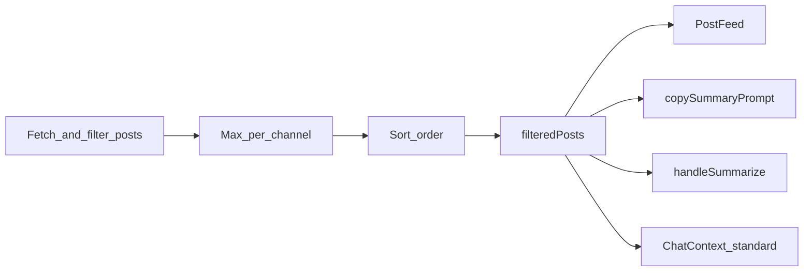

# Post view filters (max per channel + sort order)

## Goal

Add two controls on the **Posts** tab:

1. **Max posts per channel** — `0` = unlimited (shown in UI as **Unlimited**); when &gt; 0, pick posts per channel using **Latest** or **Random**
2. **Sort order** — **By time** (current default) or **By channel, then time** (groups sorted A→Z by `channelName`; within each group, newest first)

Defaults preserve today’s behavior: unlimited, latest mode (inactive until limit &gt; 0), sort by global time descending.

**Contract:** [`filteredPosts`](frontend/src/contexts/ScraperContext.tsx) is the single ordered list. The Posts feed, Copy Prompt, in-app summary stream, and standard chat must all use this array **as-is** (no re-sorting downstream).



---

## 1. Shared post-processing module

Create [`frontend/src/lib/posts/post-view.ts`](frontend/src/lib/posts/post-view.ts) with pure functions + unit tests [`frontend/src/lib/posts/post-view.test.ts`](frontend/src/lib/posts/post-view.test.ts).

**Types:**

```ts
type MaxPostsPerChannelMode = "latest" | "random"
type PostSortOrder = "time" | "channel_time"

interface PostViewOptions {
  maxPostsPerChannel: number      // 0 = unlimited
  maxPostsPerChannelMode: MaxPostsPerChannelMode
  postSortOrder: PostSortOrder
}
```

**Pipeline order** (apply after keyword + forwarded filters, on any source path):

1. `applyMaxPostsPerChannel(posts, options)` — group by `channelName`; if limit &gt; 0:
   - **latest:** per channel, sort by `timestamp` desc, take first N
   - **random:** per channel, **seeded shuffle** (seed = hash of `channelName + startDate + endDate + limit + sorted channel names`) so the same filter settings yield the same sample until underlying posts change; then take N
   - channels with fewer than N posts: keep all
2. `sortPosts(posts, options)`:
   - **time:** `timestamp` desc (current behavior)
   - **channel_time:** partition by `channelName`, order groups `localeCompare`, within group `timestamp` desc; concatenate

Also move [`buildPostsText`](frontend/src/contexts/AIContext.tsx) here as `formatPostsForPrompt(posts: Post[])` — maps posts **in array order** (no re-sort).

Export a single composer:

```ts
function applyPostViewPipeline(
  posts: Post[],
  view: PostViewOptions,
  seedContext?: { startDate: number; endDate: number },
): Post[]
```

---

## 2. ScraperContext integration

In [`frontend/src/contexts/ScraperContext.tsx`](frontend/src/contexts/ScraperContext.tsx):

**New state** (persist to `localStorage`, same pattern as channel grid sort):

| Key | Default |
|-----|---------|
| `postFilter_maxPerChannel` | `0` |
| `postFilter_maxPerChannelMode` | `"latest"` |
| `postFilter_sortOrder` | `"time"` |

Expose via context: getters + setters for all three.

**Update `handleFilterPosts`** — after existing filters in **all three branches** (date-range, semantic, related-post search), run `applyPostViewPipeline` before `setFilteredPosts`.

Current date-range path ends with:

```303:303:frontend/src/contexts/ScraperContext.tsx
        setFilteredPosts(posts.sort((a, b) => b.timestamp - a.timestamp))
```

Replace with pipeline call using `postSortOrder` (not hardcoded sort).

Add `maxPostsPerChannel`, `maxPostsPerChannelMode`, `postSortOrder` to the `handleFilterPosts` dependency array.

---

## 3. Posts tab UI

In [`frontend/src/components/PostFilter.tsx`](frontend/src/components/PostFilter.tsx), add a new row **“Post limit & order”** (below Post Type or in the time-filters section):

**Max per channel**

- Number input, `min={0}`, no practical max (or cap at e.g. 500)
- When value is `0`, show adjacent badge/label **Unlimited** (not a blank mystery)
- Mode toggle (only meaningful when limit &gt; 0; disabled or dimmed when unlimited):
  - **Latest** | **Random**

**Sort order**

- Segmented control / pill buttons:
  - **By time** (default)
  - **By channel**

Use existing PostFilter styling (uppercase labels, pill buttons like forwarded filter).

In [`frontend/src/components/PostFeed.tsx`](frontend/src/components/PostFeed.tsx), enrich the subtitle under “Selected Posts”:

- Always: `{n} posts in range`
- When limit &gt; 0: append `(max {N}/channel, {latest|random})`
- When sort is `channel_time`: append `(grouped by channel)`

---

## 4. Keep AI prompt order in sync

### Already correct (once pipeline lives in ScraperContext)

- [`copySummaryPrompt`](frontend/src/contexts/AIContext.tsx) — uses `filteredPosts` + `buildPostsText`
- [`handleSummarize`](frontend/src/contexts/AIContext.tsx) — uses `filteredPosts` when no pre-sync refetch

### Must fix (today they bypass pipeline)

Pre-sync refetch blocks in [`AIContext.tsx`](frontend/src/contexts/AIContext.tsx) (~L174–187) and [`ChatContext.tsx`](frontend/src/contexts/ChatContext.tsx) (~L186–203) re-fetch from DB, apply only keyword filter, then **hard-sort by time** — ignoring forwarded filter, max-per-channel, and sort order.

**Fix:** extract shared helper in `post-view.ts` (or a thin `post-fetch.ts`):

```ts
function buildFilteredPostsFromRaw(
  posts: Post[],
  ctx: {
    searchText: string
    forwardedFilter: ...
    channels: Channel[]
    view: PostViewOptions
    startDate: number
    endDate: number
  },
): Post[]
```

Use in `handleFilterPosts` **and** in AI/Chat pre-sync paths instead of inline logic.

After refetch, assign `postsToSummarize` / `postsToChat` from helper output; call `handleFilterPosts()` to refresh UI state.

### Use shared prompt formatter

- Replace inline `buildPostsText` in AIContext with `formatPostsForPrompt`
- Replace duplicated `.map(...).join(...)` in ChatContext (~L209–214) with same helper

### Explicitly out of scope

- **RAG / history chat mode** — uses `searchSimilarPosts`, not `filteredPosts`; unchanged
- **`generateBackgroundSummary`** / server [`auto_summary.py`](backend/app/jobs/auto_summary.py) — automated jobs, not driven by Posts tab view settings
- **Pending pasted summaries** — `promptText` is frozen at copy time; no change

---

## 5. Command palette / clear filters

Update [`frontend/src/lib/commands/post-filters.ts`](frontend/src/lib/commands/post-filters.ts) `clearPostFilters` to reset view options to defaults (unlimited, latest, by time).

Wire new setters through [`useCommandRegistry`](frontend/src/hooks/useCommandRegistry.ts) / [`CommandContext`](frontend/src/lib/commands/types.ts) if needed for clear to work.

---

## 6. Tests

**Unit** — `post-view.test.ts`:

- Unlimited + by time → identical to current global desc sort
- Max latest: 2/channel across 3 channels → 6 posts max, correct per-channel picks
- Max random: deterministic given seed context
- Sort `channel_time`: groups alphabetical, within-group newest first
- Pipeline order: cap then sort (e.g. channel sort after cap)

**Optional Playwright** — extend [`frontend/tests/summarizer.spec.ts`](frontend/tests/summarizer.spec.ts): set max-per-channel + grouped sort, verify post feed order matches Copy Prompt text order (smoke only if test data exists).

---

## Files to touch

| File | Change |
|------|--------|
| `frontend/src/lib/posts/post-view.ts` | New pipeline + prompt formatter |
| `frontend/src/lib/posts/post-view.test.ts` | Unit tests |
| `frontend/src/contexts/ScraperContext.tsx` | State, pipeline in all filter branches |
| `frontend/src/components/PostFilter.tsx` | UI controls |
| `frontend/src/components/PostFeed.tsx` | Count/limit subtitle |
| `frontend/src/contexts/AIContext.tsx` | Use shared pipeline + formatter |
| `frontend/src/contexts/ChatContext.tsx` | Use shared pipeline + formatter |
| `frontend/src/lib/commands/post-filters.ts` | Reset new options on clear |
| `frontend/src/hooks/useCommandRegistry.ts` | Pass new setters (if needed) |

No backend or DB changes.
