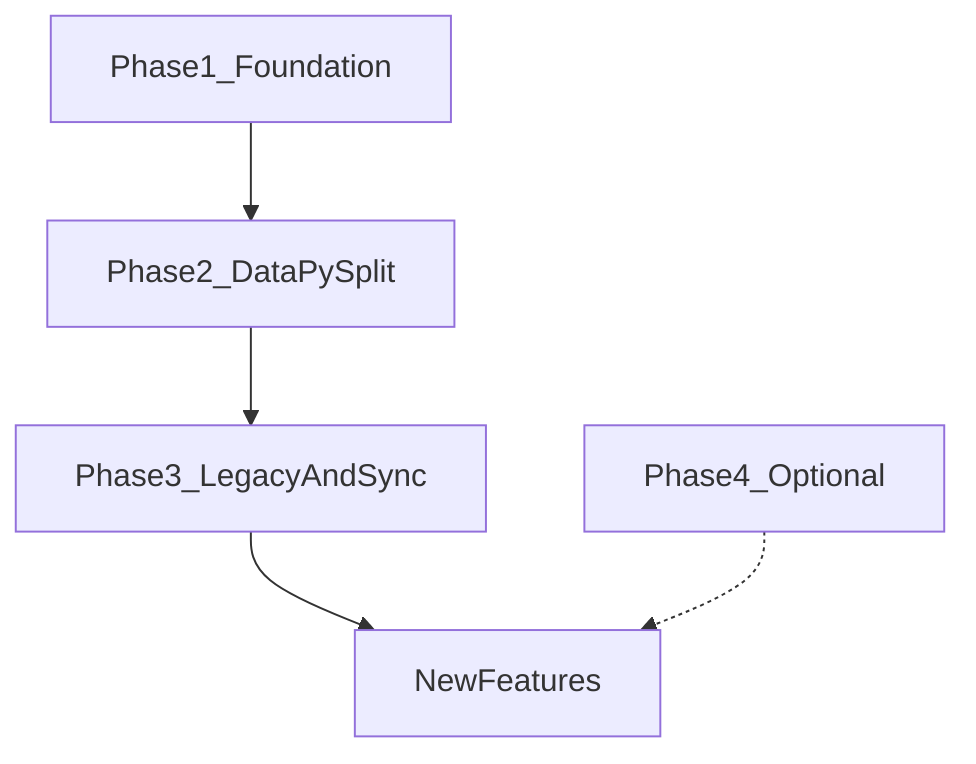

# Pre-Feature Codebase Cleanup Plan

Migration Phases 0–7 are done. This plan closes **migration tail artifacts**, **missing quality gates**, and **structural hotspots** so new features land on a stable base.

**Tooling baseline:** Align with the [Full Stack FastAPI Template](https://github.com/fastapi/full-stack-fastapi-template) conventions. Local reference clone: [`_template_tmp/`](_template_tmp/). Where TG-specific needs diverge (legacy OpenAPI exclusion, TG domain docs), note the deviation explicitly.

### Template conventions to adopt

| Area | Template (`_template_tmp`) | TG project today | Action |
|------|---------------------------|------------------|--------|
| Pre-commit | `.pre-commit-config.yaml` at repo root | Missing | Copy + adapt |
| CI quality gate | `.github/workflows/pre-commit.yml` (prek on PRs) | Missing | Add (not a separate `lint.yml`) |
| Frontend lint | Biome (`biome.json`, `biome check`) | `tsc --noEmit` only | Adopt Biome |
| Backend lint | `lint.sh` (mypy, ty, ruff) via pre-commit local hooks | Script exists, unwired | Wire via pre-commit |
| SDK regen | `generate-client.sh` + pre-commit `generate-frontend-sdk` hook | Script exists, no hook | Align script + hook |
| Security lint | `zizmor.yml` workflow + pre-commit zizmor hook | zizmor dep only | Add both |
| Typos | `[tool.typos]` in root `pyproject.toml` + pre-commit hook | Missing | Add |
| E2E tests | Playwright only (no Vitest) | Vitest files orphaned | Drop Vitest |
| Root scripts | `package.json` workspaces + `bun run lint` | Already similar | Keep |

### TG deviations from template (intentional)

- **OpenAPI export:** `ENVIRONMENT=production` during `generate-client.sh` to exclude legacy `/api/*` routes from committed SDK (template has no legacy router)
- **Backend README / development.md:** TG operator runbooks (sync, bulk-reset-sync, per-channel auto-follow) appended to template structure
- **Dual frontend API clients:** Hand-written `frontend/src/api/` for summarizer + generated `frontend/src/client/` for admin shell (ADR-006)
- **Branch name:** `main` not `master` in workflows
- **No `release-notes.md`:** skip `add-release-date` pre-commit hook

---



---

## Phase 1 — Foundation and hygiene (Session 1, ~half day)

Highest leverage; unblocks safe iteration. No behavior changes. **Follow `_template_tmp` patterns first.**

### 1.1 Pre-commit CI workflow (template: `pre-commit.yml`)

**Problem:** Quality checks run locally only. Template enforces them on every PR via [`.github/workflows/pre-commit.yml`](_template_tmp/.github/workflows/pre-commit.yml) — not a standalone lint workflow.

**Action:** Add [`.github/workflows/pre-commit.yml`](.github/workflows/pre-commit.yml) adapted from template:

- Trigger: `pull_request` (`opened`, `synchronize`) — same as template
- Setup: `uv sync --all-packages`, `bun ci`, Python 3.10+ (match existing backend CI)
- Run: `uv run prek run --from-ref origin/${GITHUB_BASE_REF} --to-ref HEAD --show-diff-on-failure`
- Branch: use `main` (template uses `master`)
- **Optional:** `PRE_COMMIT` secret + auto-commit bot (template pattern) — skip initially for single-operator repo; use `pre-commit-ci/lite-action` fallback for forks
- Add `pre-commit-alls-green` job for branch protection compatibility (template pattern)

**Do not** add a separate `lint.yml` — pre-commit hooks cover backend `lint.sh` equivalents plus frontend Biome.

### 1.2 Pre-commit config (template: `.pre-commit-config.yaml`)

**Problem:** [`development.md`](development.md) documents `uv run prek install` (lines 238–244) but no [`.pre-commit-config.yaml`](.pre-commit-config.yaml) exists.

**Action:** Copy [`_template_tmp/.pre-commit-config.yaml`](_template_tmp/.pre-commit-config.yaml) and adapt:

| Hook | Template | TG adaptation |
|------|----------|---------------|
| `check-added-large-files`, `check-toml`, `check-yaml`, `end-of-file-fixer`, `trailing-whitespace` | Yes | Same; keep `frontend/src/client/**` excludes |
| `typos` | Yes | Add `[tool.typos]` to root [`pyproject.toml`](pyproject.toml) (copy from `_template_tmp`) |
| `local-biome-check` | `npm run lint` | `bun run lint` (root [`package.json`](package.json) already has filter script) |
| `local-ruff-check` / `local-ruff-format` | `uv run ruff …` | Same |
| `local-mypy` | `uv run mypy backend/app` | Same |
| `local-ty` | `uv run ty check backend/app` | Same |
| `generate-frontend-sdk` | `bash ./scripts/generate-client.sh` on `backend/**` changes | Same — replaces separate OpenAPI drift CI step |
| `add-release-date` | `release-notes.md` | **Skip** — no `release-notes.md` in TG repo |
| `zizmor` | `uv run zizmor .` on workflows | Same |

Run once: `cd backend && uv run prek install -f`.

Expand [`development.md`](development.md) Pre-commit section to match template style ([`_template_tmp/development.md`](_template_tmp/development.md) lines 140–181): install, auto-run on commit, manual `prek run --all-files`, expected hook list.

### 1.3 Adopt Biome for frontend lint

**Problem:** Template uses Biome ([`_template_tmp/frontend/biome.json`](_template_tmp/frontend/biome.json), `lint` = `biome check`). TG uses `tsc --noEmit` only; Biome VS Code extension is recommended but not configured.

**Action:**

1. Add `@biomejs/biome` to [`frontend/package.json`](frontend/package.json) devDependencies
2. Copy [`biome.json`](_template_tmp/frontend/biome.json) to `frontend/biome.json`; extend `files.includes` excludes for TG-only generated paths if needed (`src/routeTree.gen.ts`, `src/client/**`, `src/components/ui/**` — same as template)
3. Change `lint` script to: `biome check --write --unsafe --no-errors-on-unmatched --files-ignore-unknown=true ./`
4. Align `build` with template: `tsc -p tsconfig.build.json && vite build` (typecheck at build time, Biome at lint time)
5. First run will auto-fix many files — commit as part of PR1 (expected one-time churn)
6. Remove unused `eslint` devDep if present and unwired

### 1.4 Zizmor workflow

**Problem:** Template has [`.github/workflows/zizmor.yml`](_template_tmp/.github/workflows/zizmor.yml) plus pre-commit hook. TG has `zizmor` in root dev deps only.

**Action:** Add `zizmor.yml` workflow (push + PR to `main`). Use pinned `zizmorcore/zizmor-action` SHA from template.

### 1.5 Declare `python-dotenv`

**Problem:** [`backend/tests/conftest.py`](backend/tests/conftest.py) and maintenance scripts import `dotenv` but it is **not declared** in [`backend/pyproject.toml`](backend/pyproject.toml) (relies on transitive dep).

**Action:** Add `python-dotenv` to `[dependency-groups] dev` in `backend/pyproject.toml`; run `uv lock`.

### 1.6 Regenerate OpenAPI and admin client

**Problem:** Committed [`frontend/openapi.json`](frontend/openapi.json) is stale — missing recent endpoints (`/api/v1/ai/summary/prompt`, `/api/v1/jobs/runtime-config`, `/api/v1/data/channels/bulk-reset-sync`). [`scripts/generate-client.sh`](scripts/generate-client.sh) imports `app.main` which mounts [`legacy.router`](backend/app/main.py) when `ENVIRONMENT != "production"`, polluting [`frontend/src/client/sdk.gen.ts`](frontend/src/client/sdk.gen.ts) with `LegacyService`.

**Action:**

1. Update [`scripts/generate-client.sh`](scripts/generate-client.sh):
   - **TG deviation:** export OpenAPI with `ENVIRONMENT=production` so legacy `/api/*` routes are excluded from committed artifacts (template includes all routes; we have a legacy router only in non-prod)
   - **Template alignment:** append `bun run lint` after client generation (see [`_template_tmp/scripts/generate-client.sh`](_template_tmp/scripts/generate-client.sh))
2. Run `bash scripts/generate-client.sh`; commit `frontend/openapi.json` + `frontend/src/client/*`
3. Verify summarizer hand-written client in [`frontend/src/api/`](frontend/src/api/) is unaffected (ADR-006)
4. The `generate-frontend-sdk` pre-commit hook will keep artifacts in sync going forward

### 1.7 Fix stale operator docs

**Problem:** [`development.md`](development.md) lines 175–194 still document deprecated `bulk_reresolve_start_ids.py`, global Settings auto-follow, and `bulk-reresolve-start-ids` API — contradicted by [`MEMORY.md`](MEMORY.md) (per-channel toggle on ChannelCard; bulk-reset-sync is the fix).

**Action:** Replace section **"Bulk start-ID fix"** with:

- **Bulk re-backfill:** `POST /api/v1/data/channels/bulk-reset-sync` with `{"confirm": true}`; link to [`backend/scripts/`](backend/scripts/) maintenance table in MEMORY.
- **Auto-follow:** per-channel toggle on ChannelCard (`autoFollowForwarded`); cleanup script for discovered channels unchanged.
- Note `bulk_reresolve_start_ids.py` as deprecated no-op (compat only).

Also trim [`README.md`](README.md) legacy `/api/*` references if still present.

### 1.8 Test for Copy Prompt endpoint

**Problem:** [`POST /api/v1/ai/summary/prompt`](backend/app/api/routes/ai_routes.py) shipped 2026-06-22 with **no dedicated test**. Auth smoke in [`backend/tests/api/test_route_auth.py`](backend/tests/api/test_route_auth.py) only covers `/ai/summary`.

**Action:** Add `backend/tests/api/test_ai_summary.py`:

- `test_summary_prompt_returns_prompt` — authenticated POST, assert `{"prompt": "..."}` shape, no `GEMINI_API_KEY` required
- `test_summary_prompt_requires_auth` — 401 without token
- Reuse existing fixtures from [`backend/tests/conftest.py`](backend/tests/conftest.py)

### 1.9 Archive stale plan file

**Problem:** [`.cursor/plans/proxy-bound_worker_pool_9e908eeb.plan.md`](.cursor/plans/proxy-bound_worker_pool_9e908eeb.plan.md) has all todos `pending` though IDEA-003 is **Done** in [`docs/ideas-log/IDEAS-LOG.md`](docs/ideas-log/IDEAS-LOG.md).

**Action:** Mark all plan todos `completed` (do not delete — MEMORY says not to edit the locked migration study plan; this proxy plan is separate).

---

## Phase 2 — `data.py` decomposition (Session 2, 1–2 days)

**Problem:** [`backend/app/api/routes/data.py`](backend/app/api/routes/data.py) is 1,222 lines with 66 handlers, inline Pydantic models, and camelCase helpers duplicated from [`backend/app/services/serialization.py`](backend/app/services/serialization.py) (which today only has `to_snake` / `normalize_body`).

This is the **main blocker** for clean data API features. Split in behavior-preserving phases.

### 2.1 Phase 2a — Unify serialization (no route changes)

**Action:**

1. Extend [`backend/app/services/serialization.py`](backend/app/services/serialization.py) with `to_camel`, `model_to_camel`, and entity serializers currently in `data.py` (`channel_to_camel`, `post_to_camel`, `bot_to_camel`, log serializers, etc.).
2. Delete duplicated `_CAMEL_OVERRIDES` / helpers from `data.py`; import from `serialization.py`.
3. Update [`backend/app/api/routes/rag.py`](backend/app/api/routes/rag.py) to use shared `post_to_camel` instead of local `_post_to_camel`.
4. Run full pytest suite — zero API response changes expected.

### 2.2 Phase 2b — Extract request/response schemas

**Action:** Create [`backend/app/schemas/data.py`](backend/app/schemas/data.py) for inline models:

- `BulkReresolveStartIdsRequest`, `BulkResetSyncRequest` (lines 63–77 today)
- Any import/export body shapes from `import_data` / `export_data`

Update `data.py` imports only.

### 2.3 Phase 2c — Thin handlers (incremental, by domain)

**Action:** For each domain group, move business logic into existing or new service modules under [`backend/app/services/`](backend/app/services/), leaving `data.py` routes as thin `SessionDep` wrappers:

| Domain | Target service | Routes (approx.) |
|--------|----------------|------------------|
| Channels | extend `bulk_channels.py` | list/upsert/delete/stats, bulk endpoints |
| Posts | new `posts.py` or extend existing | list, bulk_upsert |
| Summaries | already in `summaries.py` | wire routes to service |
| Bots / destinations | new `credentials.py` | bot + chat dest CRUD |
| Embeddings / translations | extend `embeddings.py` | list/upsert |
| Logs | already in `logs.py` | wire list/create routes |
| Settings / network | `network_settings.py`, `runtime_config.py` | get/put settings |
| Import/export | new `data_import_export.py` | large blocks at end of file |

Do **one domain per PR** to keep reviews manageable. Goal: `data.py` under ~300 lines of route wiring.

### 2.4 Update backend README

**Problem:** [`backend/README.md`](backend/README.md) is template boilerplate — references only `models.py`, no TG domain.

**Action:** Keep template README **structure** ([`_template_tmp/backend/README.md`](_template_tmp/backend/README.md): Docker workflow, uv, VS Code, pytest) and **append** TG-specific sections:

- Domain models: `models_tg.py` (not just `models.py`)
- Key services map (`sync_orchestrator`, `proxy_pool`, `summaries`, …)
- Scheduler single-replica caveat
- `app_test` isolation + maintenance scripts
- Link to [`development.md`](development.md) for TG operator runbooks

Do not strip template sections that still apply (uv, Docker, pytest).

---

## Phase 3 — Legacy API exit and sync hardening (optional before large sync/RAG features)

### 3.1 Legacy API strategy

**Current state:** [`backend/app/main.py`](backend/app/main.py) mounts `legacy.router` in non-production; production returns 410 for `/api/*` paths.

**Action:**

1. Document supported surface as `/api/v1/*` only in README + `development.md`.
2. After OpenAPI regen excludes legacy (Phase 1.4), grep frontend for `/api/` outside v1 — fix cosmetic log URLs in [`SettingsView.tsx`](frontend/src/) if any remain.
3. Set a deprecation note on [`backend/app/api/routes/legacy.py`](backend/app/api/routes/legacy.py) and `bulk-reresolve-start-ids` no-op endpoint; removal after one release if unused.
4. Do **not** delete `TG-Summarizer/` reference docs — tree may be absent from this clone; add one-line note in README if intentional.

### 3.2 Sync orchestrator DB offload audit

**Problem:** [`sync_orchestrator.py`](backend/app/services/sync_orchestrator.py) still has **8** `with Session(engine)` blocks vs **9** `run_db` calls — blocking ORM in async paths under load ([`MEMORY.md`](MEMORY.md) caveat).

**Action:**

1. Inventory each `with Session(engine)` block — classify as sync-safe vs should offload.
2. Convert channel-loop and page-persist paths to `run_db` where sessions are held across I/O.
3. Add focused test or extend [`backend/tests/api/test_sync_jobs.py`](backend/tests/api/test_sync_jobs.py) if behavior-sensitive.
4. Only tune [`backend/app/core/db.py`](backend/app/core/db.py) pool (`pool_pre_ping`, `pool_size`) if profiling shows need — defer by default.

---

## Phase 4 — Optional / can run parallel to features

Lower priority; pick up when touching related areas. **Defer template workflows we don't need yet** (e.g. `smokeshow.yml` coverage badges, `guard-dependencies.yml`, `add-to-project.yml`).

| Item | Action | Effort |
|------|--------|--------|
| Playwright workflows | Extend [`frontend/tests/summarizer.spec.ts`](frontend/tests/) for Copy Prompt + paste modal happy path | Medium |
| `compose.override.yml` | Remove htmlcov volume TODO (line 81) once local coverage workflow settled | Small |
| REMEDIATION-PLAN checkboxes | Audit [`docs/migration/REMEDIATION-PLAN.md`](docs/migration/REMEDIATION-PLAN.md) — mark completed QWs | Small |
| Template admin shell | Keep `/_layout/*` routes (template pattern) unless explicitly dropping | Deferred |
| Vitest | **Remove** — template uses Playwright only; delete 8 orphaned `*.test.ts` files + `vitest` devDep | Small |
| Smokeshow coverage badge | Add [`smokeshow.yml`](_template_tmp/.github/workflows/smokeshow.yml) if public coverage badge desired | Optional |

---

## Explicitly out of scope

Per [`MEMORY.md`](MEMORY.md) — do **not** include in this cleanup:

- Mode B multi-user tenancy
- pgvector, Celery/Redis, producer-consumer job queue
- Proxy pool v2 (weighted pick, circuit breaker, http2)
- React context flattening (8 → 4)
- Deleting deprecated compat endpoints without deprecation window
- Removing `TG-Summarizer/` reference tree

---

## Verification checklist (run after each phase)

```bash
# Phase 1+ (template-aligned)
cd backend && uv run prek run --all-files   # or: bash scripts/lint.sh + bun run lint
cd backend && uv run pytest tests/ -q
bash scripts/generate-client.sh             # includes bun run lint
uv run zizmor .                             # from repo root
```

Pre-commit CI on PRs runs the same hooks via `prek run --from-ref …`.

---

## Suggested PR breakdown

1. **PR1:** Phase 1 — template tooling (pre-commit config + CI, Biome, typos, zizmor, dotenv, OpenAPI regen, docs, AI prompt test, plan archive). Expect a larger diff from Biome first-run fixes.
2. **PR2:** Phase 2a (serialization unification)
3. **PR3:** Phase 2b (schemas extract)
4. **PR4+:** Phase 2c (one domain per PR)
5. **PR5:** Phase 2.4 (backend README — template structure + TG appendix)
6. **PR6:** Phase 3 (legacy docs + sync DB audit) — when approaching sync-scale features
7. **PR7 (optional):** Phase 4 — Vitest removal, Playwright Copy Prompt spec

After PR1 + PR2, the codebase is in good shape to start new product features from [`docs/ideas-log/IDEAS-LOG.md`](docs/ideas-log/IDEAS-LOG.md).
