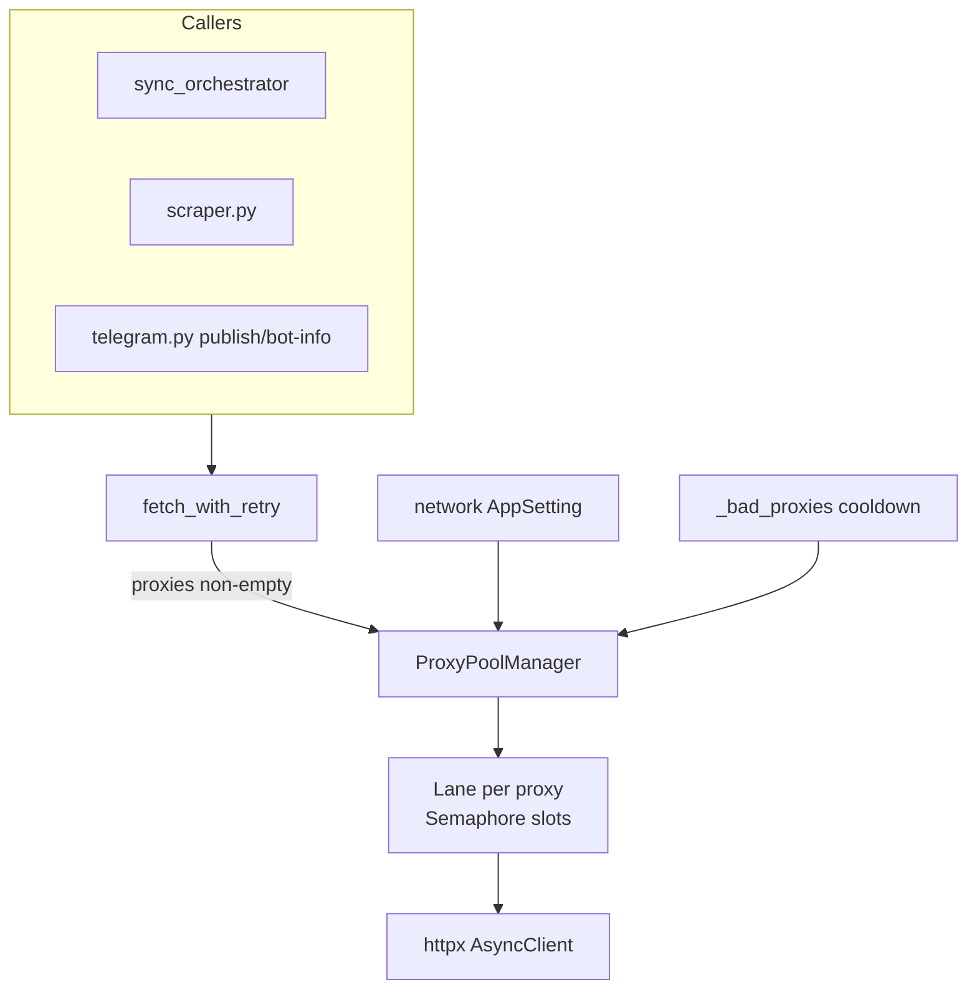

# Proxy-bound worker pool

## Goal

Replace random per-attempt proxy selection in [`backend/app/services/network.py`](backend/app/services/network.py) with a **proxy lane pool**: each resolved proxy is a lane with its own `asyncio.Semaphore(max_parallel)`. A request **acquires a lane slot before HTTP** and releases it after (success or failure). Default `max_parallel = 1` for every proxy; specific proxies can be overridden.

Scope (confirmed): **all proxied** `fetch_with_retry` calls — scraping (`t.me`), Bot API (`api.telegram.org`), publish, etc. Direct requests (`proxies=None`) stay unchanged. `test_proxy()` bypasses the pool so health checks do not block sync.

## Architecture



**Dispatch policy (v1):** among lanes not in cooldown, pick the lane with the **most free slots** (least loaded); tie-break round-robin. On retry after network/429 failure, release the lane, apply existing cooldown to that proxy, then acquire a different lane.

**Tor:** keep existing `_tor_request_counter` / `rotate_tor_identity` logic, but only while holding the local Tor lane slot.

## Configuration

Add to **network** `AppSetting` (alongside `proxyUrls` in [`backend/app/services/network_settings.py`](backend/app/services/network_settings.py)):

| Key | Type | Default | Notes |
|-----|------|---------|-------|
| `proxyDefaultConcurrency` | `int` | `1` | Min 1; env fallback `PROXY_DEFAULT_CONCURRENCY_DEFAULT` in [`backend/app/core/config.py`](backend/app/core/config.py) |
| `proxyConcurrencyOverrides` | `dict[str, int]` | `{}` | Keys = normalized proxy URL (`_normalize_proxy_url`); values = max parallel for that lane |

New helpers in `network_settings.py`:

- `normalize_proxy_url(url) -> str` — move/share from `network.py`
- `resolve_proxy_concurrency(network) -> tuple[int, dict[str, int]]`
- `compute_proxy_pool_capacity(proxies, default, overrides) -> int` — sum of slot counts for resolved proxies (skip overrides for URLs not in pool)

Extend `NETWORK_UI_KEYS`, `merge_network_put`, and [`backend/app/schemas/runtime_config.py`](backend/app/schemas/runtime_config.py) `NetworkRuntimeSettings` with:

- `proxyDefaultConcurrency`
- `proxyConcurrencyOverrides` (redacted keys in runtime-config)
- `effectiveProxyCapacity` — sum of configured slots for `resolve_proxies()` result
- Optional: `proxyLanes` snapshot — `[{ proxyUrl, maxParallel, inUse, inCooldown }]` for diagnostics (redacted URLs)

## Backend implementation

### 1. New module: [`backend/app/services/proxy_pool.py`](backend/app/services/proxy_pool.py)

Core types:

```python
@dataclass
class ProxyLane:
    url: str
    max_parallel: int
    sem: asyncio.Semaphore
    in_use: int = 0  # track for least-loaded dispatch

class ProxyPoolManager:
    async def configure(proxies, default_slots, overrides) -> None
    async def acquire(exclude: set[str] | None = None) -> AsyncIterator[str]
    def total_capacity() -> int
    def snapshot() -> list[dict]  # for runtime-config
```

- Module-level singleton `_pool` + `asyncio.Lock` for configure/acquire.
- `configure()` rebuilds lanes when proxy set or slot map changes (reuse semaphores for unchanged URLs where possible).
- Integrate [`_bad_proxies`](backend/app/services/network.py) — lanes in cooldown are excluded from `acquire()`; wait until any healthy lane has capacity (with reasonable timeout → raise `ProxyPoolExhausted` surfaced as network error).
- Validate per-proxy slots: clamp to e.g. `1..20` in merge/resolve.

### 2. Refactor [`backend/app/services/network.py`](backend/app/services/network.py)

- Extract `_normalize_proxy_url`, `_build_client`, HTTP attempt body into `_fetch_once(url, proxy_url, method, json_body)`.
- In `fetch_with_retry`:
  - If `proxies` empty → current direct path (no pool).
  - If `proxies` set → load concurrency via new optional param `proxy_concurrency: tuple[int, dict] | None` (callers pass from network settings) **or** resolve from a passed `network: dict` snapshot; default to `(1, {})` if omitted (tests).
  - `await pool.configure(proxies, default, overrides)` then per retry attempt:
    ```python
    async with pool.acquire(exclude=tried) as proxy_url:
        ... existing fetch + telemetry ...
    ```
  - Remove `random.choice` selection loop for proxied path.
- Add `bypass_pool: bool = False` kwarg; set `True` in `test_proxy()` only.

### 3. Thread concurrency config into callers

Pass `proxy_concurrency` from network settings wherever `proxies=` is already resolved:

- [`backend/app/services/sync_orchestrator.py`](backend/app/services/sync_orchestrator.py) — add `proxy_default_concurrency` + `proxy_concurrency_overrides` to `_ChannelSyncCtx`; pass into `scrape_channel_page` / `get_channel_info`.
- [`backend/app/services/scraper.py`](backend/app/services/scraper.py) — forward new kwargs to `fetch_with_retry`.
- [`backend/app/api/routes/telegram.py`](backend/app/api/routes/telegram.py) — resolve concurrency when resolving proxies for bot-info/publish.

### 4. Couple sync job concurrency to pool capacity

In `run_sync_job` ([`sync_orchestrator.py`](backend/app/services/sync_orchestrator.py) ~L842):

```python
concurrency = min(
    configured_sync_concurrency,
    compute_proxy_pool_capacity(proxies, default, overrides) if proxies else configured_sync_concurrency,
)
```

Load proxies + concurrency once per job from operator network settings (same source as channel ctx). When no proxies, keep today’s `syncConcurrency` only.

Update [`get_active_sync_job_summary`](backend/app/services/scraper_jobs.py) / runtime-config to expose `effectiveProxyCapacity` alongside `allowedConcurrency` so operators can see when sync is pool-limited.

### 5. Runtime config

Extend [`backend/app/services/runtime_config.py`](backend/app/services/runtime_config.py) `_network_runtime_payload` with new fields and live pool snapshot from `ProxyPoolManager.snapshot()`.

## Frontend

In [`frontend/src/contexts/SettingsContext.tsx`](frontend/src/contexts/SettingsContext.tsx) + [`frontend/src/components/SettingsView.tsx`](frontend/src/components/SettingsView.tsx) (Network section, advanced):

1. **Default slots** — numeric input `proxyDefaultConcurrency` (min 1), saved in network PUT.
2. **Per-proxy overrides** — when proxy list is non-empty, render a compact table parsed from `defaultProxyUrls` lines: URL (read-only) + slots input (defaults to global default). Persist as `proxyConcurrencyOverrides` map on save.
3. **Helper text** — effective parallel HTTP capacity ≈ sum of slots; suggest `syncConcurrency` ≤ that sum (link to Scraping & Sync section).

Hydrate/persist via existing `GET/PUT /api/v1/data/settings/network` flow (no OpenAPI client regen required if using hand-written [`frontend/src/api`](frontend/src/api) paths already used by SettingsContext).

## Tests

New [`backend/tests/services/test_proxy_pool.py`](backend/tests/services/test_proxy_pool.py):

- Lane with slots=1 allows only one concurrent acquire.
- Lane with slots=3 allows three concurrent acquires.
- Overrides beat default.
- Cooldown proxy excluded from acquire until expired.
- `compute_proxy_pool_capacity` sums correctly.

Update / add:

- [`backend/tests/services/test_network_settings.py`](backend/tests/services/test_network_settings.py) — merge/validate new keys.
- [`backend/tests/api/test_runtime_config.py`](backend/tests/api/test_runtime_config.py) — new network fields.
- Lightweight test patching slow `_fetch_once` to assert max in-flight per proxy under concurrent `fetch_with_retry` calls.

Existing sync job tests that mock `scrape_channel_page` remain valid; add one integration-style test with mocked httpx if needed.

## Docs / ideas log

- Add **IDEA-003** to [`docs/ideas-log/IDEAS-LOG.md`](docs/ideas-log/IDEAS-LOG.md) + short detail file; mark done when shipped.
- Note in [`MEMORY.md`](MEMORY.md): proxy pool replaces random rotation; `syncConcurrency` capped by pool capacity when proxies active.

## Out of scope (follow-ups)

- Dynamic AIMD shrink/grow on 429 (cooldown per lane is enough for v1).
- Job chunking / Postgres queue (separate idea).
- Regenerating `frontend/src/client` OpenAPI types (hand-written settings path is sufficient).

## Rollout / compatibility

- Existing deployments: `proxyDefaultConcurrency` defaults to 1 → behavior close to today but **without** same-IP collisions from random choice.
- Operators with high `syncConcurrency` and few proxies will see **lower** effective channel parallelism — intentional; surface via runtime-config + Settings hint.
