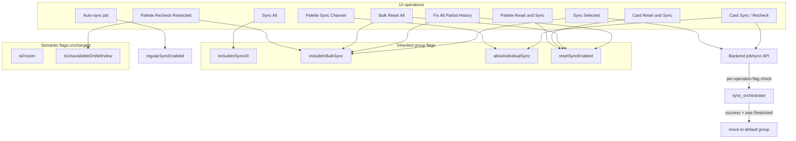

# Recheck Frozen & Restricted Channels (v2 — permission flags)

## Agreed decisions

| Topic | Choice |
|---|---|
| Permission model | **4 inherited group flags** (strict inheritance, configurable per group in Settings) |
| Selection | All channels selectable; **Select All includes frozen/restricted** |
| Backend enforcement | **Flags only** — no `forceSync` override; reject/skip channels that fail the flag for that operation |
| Semantic flags | **`isFrozen` / `isUnavailableOnWebView` kept** for badges + auto-group moves; separate from sync permissions |
| UI when denied | **Disable** button/command with tooltip citing the channel's group setting |
| Auto-sync | Unchanged — still `regularSyncEnabled` / `dynamicSyncEnabled` + frozen schedule guard |
| Recovery | Successful sync or metadata refresh showing available → **auto-move Restricted → default** |

### The four flags

| Flag | Governs |
|---|---|
| **`includeInSyncAll`** | Toolbar/palette **Sync All** only |
| **`includeInBulkSync`** | **Sync Selected**, **Fix All Partial History**, palette **Recheck Restricted** (sync half), and the sync-eligibility half of bulk reset paths |
| **`allowIndividualSync`** | Per-card **Sync/Recheck** button, palette **Sync Channel** |
| **`resetSyncEnabled`** | Per-card **Reset & Sync**, palette **Reset & Sync Channel**, and the reset-eligibility half of **Bulk Reset All** / **Fix All Partial History** |

**Bulk reset rule:** Bulk Reset All and Fix All Partial History require **both** `includeInBulkSync` **and** `resetSyncEnabled`.

**Palette Recheck Restricted:** targets **all** `isUnavailableOnWebView` channels (not filtered by `includeInBulkSync`); backend still enforces per-channel flags when executing.

### Built-in group defaults

| Group | includeInSyncAll | includeInBulkSync | allowIndividualSync | resetSyncEnabled |
|---|---|---|---|---|
| **default** | true | true | true | true |
| **Slow feed** | true | true | true | true |
| **High velocity** | true | true | true | true |
| **Restricted** | false | true | true | false |
| **Frozen** | false | false | true | true |

Restricted profile enables recheck via **Sync Selected** (bulk) and per-card/palette individual sync, but excludes Sync All and any reset.

Frozen profile is a full pause from bulk paths but still allows one-off sync and reset when explicitly triggered.

## Architecture



## Phase 1 — Backend: DB + group inheritance

**DB + model** — [`backend/app/models_tg.py`](backend/app/models_tg.py)

Add to `ChannelSettingGroup`:

- `include_in_sync_all: bool = True`
- `include_in_bulk_sync: bool = True`
- `allow_individual_sync: bool = True`
- `reset_sync_enabled: bool = True`

**Alembic migration** (after head `o7p8q9r0s1t2`):

- Add 4 columns, server default `true`.
- Backfill built-in groups per table above (match by reserved name / id prefix).

**Setting groups service** — [`backend/app/services/channel_setting_groups.py`](backend/app/services/channel_setting_groups.py)

- Add all 4 fields to `INHERITED_SNAKE_FIELDS`, `default_group_field_values()`, `setting_group_to_camel()`, `effective_channel_fields()`.
- Update built-in seeders (`get_or_create_restricted_group`, `get_or_create_frozen_group`, etc.) with preset values.
- Add helpers:
  - `is_restricted_group(group)` — id prefix or `is_unavailable_on_web_view`
  - `move_channel_from_restricted_to_default(session, channel, user_id)` — assign default group + recompute sync deadlines
  - `channel_allows_sync_operation(channel, group, operation: Literal["sync_all","bulk","individual"])`
  - `channel_allows_reset(channel, group, *, bulk: bool)` — checks `reset_sync_enabled` (+ `include_in_bulk_sync` when `bulk=True`)

**Schemas** — [`backend/app/schemas/data.py`](backend/app/schemas/data.py): expose all 4 camelCase fields on group read/write.

## Phase 2 — Backend: operation-aware gates (replace frozen hardcodes)

**Remove** implicit `isFrozen` / `channel_is_frozen` skips from sync entry points; replace with flag checks.

### Jobs API — [`backend/app/api/routes/jobs.py`](backend/app/api/routes/jobs.py)

- Extend `StartSyncJobRequest` with `sync_mode: Literal["sync_all","bulk","individual","recheck_restricted"]` (default `"bulk"` when `channelIds` provided, `"sync_all"` when omitted — or require explicit mode).
- Replace `_resolve_channel_entries` with `_resolve_sync_entries(session, channel_ids, operator_id, sync_mode)`:
  - `sync_all`: all operator channels where effective `includeInSyncAll`
  - `bulk`: requested or all channels where effective `includeInBulkSync`
  - `individual`: explicit IDs where effective `allowIndividualSync`
  - `recheck_restricted`: all channels where effective `isUnavailableOnWebView` (palette path)
- Return 400 with clear message when resolved list is empty.

### Sync orchestrator — [`backend/app/services/sync_orchestrator.py`](backend/app/services/sync_orchestrator.py)

- `_prepare_channel_sync`: replace `group.is_frozen` early return with operation-appropriate flag check (mode passed via job metadata).
- `_finalize_channel_success`: if channel was in Restricted group, call `move_channel_from_restricted_to_default`.
- Keep `_finalize_channel_scrape_error` → `move_channel_to_restricted_group` on unavailable failure.

### Bulk reset — [`backend/app/services/bulk_channels.py`](backend/app/services/bulk_channels.py)

- Replace `channel_is_frozen` skip with `channel_allows_reset(..., bulk=True)` (`includeInBulkSync` + `resetSyncEnabled`).
- Per-channel explicit reset (palette/card): require `resetSyncEnabled` only.

### Auto-sync — [`backend/app/jobs/auto_sync.py`](backend/app/jobs/auto_sync.py)

- **No change** to scheduling inputs (`regularSyncEnabled`, `dynamicSyncEnabled`, `is_frozen` schedule guard).

## Phase 3 — Frontend: selection (unchanged intent)

- [`frontend/src/components/ChannelCard.tsx`](frontend/src/components/ChannelCard.tsx): remove frozen guards on selection checkbox/toggle.
- [`frontend/src/components/ChannelGrid.tsx`](frontend/src/components/ChannelGrid.tsx): Select All / Revert include all channels; group/tag chip toggles stop using `excludeFrozen`.
- Update [`frontend/src/lib/channels/channel-grid-chips.test.ts`](frontend/src/lib/channels/channel-grid-chips.test.ts).

## Phase 4 — Frontend: wire each path to the correct flag

Introduce a small pure helper [`frontend/src/lib/channels/sync-permissions.ts`](frontend/src/lib/channels/sync-permissions.ts):

```ts
export type SyncOperation = "sync_all" | "bulk" | "individual" | "reset" | "bulk_reset"

export function channelAllows(channel: Channel, op: SyncOperation): boolean
export function disabledReason(channel: Channel, op: SyncOperation): string | null
```

**Per-path wiring:**

| Path | Filter / gate |
|---|---|
| `handleScrapeAll` | `includeInSyncAll`; API `sync_mode: "sync_all"` |
| `handleScrapeSelected` | selected ∩ `includeInBulkSync`; API `sync_mode: "bulk"` |
| Card Sync button | `allowIndividualSync`; label "Recheck" when `isUnavailableOnWebView` |
| Card Reset button | `resetSyncEnabled`; disabled when false |
| Palette Sync Channel | `allowIndividualSync` |
| Palette Reset & Sync | `resetSyncEnabled` |
| Bulk Reset All / Fix Partial | backend filters; frontend disabled when no eligible channels |
| Recheck Restricted palette | all `isUnavailableOnWebView`; API `sync_mode: "recheck_restricted"` |

**ScraperContext** — [`frontend/src/contexts/ScraperContext.tsx`](frontend/src/contexts/ScraperContext.tsx):

- Remove `ignoreFrozen` / `forceSync` concept entirely.
- `runServerSync(channelIds, source, { syncMode })` passes mode to [`frontend/src/api/jobs.ts`](frontend/src/api/jobs.ts).
- Update [`frontend/src/lib/commands/actions.ts`](frontend/src/lib/commands/actions.ts) disabled checks to use permission helper.

**Tooltips:** when disabled, cite group name + flag (e.g. `"Reset disabled — group 'Restricted' has Reset & Sync off"`).

## Phase 5 — Frontend: group settings UI + recovery

**SettingGroupsPanel** — [`frontend/src/components/SettingGroupsPanel.tsx`](frontend/src/components/SettingGroupsPanel.tsx)

Add a **Sync permissions** section with 4 checkboxes:

- Include in Sync All → `includeInSyncAll`
- Include in bulk sync → `includeInBulkSync` (helper: Sync Selected, bulk recheck, bulk-reset eligibility)
- Allow individual sync → `allowIndividualSync` (helper: card + palette single-channel sync)
- Reset & Sync enabled → `resetSyncEnabled`

Keep existing **Frozen** / **Restricted** semantic checkboxes separate (badges + auto-group assignment behavior).

**Types** — [`frontend/src/types.ts`](frontend/src/types.ts), [`frontend/src/lib/commands/group-commands.ts`](frontend/src/lib/commands/group-commands.ts), [`frontend/src/api/data.ts`](frontend/src/api/data.ts): wire all 4 fields through inherited channel view.

**Recovery** — [`frontend/src/lib/channels/refresh-metadata.ts`](frontend/src/lib/channels/refresh-metadata.ts):

- When channel was unavailable and `channel-info` no longer reports unavailable → `bulkAssignSettingGroup` to default + success toast.

## Phase 6 — Tests

**Backend**

- Flag inheritance + built-in defaults ([`test_channel_setting_groups.py`](backend/tests/services/test_channel_setting_groups.py))
- `sync_all` mode excludes Restricted/Frozen by `includeInSyncAll`
- `bulk` mode: Restricted included, Frozen excluded (per presets)
- `individual` mode: per `allowIndividualSync`
- `recheck_restricted` targets unavailable channels
- Bulk reset requires both bulk + reset flags
- Restricted recovery on sync success

**Frontend unit**

- `sync-permissions.ts` matrix tests for all 4 flags × operations
- Selection includes frozen channels
- Disabled tooltips / button states per flag
- Group panel saves all 4 fields
- refresh-metadata recovery path

**Optional Playwright:** filter Restricted → select → Sync Selected → job starts.

## Regen / hygiene

- Regenerate OpenAPI client after schema changes.
- Run `bun run test:unit`, backend pytest, `tsc`.

## Out of scope (deferred)

- Auto-scheduled periodic recheck of Restricted channels.
- Bot API fallback for unavailable web views.
- Auto-linking Frozen/Restricted semantic toggles to permission presets (flags configured independently in v1).
- Tying auto-sync to the new permission flags.

## Risk notes

- **Four flags add configuration surface** — built-in presets must be correct; document in group panel helper text.
- **Frozen group with `allowIndividualSync=true`** lets operators one-off sync a paused channel without unfreezing — intentional.
- **Palette Recheck Restricted** bypasses `includeInBulkSync` filter for target selection, but Restricted preset has it `true` anyway; backend still validates per channel.
- **Mixed Sync Selected** (normal + restricted): only channels with `includeInBulkSync=true` sync; others skipped with per-channel error in job result.
