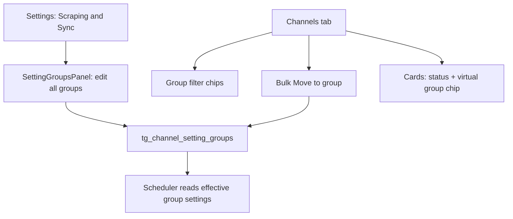

# Setting Groups UX v2 Plan

## Confirmed Product Decisions
- **Remove** Settings → “New Channel Sync Defaults” and **“Apply to Existing Channels”** bulk buttons; manage all sync behavior via the groups panel.
- **Seed built-in preset groups** (editable, non-deletable, always visible at `0 channels`):
  - **Slow feed:** regular every **1440 min** (daily), dynamic **on**, expected posts **1**
  - **High velocity:** regular every **60 min**, dynamic **on**, expected posts **10**
  - `autoFollowForwarded: false`, not frozen, not restricted (unless later changed in panel)
- **New channels** still assign to **`default`** group.
- **Reserved/system groups** remain: `default`, `Frozen`, `Restricted` + new presets.
- **Channels tab discovery:** dedicated **Group filter chips** + virtual **`group:Name`** chips on cards.
- **Virtual group chips:** shown for **every** group (including `default`); **not editable/removable** on cards; users **cannot create manual tags** matching `group:*`.
- **Channel cards:** remove per-channel sync interval/toggle UI (keep compact status + next-sync info + group badge/chip).
- **Unique group names:** case-insensitive per operator scope.

## Target UX Flow

## Backend Changes

### 1. Built-in preset groups
Update [`backend/app/services/channel_setting_groups.py`](backend/app/services/channel_setting_groups.py):

- Add constants:
  - `SLOW_FEED_GROUP_NAME = "Slow feed"`
  - `HIGH_VELOCITY_GROUP_NAME = "High velocity"`
- Add deterministic ids: `slow-feed-{scope}`, `high-velocity-{scope}`.
- Extend `RESERVED_GROUP_NAMES`, `is_reserved_group_id()`, delete/rename guards.
- Add `get_or_create_slow_feed_group()` and `get_or_create_high_velocity_group()` with the confirmed sync values.
- Extend `ensure_reserved_groups()` → `ensure_builtin_groups()` returning all 5 built-ins.
- Call from `list_setting_groups()` and channel-create paths.

### 2. Unique names
- **Alembic migration** (new revision after `m5n6o7p8q9r0`):
  - Deduplicate existing custom names case-insensitively (keep oldest/canonical row; rename or merge collisions with clear suffix only if needed).
  - Add unique index on `(user_id, lower(name))` — treat `NULL user_id` as global scope consistently with existing operator filtering.
- Validate in `create_setting_group()` and `apply_group_fields()`:
  - `409 Conflict` on duplicate name (case-insensitive, same scope).
  - Block reserved names including `Slow feed` / `High velocity`.

### 3. Decouple default group seed from removed UI settings
Today [`default_group_field_values()`](backend/app/services/channel_setting_groups.py) reads `load_sync_settings()`. After removing the UI section:

- Seed **default** group from backend constants in [`backend/app/jobs/settings.py`](backend/app/jobs/settings.py) (e.g. regular 60m, dynamic off, expected posts 15) — not from mutable app settings that no longer have a UI.
- Keep operational job settings (`syncConcurrency`, `syncFailureBackoffMinutes`, etc.) unchanged.

### 4. Channel create/import cleanup
- [`backend/app/services/channels.py`](backend/app/services/channels.py): on create, assign `default` / `restricted` only; ignore inherited-field body on create (already mostly guarded).
- [`frontend/src/lib/channels/add-channel.ts`](frontend/src/lib/channels/add-channel.ts) and [`frontend/src/contexts/ScraperContext.tsx`](frontend/src/contexts/ScraperContext.tsx): stop sending inherited sync fields on create; rely on group assignment.

### 5. Data migration for existing installs
New Alembic data step:
- For each operator scope, create missing `slow-feed-*` and `high-velocity-*` rows with preset values.
- Do **not** auto-move existing channels (they stay on current groups, mostly `default`).

## Frontend — Settings

### 6. Remove legacy sync-default surfaces
In [`frontend/src/components/SettingsView.tsx`](frontend/src/components/SettingsView.tsx):

- Remove **“New Channel Sync Defaults”** inputs (`regularSyncIntervalMinutes`, `dynamicSyncEnabledDefault`, `dynamicSyncExpectedPostsDefault`).
- Remove **“Apply to Existing Channels”** section and `applySyncTemplateToChannels` usage.
- Keep **SettingGroupsPanel** as the primary sync-configuration surface (optionally move it higher in the section).

### 7. SettingsContext + command palette cleanup
- [`frontend/src/contexts/SettingsContext.tsx`](frontend/src/contexts/SettingsContext.tsx): remove unused sync-template state/localStorage persistence if nothing else consumes it.
- [`frontend/src/lib/commands/settings-schema.ts`](frontend/src/lib/commands/settings-schema.ts): remove or replace commands that edited global sync defaults / “apply to all channels” patches.
- Add palette commands:
  - `Filter channels by group: …`
  - `Move selected channels to group: …`
  - `Open setting group: …` (navigate to Settings sync section + select group)

### 8. Reserved-group helpers
Extend [`frontend/src/lib/channels/setting-groups.ts`](frontend/src/lib/channels/setting-groups.ts):

- Recognize `slow-feed-*` and `high-velocity-*` as reserved/non-deletable.
- Sort built-ins consistently in panels: `default`, `Slow feed`, `High velocity`, `Frozen`, `Restricted`, then custom groups.

## Frontend — Channels Tab

### 9. Simplify channel cards
In [`frontend/src/components/ChannelCard.tsx`](frontend/src/components/ChannelCard.tsx):

- **Remove** read-only Regular/Dynamic/Auto-follow control blocks (toggles + minute/post inputs).
- **Keep:** status indicator, optional compact next-sync lines, existing `Group: {name}` line or replace with virtual chip.
- Freeze action remains a **group move** to `Frozen` / `default`.

### 10. Virtual `group:Name` chips (UI-only)
Add helper module e.g. [`frontend/src/lib/channels/virtual-group-tags.ts`](frontend/src/lib/channels/virtual-group-tags.ts):

- `toVirtualGroupTagName(groupName) => \`group:${groupName}\``
- `isVirtualGroupTag(name) => name.toLowerCase().startsWith("group:")`
- Render virtual chip on every card from `channel.settingGroupName`.
- Style distinctly (system chip; no remove button; not passed to tag edit handlers).

**Manual tag guardrails** in [`frontend/src/lib/channels/channel-tag-model.ts`](frontend/src/lib/channels/channel-tag-model.ts) + add/remove tag flows:

- Reject user-entered tags matching `group:*` (case-insensitive) with toast/error.
- Backend optional mirror in [`backend/app/services/channel_tags.py`](backend/app/services/channel_tags.py) for API safety.

**Tag/AI exclusion:** virtual group tags must **not** be persisted or included in `{all_tags}` / Tag tab prompts — only derived at display/filter time.

### 11. Group filter chips row
In [`frontend/src/components/ChannelGrid.tsx`](frontend/src/components/ChannelGrid.tsx):

- Add a **Group** chip row (parallel to existing tag bar) sourced from `api.listSettingGroups()`.
- Show all groups with `(selected/total)` counts, including `0` totals.
- Click behavior mirrors tag chips: select all channels in that group.
- Integrate with existing search/filter pipeline (new `selectedGroupFilter` state).
- Ensure `Move to group` dropdown uses the same list.

## API / Types
- Optionally add `isReserved: boolean` to setting-group API payload in [`backend/app/services/channel_setting_groups.py`](backend/app/services/channel_setting_groups.py) to simplify frontend logic (or keep id-prefix helpers).
- Update [`frontend/src/types.ts`](frontend/src/types.ts) if new field added.

## Tests

### Backend
- Unique name create/update conflicts (`409`).
- `ensure_builtin_groups` creates all 5 groups with correct preset values.
- Reserved-name blocks include `Slow feed` / `High velocity`.
- Cannot delete reserved presets.
- Migration idempotency on existing DB.

### Frontend
- `virtual-group-tags` helper tests.
- Manual tag add rejects `group:foo`.
- `setting-groups` reserved id detection for new presets.
- Group filter chip selection logic unit tests.
- Settings section no longer renders removed controls (component test or Playwright).

### E2E (targeted)
- Create custom group → visible in panel + filter row at `0 channels`.
- Move channel → virtual chip updates.
- Cannot add manual `group:foo` tag.

## Rollout Sequence
1. Backend: builtin preset groups + unique-name migration/validation.
2. Backend: default-group seed decoupling + channel-create cleanup.
3. Frontend: remove legacy Settings sync-default UI + context/command cleanup.
4. Frontend: card simplification + virtual group chips + tag guardrails.
5. Frontend: group filter chips row + palette commands.
6. Tests + staging verify.

## Out of Scope (this iteration)
- Auto-moving channels into Slow feed / High velocity based on velocity heuristics.
- Persisting virtual `group:` tags in DB.
- Changing new-channel target away from `default`.
