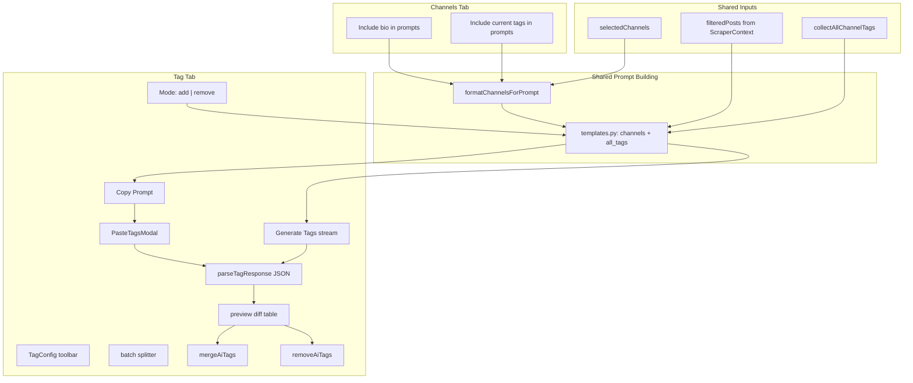

# Tag Tab v1 — AI-Assisted Channel Tagging

## Goal

Give operators a dedicated **Tag** tab to categorize selected channels using sample posts (same scope as Summary: `selectedChannels` + `filteredPosts` from the Posts tab pipeline). Support **Copy Prompt → external AI → paste back** (primary) and **in-app generate** (secondary), then apply suggested tags in **add** or **remove** mode while recording **source** (`manual` | `ai`) and **assignedAt** per tag.

Also improve **all AI prompts** by letting the user control what channel metadata appears in the `{channels}` block — via two checkboxes on the **Channels** tab.

## Architecture



## Key decisions (locked for v1)

| Topic | Decision |
|-------|----------|
| Channel scope | **Selected channels only**; posts = canonical `filteredPosts` (respects date range, keyword, forwarded, max-per-channel, sort) |
| Tag operation mode | User picks **Add tags** or **Remove tags** in Tag tab; prompt instructions and apply logic follow the selection |
| Add apply | **Merge** — append proposed tags; skip duplicates (case-insensitive); new tags get `source: "ai"` |
| Remove apply | **Subtract only** — remove proposed tag names that exist on the channel; ignore unknown tags; never delete tags not in AI response |
| Tag metadata | Evolve `tags` from `string[]` to structured objects with `source` + `assignedAt` |
| Existing tag collision (add) | If tag name already exists, **keep existing metadata** (manual stays manual) |
| Manual tags | `source: "manual"`, `assignedAt: Date.now()` on add |
| Channel prompt options | Two checkboxes on **Channels** tab; persisted in `localStorage`; affect `{channels}` in **Summary, Tag, and Chat** prompts |
| `{all_tags}` | Included in **Tag prompt only** (v1) — sorted list of all tag names across the operator's channels |
| History | **Persist to DB** with pending/completed lifecycle similar to Summary/Chat |
| Batching | Split large selections into batches (default **12 channels/batch**) |
| Auto-summary job | Backend job keeps **names-only** `{channels}` fallback (no checkbox prefs in DB yet) |

---

## Shared channel context — Channels tab checkboxes

### UI (Channels tab)

Add a compact **AI prompt context** row in [`ChannelGrid.tsx`](frontend/src/components/ChannelGrid.tsx) toolbar (near selection controls), with two checkboxes:

| Checkbox label | Wording rationale |
|----------------|-------------------|
| **Include channel bio in prompts** | Clear that bio is injected into AI prompts, not shown elsewhere |
| **Include current tags in prompts** | Signals existing tags are sent as context (useful for refinement / remove mode) |

- Default: **both off** (preserves today's compact `channel_a, channel_b, ...` behavior).
- Persist: `localStorage` keys `prompt_includeChannelBio`, `prompt_includeChannelTags` (same pattern as `postFilter_*` in [`ScraperContext.tsx`](frontend/src/contexts/ScraperContext.tsx)).
- State home: [`UIContext.tsx`](frontend/src/contexts/UIContext.tsx) — `includeChannelBioInPrompt`, `includeChannelTagsInPrompt` + setters.

### Shared formatter

New [`frontend/src/lib/channels/format-channels-for-prompt.ts`](frontend/src/lib/channels/format-channels-for-prompt.ts):

```typescript
formatChannelsForPrompt(
  channels: Channel[],
  selectedNames: Iterable<string>,
  options: { includeBio: boolean; includeTags: boolean },
): string
```

**Output shapes:**

Both off (legacy-compatible):
```
channel_a, channel_b, channel_c
```

With options on (one block per selected channel):
```
### channel_a
Bio: Independent news outlet covering...
Current tags: Politics, Geopolitics

### channel_b
Bio: (none)
Current tags: (none)
```

- Use `getTagNames()` from `channel-tag-model.ts` for tag display.
- Omit `Bio:` line when bio is empty/missing.
- Omit `Current tags:` when channel has no tags.

Backend mirror: [`backend/app/prompts/channels_context.py`](backend/app/prompts/channels_context.py) with the same rules (for auto-summary fallback and server-side prompt assembly).

### Template changes — [`templates.py`](backend/app/prompts/templates.py)

Replace the flat `{channels}` sentence in `SYSTEM_PROMPT` and `CHAT_PROMPT`:

```diff
- the posts are from multiple Telegram channels: {channels}.
+ ### CHANNELS IN SCOPE
+ {channels}
```

`{channels}` is now a **pre-formatted string** (comma list or per-channel blocks), not a raw name join.

### API contract change

Extend [`SummaryRequest`](backend/app/ai/models.py) and new `TagRequest`:

- Add `channels_text: str` (`channelsText`) — **authoritative** formatted `{channels}` block from frontend.
- Keep `channels: list[str]` for logging/metadata/backward compat.

Update [`format_summary_prompt`](backend/app/prompts/summary.py) to accept `channels_text` and pass through to template.

Wire checkboxes in:

- [`AIContext.tsx`](frontend/src/contexts/AIContext.tsx) — `copySummaryPrompt`, `handleSummarize`
- [`ChatContext.tsx`](frontend/src/contexts/ChatContext.tsx) — chat prompt build
- [`TagContext.tsx`](frontend/src/contexts/TagContext.tsx) — tag prompt build

---

## Tag prompt — add/remove mode + `{all_tags}`

### Tag operation mode (Tag tab only)

Segmented control in [`TagConfig.tsx`](frontend/src/components/TagConfig.tsx):

| Mode | Label | Prompt instruction | Apply behavior |
|------|-------|-------------------|----------------|
| `add` | **Suggest tags to add** | Assign 2–4 taxonomy tags per channel that are **not yet** on the channel (or reinforce missing ones) | `mergeAiTags()` |
| `remove` | **Suggest tags to remove** | Identify 0–3 tags per channel that are **incorrect or outdated** given post content | `removeAiTags()` — subtract only listed tags |

- Default mode: **Add tags**.
- Session state in `TagContext`; not persisted across reloads (v1).
- Same JSON output contract for both modes — only semantics differ:

```json
{
  "channel_username": ["Politics", "Geopolitics"]
}
```

In **remove** mode, values are tags to **drop**, not keep.

### `{all_tags}` block

New placeholder in **TAG template only** ([`backend/app/prompts/templates.py`](backend/app/prompts/templates.py) — `TAG_PROMPT`):

```
### EXISTING TAGS IN USE (across all channels)
{all_tags}
```

Built from `collectAllChannelTags(channels)` on frontend (all operator channels, not just selected). Backend receives `all_tags: str` in `TagRequest` (comma-separated or bullet list). Tells the model to **reuse these names** for consistency and avoid synonyms (`Economy` vs `Finance`).

When no tags exist: `"(none yet)"`.

### Full tag prompt structure

New [`backend/app/prompts/tagging.py`](backend/app/prompts/tagging.py) + `TAG_PROMPT` in templates:

1. Role + task (varies by `tag_mode`: add vs remove)
2. Master taxonomy (same list as before)
3. `{all_tags}` — existing vocabulary
4. Rules: English tags, organic content only, 2–4 (add) or 0–3 (remove) per channel
5. `### CHANNELS IN SCOPE` → `{channels}` (respects Channels-tab checkboxes)
6. `### POSTS TO ANALYZE` → grouped channel post blocks (`{posts_text}`)
7. Strict JSON output — keys = exact channel usernames from CHANNELS IN SCOPE

**Proposed taxonomy (v1, embedded in prompt):**

- Politics — domestic government, elections, policy
- Geopolitics — international relations, foreign policy, treaties
- Military & Defense — warfare, armed forces, security incidents
- Economy & Finance — markets, trade, banking, inflation, currency
- Bourse & Investments — stocks, crypto, commodities
- Technology & AI — software, hardware, telecom, AI
- Cybersecurity & Digital Rights — hacking, censorship, cyberattacks
- Human Rights & Activism — protests, detentions, civil society
- Society & Culture — daily life, health, education, religion, sociology
- Sports — athletics, tournaments, analysis
- History & Literature — archives, poetry, essays, books
- Regional News — locality-focused reporting (city/province/country)

**Grouped posts block** (built in [`frontend/src/lib/channels/tag-prompt.ts`](frontend/src/lib/channels/tag-prompt.ts)):

```
### channel_a
Posts (chronological):
- [ID 123 | 2026-01-15] Post text...
```

Channel header here is minimal (bio/tags live in `{channels}` section when checkboxes are on).

---

## Data model change — structured tags

Today: `tags: string[]` on [`Channel`](frontend/src/types.ts) / [`tg_channels.tags`](backend/app/models_tg.py) JSON column.

**v1 shape:**

```typescript
export type TagSource = "manual" | "ai"

export interface ChannelTag {
  name: string
  source: TagSource
  assignedAt: number // ms epoch
}
```

**No Alembic migration required** — JSON column stays; shape evolves with normalization.

Add [`frontend/src/lib/channels/channel-tag-model.ts`](frontend/src/lib/channels/channel-tag-model.ts):

- `normalizeChannelTags(raw: unknown): ChannelTag[]`
- `getTagNames(tags: ChannelTag[]): string[]`
- `mergeAiTags(existing, proposedNames, now): ChannelTag[]` — add mode
- `removeAiTags(existing, proposedNames): ChannelTag[]` — remove mode; case-insensitive match on name
- `addManualTag(existing, name, now): ChannelTag[]`

Update all tag consumers to use helpers instead of raw strings.

**UI affordance:** on `ChannelCard`, small indicator on AI-sourced tags (`source === "ai"`).

---

## Backend API

Extend [`backend/app/api/routes/ai_routes.py`](backend/app/api/routes/ai_routes.py):

| Endpoint | LLM? | Purpose |
|----------|------|---------|
| `POST /api/v1/ai/tag/prompt` | No | Copy Prompt |
| `POST /api/v1/ai/tag/stream` | Yes (SSE) | In-app generate |

**`TagRequest`** in [`backend/app/ai/models.py`](backend/app/ai/models.py):

- `channels: list[str]`
- `channels_text: str` — formatted `{channels}` block
- `posts_text: str` — grouped posts
- `all_tags: str` — formatted `{all_tags}` block
- `tag_mode: Literal["add", "remove"]` (`tagMode`)
- `model`, `temperature`, `provider` (optional)
- `tags_per_channel_min`, `tags_per_channel_max` (optional; defaults vary by mode)

---

## Frontend — Tag tab

### Tab registration

Add `"tag"` to `WORKSPACE_TABS` (after **Summary**), `TabType`, `VALID_TABS`, `App.tsx`, `TgProviders`.

### Components

| Component | Responsibility |
|-----------|----------------|
| [`TagConfig.tsx`](frontend/src/components/TagConfig.tsx) | Add/Remove mode toggle, model picker, batch indicator, Copy Prompt, Generate Tags, Paste Response |
| [`TagView.tsx`](frontend/src/components/TagView.tsx) | Preview table: channel \| current tags \| proposed \| action (add/remove) |
| [`PasteTagsModal.tsx`](frontend/src/components/PasteTagsModal.tsx) | Clipboard paste, JSON validation |
| [`TagContext.tsx`](frontend/src/contexts/TagContext.tsx) | Orchestration; reads prompt checkboxes from `UIContext` |

### Apply flow

1. Preview shows per-channel diff with mode-aware labels ("+Politics" vs "−Politics")
2. **Apply** calls `mergeAiTags` or `removeAiTags` per channel → `upsertChannel`
3. Toast: *"Added N tags to M channels"* or *"Removed N tags from M channels"*
4. Remove mode: only tags present in AI response **and** on the channel are deleted; manual/ai metadata irrelevant on removal

### Response parsing

[`frontend/src/lib/channels/parse-tag-response.ts`](frontend/src/lib/channels/parse-tag-response.ts) — same parser for both modes; mode only affects apply step.

---

## Tag run history — persisted to DB

Persist Tag runs similarly to Summary/Chat so operators can audit, resume, and re-apply workflows.

### Data model

Add a `TagRun` entity stored in DB (either dedicated table, or `Summary`-style with typed `extra`; plan prefers a dedicated table for clarity).

Proposed fields:

- `id` (string/uuid)
- `createdAt`, `updatedAt` (ms epoch)
- `status` (`pending` | `completed` | `failed`)
- `source` (`generated` | `pasted`)
- `mode` (`add` | `remove`)
- `channels` (`string[]`) selected at run time
- `startDate`, `endDate`
- `postCount`
- `model` (or `external`)
- `promptText`
- `responseText`
- `allTagsSnapshot` (`string[]`) used for prompt at generation time
- `channelContextOptions` (`includeBio`, `includeTags`)
- `suggestions` (normalized parsed JSON payload)
- `applyResult` (counts + per-channel changes)
- `error` (optional)

### Backend/API

- Add SQLModel + Alembic migration for `tg_tag_runs`.
- Add service layer in `backend/app/services/tag_runs.py` (upsert/list/get/delete).
- Add routes in `backend/app/api/routes/data.py`:
  - `GET /api/v1/data/tag-runs`
  - `PUT /api/v1/data/tag-runs/{id}`
  - `DELETE /api/v1/data/tag-runs/{id}`
- Keep AI routes focused on prompt/generation; persistence remains in data routes (same app pattern).

### Frontend/repository

- Add `TagRun` type in `frontend/src/types.ts`.
- Add repository methods in `frontend/src/lib/repository.ts`:
  - `listTagRuns()`
  - `upsertTagRun()`
  - `deleteTagRun()`
- Add API client methods in `frontend/src/api/data.ts`.

### UX flow

- `Copy Prompt` creates a **pending** `TagRun` with `promptText`.
- In-app `Generate` creates/updates run with streamed output.
- `PasteTagsModal` completes pending run with pasted response.
- `Apply` updates run `applyResult` and marks as completed if not already.
- New `TagHistoryView` (or section inside `TagView`) with:
  - list of runs (newest first),
  - status badges,
  - reopen preview,
  - re-apply (optional v1.1),
  - delete run.

### Compatibility and migration

- No change to channel `tags` storage strategy from this decision.
- Legacy sessions without tag runs remain valid (history simply starts empty).

---

## What we are NOT building in v1

- Auto-tagging scheduler / background job
- Server-side tag taxonomy enforcement
- `{all_tags}` in Summary/Chat prompts (Tag only)
- Storing Channels-tab checkbox prefs in DB (localStorage only; auto-summary unaffected)
- Mobile layout

---

## Testing

| Layer | Coverage |
|-------|----------|
| Unit | `format-channels-for-prompt.ts` (4 combos of checkboxes), `channel-tag-model.ts` (add + remove), `parse-tag-response.ts` |
| Backend | `format_tag_prompt` with add/remove modes + `all_tags`; `format_summary_prompt` with rich `channels_text` |
| Playwright | Channels tab checkboxes persist; Tag tab add flow; Tag tab remove flow; pending run appears in Tag history and can be completed/applied |

---

## Implementation order

1. **Tag model normalization** — helpers + migrate existing UI/read paths
2. **Channel prompt context** — formatter, checkboxes, template `{channels}` change, wire Summary + Chat
3. **Tag prompt backend** — `TAG_PROMPT` with `{all_tags}` + mode, API endpoints
4. **Tag history persistence** — `tg_tag_runs` model/migration/routes + frontend repository methods
5. **Tag frontend** — prompt builder, parser, TagContext + UI + TagHistoryView
6. **Tab wiring + tests**

---

## Open items for iteration (post-v1)

- Configurable taxonomy list in Settings
- Filter ChannelGrid by tag source (`manual` vs `ai`)
- Persist prompt checkbox prefs to DB / Settings (so auto-summary respects them)
- `{all_tags}` in Summary/Chat for consistency
