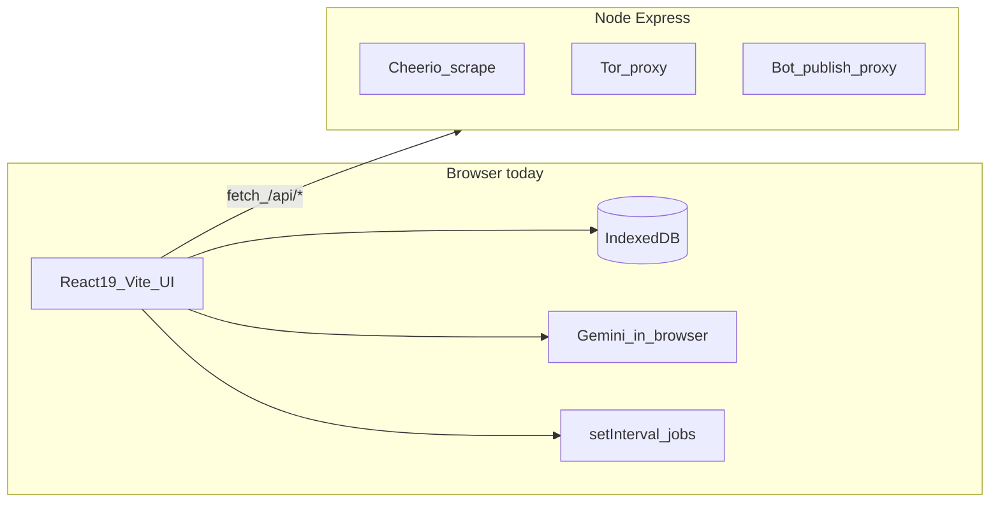
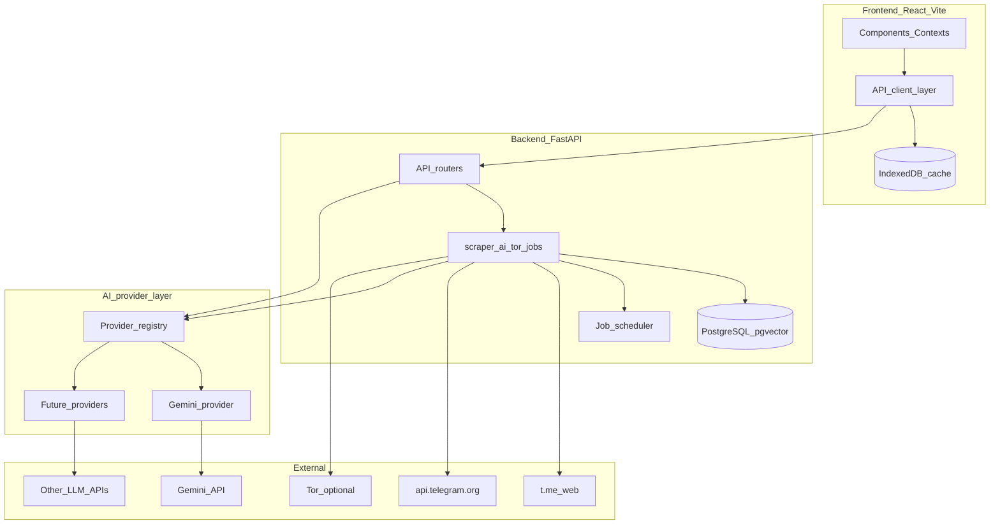

# TG-Summarizer → FastAPI Migration Plan

## Current state (baseline)

[TG-Summarizer](TG-Summarizer/) is a **hybrid** app, not a pure SPA:



| Layer | Today | Migration target |
|-------|-------|------------------|
| UI | React 19, Tailwind v4, shadcn, contexts | **Keep** (same stack) |
| Data | IndexedDB ([`src/lib/db.ts`](TG-Summarizer/src/lib/db.ts), 12 stores + legacy `bots`) | **Hybrid**: PostgreSQL source of truth + browser cache for reads/offline where useful |
| AI | `@google/genai` in browser; key in bundle ([`vite.config.ts`](TG-Summarizer/vite.config.ts)) | Server-side **pluggable providers**; **Gemini first**, others later (OpenAI, Anthropic, Ollama, etc.) |
| Scraping/Tor | Express ([`server/server.ts`](TG-Summarizer/server/server.ts), 10 routes) | FastAPI routers |
| Scheduling | Client `setInterval` in [`App.tsx`](TG-Summarizer/src/App.tsx), [`AIContext.tsx`](TG-Summarizer/src/contexts/AIContext.tsx), [`RAGContext.tsx`](TG-Summarizer/src/contexts/RAGContext.tsx) | APScheduler / Celery / background tasks |
| Auth | None | **TBD** — self-hosted single-operator likely needs light auth, not full SaaS (see open decisions) |
| Infra | No Docker | Template Docker Compose + Traefik; **always-on** self-hosted instance |
| Repo layout | Single `TG-Summarizer/` folder | **Full template monorepo**: port UI into `frontend/`, backend in `backend/` |

Target foundation: [fastapi/full-stack-fastapi-template](https://github.com/fastapi/full-stack-fastapi-template) — adopt **whole monorepo layout**, not backend-only.

---

## Confirmed decisions (from review)

| Decision | Choice | Implication |
|----------|--------|-------------|
| Deployment | **Self-hosted always-on** (Docker on VPS/home server) | Server-side scheduling is justified; browser tab need not stay open |
| Data | **Hybrid sync** | Postgres is authoritative; IndexedDB becomes cache/sync layer, not permanent dual-write |
| Template scope | **Full monorepo** | Move TG-Summarizer UI into template `frontend/`; align Vite/TS/Tailwind tooling |
| Network config | **Hybrid** | Server env defaults; optional UI overrides for proxies; **Tor control password never in browser** |
| Auth | **Decide in discovery** | Compare API key vs simplified JWT vs reverse-proxy for self-hosted single-operator |

---

## Assumptions flagged in review (do not treat as decided)

These were embedded in earlier drafts without enough evidence. Discovery must validate or replace them.

1. **"12 IndexedDB stores"** — actually **12 named stores + legacy `bots`** in [`db.ts`](TG-Summarizer/src/lib/db.ts); inventory must confirm which are still used.
2. **"Retire IndexedDB entirely"** — conflicts with hybrid-sync goal; plan now keeps a **cache layer** with explicit sync semantics (ADR required).
3. **"Keep TG-Summarizer folder as-is"** — superseded by full monorepo decision; UI moves to `frontend/`.
4. **"Refactor only `telegram.ts`"** — incomplete: **8+ files** call `/api/*` directly ([`SettingsView.tsx`](TG-Summarizer/src/components/SettingsView.tsx), [`BotManagement.tsx`](TG-Summarizer/src/components/BotManagement.tsx), [`ScraperContext.tsx`](TG-Summarizer/src/contexts/ScraperContext.tsx), etc.), violating [`AGENTS.md`](TG-Summarizer/AGENTS.md) service-layer rule. Migration needs a unified API client layer.
5. **"Scrape behaves identically"** — Python HTML parsing will differ at byte level; target **behavioral parity** on fixtures, not identical JSON.
6. **"Generated OpenAPI client fits all endpoints"** — may not suit **SSE streaming** (summary/chat) or large scrape telemetry payloads; ADR must allow hand-written clients for streaming routes.
7. **"PostgreSQL required from day one"** — template default, but hybrid sync may allow Postgres in Phase 3 while Phase 1–2 still read/write IndexedDB cache.
8. **"Template JWT auth is right fit"** — self-hosted single-operator may prefer **API key, reverse-proxy auth, or optional login** over full email-recovery user system; template auth may be stripped or simplified.
9. **Proxy/Tor config moves server-side** — today **every scrape request** sends `proxies`, `torControlPassword`, etc. from [`SettingsContext`](TG-Summarizer/src/contexts/SettingsContext.tsx) localStorage → [`telegram.ts`](TG-Summarizer/src/services/telegram.ts) body → [`server.ts`](TG-Summarizer/server/server.ts). Unclear if UI-driven network settings remain or become server env only — **needs ADR**.
10. **Phase order is optimal** — Phase 2 (AI on server) while data still client-assembled sends **large post payloads** over the network; hybrid sync may require **earlier read APIs** or accepting fat requests temporarily.
11. **UI is stable** — [`docs/PROGRESS.md`](TG-Summarizer/docs/PROGRESS.md) shows a **Settings Hub restructure not started**; migrating during that refactor risks double work — coordinate timing in discovery.
12. **AI Studio / Cloud Run origin** — app was built for AI Studio ([`README.md`](TG-Summarizer/README.md), [`.env.example`](TG-Summarizer/.env.example)); self-hosted Docker is a **different ops model** (Tor binary, secrets, volumes).

---

## Open decisions (still need your input or discovery ADR)

| # | Question | Options | Notes |
|---|----------|---------|-------|
| A | **Auth for self-hosted** | ~~deferred to discovery ADR~~ | Compare API key vs simplified JWT vs reverse-proxy; strip unused template email/signup |
| B | **Proxy/Tor settings** | ~~decided: hybrid~~ | Env defaults + UI proxy overrides; Tor secrets server-only; spike Tor-in-Docker in Phase 0 |
| C | **Hybrid sync model** | (a) Read-through cache (b) Offline queue + replay (c) Cache posts only, settings always server | Drives Phase 3 design |
| D | **Phase 2 vs Phase 3 order** | (a) AI on server first, fat client payloads OK temporarily (b) Basic read APIs first, then AI | Trade-off: security vs network payload size |
| E | **Settings Hub refactor** | (a) Finish UI restructure before backend migration (b) Migrate backend first, refactor UI in monorepo (c) Do both in monorepo in one pass | [`PROGRESS.md`](TG-Summarizer/docs/PROGRESS.md) |
| F | **Tor in Docker** | Required feature vs optional flag vs drop for self-hosted | Highest-risk spike; may block scrape parity |

---

## Phase 0 — Discovery & architecture study (do this first)

Goal: produce a short **Architecture Decision Record (ADR) pack** before writing migration code. Estimated 3–5 focused days.

### 0.1 Inventory the existing app

| Workstream | What to read | Deliverable |
|------------|--------------|-------------|
| **Domain model** | [`src/types.ts`](TG-Summarizer/src/types.ts), [`src/lib/db.ts`](TG-Summarizer/src/lib/db.ts) (stores, indexes, export/import) | ERD draft: 12 IndexedDB stores → SQL tables |
| **API surface** | [`server/server.ts`](TG-Summarizer/server/server.ts) (lines ~408–730), [`src/services/telegram.ts`](TG-Summarizer/src/services/telegram.ts) | Contract doc: 10 Express routes + request/response shapes |
| **AI layer** | [`src/services/ai.ts`](TG-Summarizer/src/services/ai.ts), [`src/constants.ts`](TG-Summarizer/src/constants.ts) | Endpoint spec: summary (stream), chat, embeddings, translation; **provider-agnostic request/response shapes** |
| **Background jobs** | [`App.tsx`](TG-Summarizer/src/App.tsx), [`ScraperContext.tsx`](TG-Summarizer/src/contexts/ScraperContext.tsx), [`AIContext.tsx`](TG-Summarizer/src/contexts/AIContext.tsx), [`RAGContext.tsx`](TG-Summarizer/src/contexts/RAGContext.tsx), [`TranslationContext.tsx`](TG-Summarizer/src/contexts/TranslationContext.tsx) | Job catalog: trigger, interval, inputs, side effects |
| **State boundaries** | All 8 contexts + [`AGENTS.md`](TG-Summarizer/AGENTS.md) | Map: what stays UI-only vs becomes API calls |
| **Feature docs** | [`docs/`](TG-Summarizer/docs/) (22 plans: RAG, retention, translation, telemetry, export) | Feature checklist with migration priority |
| **Tests as spec** | [`tests/test-scrape*.ts`](TG-Summarizer/tests/), [`src/lib/db.test.ts`](TG-Summarizer/src/lib/db.test.ts) | Golden fixtures for scrape parsing + DB behavior |

### 0.2 Study the FastAPI template

Clone template locally (read-only study) and document:

- **Backend layout**: `backend/app/api/`, `models.py`, `crud.py`, Alembic, `core/config.py`
- **Auth flow**: JWT, `CurrentUser` dependency, superuser bootstrap
- **Frontend client**: auto-generated TypeScript client from OpenAPI — evaluate reuse vs hand-written `fetch`
- **Docker/dev**: `compose.yml`, `compose.override.yml`, `development.md`, Traefik routing
- **What to keep vs strip**: template ships demo “Items” CRUD + email recovery — list what stays as scaffolding vs gets replaced

### 0.3 Study external dependencies & Python equivalents

| Node / browser today | Python candidate | Risk to validate in spike |
|----------------------|------------------|---------------------------|
| cheerio HTML parse | BeautifulSoup / selectolax / lxml | Parity on forwarded-message metadata, pagination |
| axios + proxy agents | httpx + proxies | SOCKS/HTTP rotation, rate limits |
| tor-control-promise | stem / subprocess `tor` | NEWNYM, port lifecycle in Docker |
| `@google/genai` | `google-genai` Python SDK (first provider) | Streaming SSE, embedding model parity; design **provider interface** so SDK is not leaked to routers |
| idb + JSZip export | SQLAlchemy + pgvector + file export | Vector dimension, migration path from ZIP |
| franc-min language detect | langdetect / fasttext | Accuracy on Persian/RTL content |
| Web Worker cosine search | numpy / pgvector / Qdrant | Scale limits vs current “load all embeddings” |

Run **2–3 time-boxed spikes** (max 1 day each): scrape one channel, one Gemini stream, Tor in container.

### 0.4 Security & secrets audit

Document every secret and where it lives today:

- `GEMINI_API_KEY` bundled into client ([`vite.config.ts`](TG-Summarizer/vite.config.ts) line 15)
- Bot tokens in IndexedDB, sent to `/api/publish`
- Proxy URLs in `localStorage` via [`SettingsContext`](TG-Summarizer/src/contexts/SettingsContext.tsx)

Output: **secrets matrix** (what moves server-side, what remains user-configurable, encryption at rest).

### 0.5 Architecture decision records (ADRs)

Produce written decisions (with options + recommendation) for:

1. **Repo layout** — ~~decided: full monorepo~~ document porting steps from `TG-Summarizer/` → `frontend/`
2. **Auth model** — light self-hosted auth vs template JWT (see open decision A)
3. **Hybrid sync** — cache invalidation, offline queue, conflict resolution, what stays in IndexedDB vs Postgres
4. **Job runner** — APScheduler in-process vs Celery + Redis vs FastAPI BackgroundTasks only
5. **Vector search** — pgvector in Postgres vs dedicated vector DB vs keep client search temporarily
6. **API style** — generated OpenAPI client vs thin `src/api/` wrapper
7. **Tor deployment** — sidecar container vs host Tor vs optional feature flag
8. **AI provider abstraction** — interface design, model registry, per-provider secrets, embedding dimension strategy when switching providers

### 0.6 Discovery outputs (gate before Phase 1)

- `docs/migration/INVENTORY.md` — routes, jobs, stores, contexts
- `docs/migration/ADR-*.md` — 8 decisions above (including AI provider abstraction)
- `docs/migration/TARGET-ARCHITECTURE.md` — diagram + module map
- `docs/migration/MIGRATION-RISKS.md` — ranked risks + mitigations
- `docs/migration/DATA-MODEL.md` — SQL schema draft from `types.ts`

---

## Phase 1 — Foundation & API parity

**Goal**: Bootstrap full template monorepo; port Express scraping/Tor/bot routes to FastAPI; unify frontend API access.

- Generate/adopt template monorepo at workspace root (`backend/`, `frontend/`, `compose.yml`)
- **Port TG-Summarizer UI** into `frontend/` (components, contexts, styles) — reconcile Tailwind/shadcn/Vite version differences with template
- Port 10 Express routes → FastAPI routers under `/api/v1/telegram/` and `/api/v1/network/`
- Port scrape tests to pytest with saved HTML fixtures; target **behavioral parity**, not byte-identical output
- Introduce **`frontend/src/api/`** client layer; consolidate all `/api/*` calls (today scattered across services + 8+ components)
- Docker Compose: always-on stack (`backend`, `frontend`, `postgres`, optional `tor` sidecar)
- **Data/AI/scheduling unchanged** in this phase (still IndexedDB + browser Gemini until Phase 2–3)

**Exit criteria**: self-hosted `docker compose up` runs app; scrape/channel-info/publish/Tor routes pass fixture tests; no direct `fetch("/api/...")` outside `api/` layer.

---

## Phase 2 — Secrets & AI on server (Gemini first, pluggable by design)

**Goal**: Remove client-side AI calls; all LLM traffic goes through a **server-side provider abstraction**. Ship **Gemini only** in this phase, but avoid Gemini-specific types leaking past the service boundary so additional providers can be added without rewriting routers or the frontend.

### Provider layer (backend)

Introduce `backend/app/ai/` with a small, stable interface:

```
ai/
  base.py           # LLMProvider protocol: complete(), stream(), embed(), translate()
  registry.py       # resolve provider + model from settings/DB
  providers/
    gemini.py       # Phase 2 implementation (google-genai SDK)
    # openai.py, anthropic.py, ollama.py — future, not Phase 2 scope
  models.py         # Pydantic: ChatMessage, CompletionRequest, EmbeddingRequest, etc.
```

- Routers depend on `LLMProvider`, never on `google.genai` directly
- **Model selection**: API accepts `provider` + `model` (or a single `model_id` like `gemini:gemini-2.0-flash`); default from server config
- **Secrets**: per-provider API keys in env / encrypted settings table — not in frontend
- **Prompts**: provider-agnostic templates in `backend/app/prompts/` (same prompts regardless of backend)
- **Logging**: `LLMLog` records `provider`, `model`, tokens/latency — same schema for all providers

### API & frontend

- New routers: `/api/v1/ai/summary`, `/chat`, `/embeddings`, `/translate` (SSE for streams)
- Refactor [`src/services/ai.ts`](TG-Summarizer/src/services/ai.ts) → thin HTTP client; remove `GEMINI_API_KEY` from Vite `define`
- Frontend keeps existing model picker UX in [`SettingsContext`](TG-Summarizer/src/contexts/SettingsContext.tsx) but options come from `GET /api/v1/ai/models` (initially Gemini models only)
- [`AIContext`](TG-Summarizer/src/contexts/AIContext.tsx), [`ChatContext`](TG-Summarizer/src/contexts/ChatContext.tsx), [`TranslationContext`](TG-Summarizer/src/contexts/TranslationContext.tsx) call backend only

### Deferred to later phases (document in ADR, do not block Phase 2)

- Additional provider implementations (OpenAI, Anthropic, local/Ollama)
- Per-user provider credentials (if multi-user auth is adopted)
- **Embedding re-indexing** when switching embedding provider/model (vector dimensions may differ — tag embeddings with `provider` + `model` + `dimensions` in Phase 5 schema)

**Exit criteria**: no API keys in browser bundle; summary/chat/translation work via Gemini through the provider interface; adding a second provider requires only a new `providers/*.py` file + registry entry, not router changes.

---

## Phase 3 — Server database & hybrid sync

**Goal**: PostgreSQL becomes **source of truth**; IndexedDB becomes **cache/sync layer** (not deleted).

- SQLModel models from [`types.ts`](TG-Summarizer/src/types.ts) + Alembic migrations
- CRUD + sync APIs: channels, posts, summaries, bots (tokens encrypted server-side), logs, settings
- **Sync protocol** (ADR): e.g. server timestamps / etag per resource, client cache invalidation, optional offline write queue
- Refactor [`db.ts`](TG-Summarizer/src/lib/db.ts) into `cache.ts` (IndexedDB) + `repository.ts` (API-first, cache-second)
- One-time **import tool**: existing JSZip export → `POST /api/v1/import`; seed server DB + warm cache
- Settings: decide per open decision B — UI network/proxy settings persisted server-side vs env

**Exit criteria**: fresh install authoritative on Postgres; existing ZIP import works; UI functional with cache (including brief offline read if ADR chooses it).

---

## Phase 4 — Background jobs & scheduling

**Goal**: Always-on server runs sync/embedding/retention (aligned with self-hosted deployment); browser timers removed.

| Job today | New owner |
|-----------|-----------|
| Auto-sync channels (`App.tsx` ~60s) | Scheduler per channel config |
| Embedding backfill (`RAGContext`) | Worker task |
| Auto-regenerate summaries (`AIContext`) | Worker task |
| Retention cleanup (`App.tsx` ~6h) | Cron job |
| Translation batching (`TranslationContext`) | Queue or debounced worker |

- Job status API + UI in existing [`LogsView`](TG-Summarizer/src/components/LogsView.tsx) / [`NetworkTelemetry`](TG-Summarizer/src/components/NetworkTelemetry.tsx)
- Remove `setInterval` from contexts except pure UI (e.g. [`RelativeTime`](TG-Summarizer/src/components/RelativeTime.tsx))

**Exit criteria**: closing browser tab does not stop sync; jobs visible and controllable from UI.

---

## Phase 5 — RAG & vector search on server

**Goal**: Replace in-browser embedding load + [`vectorMath.worker.ts`](TG-Summarizer/src/workers/vectorMath.worker.ts).

- Store embeddings in pgvector (or ADR-chosen store); columns: `provider`, `model`, `dimensions` (required for future provider switches)
- `/api/v1/rag/search` with channel/time filters (mirror [`RAGContext`](TG-Summarizer/src/contexts/RAGContext.tsx) semantics)
- Citation format `[ChannelName #PostID]` unchanged for [`CitationHover`](TG-Summarizer/src/components/CitationHover.tsx)
- Delete web worker once parity proven

---

## Phase 6 — Auth, hardening & production

(Scope per open decision A — default assumption: **light auth** for self-hosted, not full multi-tenant SaaS.)

- Implement chosen auth: API key, simplified JWT, or reverse-proxy — strip unused template features (email recovery, Items demo) if not needed
- Rate limiting, structured logging, Sentry hook from template
- Production Docker Compose per template `deployment.md`
- Remove Express, `tsx`, cheerio, tor Node deps from frontend package
- E2E: Playwright from template for critical flows

---

## Target architecture (end state)



**Frontend keeps**: React 19, Vite, Tailwind v4, shadcn, contexts (slimmed), components, guided tour, RTL/theme, citation UI.

**Backend owns**: scraping, Tor/proxy, bot publish, **pluggable AI providers** (Gemini first), embeddings, vector search, scheduling, persistence, secrets, logs.

---

## Suggested study order (week 1)

1. Read [`AGENTS.md`](TG-Summarizer/AGENTS.md) + [`types.ts`](TG-Summarizer/src/types.ts) + skim [`db.ts`](TG-Summarizer/src/lib/db.ts) store list
2. Trace one full user flow: add channel → sync → summarize → publish (follow contexts + services)
3. Document Express routes from [`server/server.ts`](TG-Summarizer/server/server.ts)
4. Catalog all `setInterval` / job triggers in `src/`
5. Clone FastAPI template; trace one CRUD path end-to-end
6. Run scrape + Gemini spikes in Python
7. Draft ADRs and review before Phase 1 coding

---

## Key risks to track during discovery

- **Scrape fragility**: Telegram HTML changes; proxy/Tor behavior in Docker differs from macOS host
- **Streaming UX**: SSE/WebSocket latency vs current in-process Gemini stream
- **Provider portability**: embedding dimensions and streaming APIs differ across providers; abstract early, re-index embeddings on provider change
- **Data migration**: IndexedDB → Postgres for large local datasets + embedding vectors
- **Monorepo port risk**: merging TG-Summarizer UI into template `frontend/` may hit Tailwind v4 / shadcn / path alias differences
- **Hybrid sync complexity**: dual-write bugs, stale cache, conflict resolution — needs explicit ADR before Phase 3
- **Auth scope creep**: defer decision but design APIs with optional `user_id` column for future multi-user

---

## What we are explicitly not doing in discovery

- Building a multi-tenant SaaS (unless requirements change)
- Changing citation format, UTC timestamp rules, or RTL behavior
- Committing to Celery/Redis until job catalog + scale requirements are documented
- Assuming template JWT + email flows are required without validating against self-hosted single-operator use case

## Alternative approaches worth comparing in discovery

| Area | Plan default | Alternative | When alternative wins |
|------|--------------|-------------|----------------------|
| Template adoption | Full monorepo (your choice) | Backend-only fork | Faster start if monorepo port is blocked by dep conflicts |
| Phase 2/3 order | AI server first | Basic data APIs first | If fat post payloads to `/ai/summary` are a concern |
| Job runner | APScheduler in backend container | Celery + Redis | Many channels, long scrape jobs, horizontal scale |
| Vector store | pgvector | Dedicated Qdrant | Very large embedding corpora |
| Tor | Port Node Tor lifecycle to Python/Docker | Drop Tor; proxies only | Self-hosted VPS with static IP may not need Tor |
| Auth | Light self-hosted | Template JWT as-is | If you later want multiple family/team accounts |
