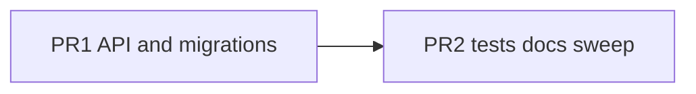

# TG UI Primitives — Adjacent Polish

## Scope (in)

Everything from the prior recommendation **except** Defer/low-ROI: no LogTabBar/Chat mode/SettingsHub-as-segmented, no ChannelCard/PostFeed/palette chrome extractions, no Discover/ChannelGridBody empties, no admin `/_layout` migrate, no screenshot CI.

## Scope (out)

Those deferred items stay out. Paste/Chat/Summary compose textareas stay one-offs.

## Locked approach

- **Ship as 2 PRs** (reviewable, staging-friendly).
- **Color/link gaps:** extend [`tg-button.tsx`](frontend/src/components/ui/tg-button.tsx) with `successSoft` (Sync soft-green), `infoSoft` (Freeze blue), and `link` (Network Clear/Test compact actions) — mirrors existing `dangerSoft`, avoids unbounded `className` soup.
- **Appearance theme:** add `TgSegmentedControl` size `dense` (no `rounded-lg` on track; opacity-style selected) and migrate Appearance — retire its `tg-ui-allow`.
- **Settings headers:** extend [`TgSettingsSection`](frontend/src/components/ui/tg-settings-section.tsx) with optional `subtitle`, `actions`, `headerExtra` — migrate Database Table Sizes + NetworkTelemetry cards.
- **Toggle:** move [`ToggleSwitch.tsx`](frontend/src/components/settings/ToggleSwitch.tsx) → [`ui/tg-toggle.tsx`](frontend/src/components/ui/tg-toggle.tsx) as `TgToggle`; re-export thin alias from old path for one release cycle then update imports in Appearance/Network/Ai.
- **Select:** move [`select-trigger-class.ts`](frontend/src/components/channel-grid/select-trigger-class.ts) to [`ui/tg-select-trigger.ts`](frontend/src/components/ui/tg-select-trigger.ts); channel-grid re-exports for compatibility; document in catalog.
- **Docs:** add [`frontend/docs/tg-ui.md`](frontend/docs/tg-ui.md) primitives catalog; short pointer in [`MEMORY.md`](MEMORY.md); **commit MEMORY** in PR2.
- **CI:** extend [`check-tg-ui-duplicates.sh`](frontend/scripts/check-tg-ui-duplicates.sh) only if new recipes need gating; goal is **zero `tg-ui-allow`** for the current allowlist set after PR1.

---

## PR1 — API extensions + call-site cleanup

### 1. Close `tg-ui-allow` gaps

| Allow site | Fix |
|---|---|
| Sync soft-green confirm | `TgButton variant="successSoft"` |
| Freeze blue soft fill | `TgButton variant="infoSoft"` |
| Network Clear/Test link actions (×4) | `TgButton variant="link" size="sm"` |
| Appearance theme toggle | `TgSegmentedControl size="dense"` |
| ChannelGrid sort direction | `TgIconButton` (+ tooltip) |
| Database Table Sizes header | `TgSettingsSection` + `subtitle`/`actions` |
| NetworkTelemetry Routing/Tor cards | `TgSettingsSection` (+ `headerExtra` if icon-in-title needed) |

Update unit tests in `tg-button.test.tsx` / `tg-segmented.test.tsx` / `tg-settings-section.test.tsx`.

### 2. `TgFieldLabel` (+ thin help text) sweep

- Extend [`tg-input.tsx`](frontend/src/components/ui/tg-input.tsx): keep `TgFieldLabel`; add `TgHelpText` for repeated `text-[10px] opacity-40 italic` helper lines if ≥3 call sites match.
- Migrate duplicate label rows in Sync, SettingGroupsPanel, LogFilterBar, ChatView (settings-like labels only) — do not force Chat status pills into labels.

### 3. Loading completeness audit

Wire `loading` / `loadingLabel` where async and still missing (TG shell only):

- [`BotManagement.tsx`](frontend/src/components/BotManagement.tsx) — Save Bot / Save Destination
- [`TagConfig.tsx`](frontend/src/components/TagConfig.tsx) — Apply suggestions
- [`DiscoverView.tsx`](frontend/src/components/DiscoverView.tsx) — Follow / Follow selected
- [`SummaryView.tsx`](frontend/src/components/SummaryView.tsx) — metadata Save if still async without busy
- Confirm footers already on `TgConfirmDialog` — verify ChannelGrid / History / Database / Logs pass `loading` when confirm awaits
- Leave Sync inline confirm as-is structurally; ensure its confirm button already uses loading (it does)

### 4. `TgToggle` + select trigger move

- As locked above; update Appearance/Network/Ai imports.
- Grep for `ToggleSwitch` / `selectTriggerClassName` → zero direct settings-path / old path usages (compat re-export OK).

### PR1 DoD

- No remaining `tg-ui-allow:` comments for the current set listed above.
- `bun run test:unit` + `bun run test:tg-ui` green.
- Visual look unchanged aside from using shared variants.

---

## PR2 — A11y / Playwright / docs / MEMORY / button sweep

### 5. Focus / a11y consistency

- Spot-fix and fix: chips, segmented (incl. dense), icon+tooltip, palette confirm after tooltip `data-slot` fix.
- Ensure interactive primitives keep `focus-visible:ring-2 focus-visible:ring-app-ink/30` (and danger rings where applicable).
- Keyboard: Tab through Channels toolbar + Settings → Network in Playwright (assert focusable + focus-visible class on sample controls).

### 6. Playwright depth

Extend [`frontend/tests/tg-ui-primitives.spec.ts`](frontend/tests/tg-ui-primitives.spec.ts) (and thin hooks in `summarizer.spec.ts` only if needed):

- Logs clear-all → `TgConfirmDialog` (Cancel no-op; Confirm proceeds)
- One ChannelGrid destructive confirm (delete or reset) open/cancel
- Sync inline confirm still works (not a modal)
- Assert no native `window.confirm` dialogs in those flows
- Theme light/dark already partially covered — add IconButton frosted/ghost hover class asserts on ChannelCard or History action

### 7. Primitives catalog + MEMORY

- Write [`frontend/docs/tg-ui.md`](frontend/docs/tg-ui.md): when to use each `tg-*`, loading rules, `tg-ui-allow` policy, left-behind grep / `bun run test:tg-ui`.
- Update [`MEMORY.md`](MEMORY.md) Architecture pointer to that doc; commit MEMORY (currently local-only sync).

### 8. Remaining raw `<button>` sweep

- Grep TG shell for raw `<button>` not behind `data-slot="tg-*"` / allow.
- Migrate **only** when an existing variant fits (incl. new soft/link). True one-offs keep a one-line `tg-ui-allow` justification.
- Likely leftovers: SettingsHub nav, LogFilterBar density filters, Chat mode toggles — **leave** if they don’t match (already deferred as UX patterns); migrate ChannelCard/History/Chat scraps that are clearly TgButton/IconButton shaped.

### 9. Staging dark/light QA

- Encode the checklist as Playwright class asserts (above) plus a short “manual staging smoke” section in `tg-ui.md` (Channels frosted icons, soft icons, primary/ghost hover) — not a new CI visual system.

### PR2 DoD

- New Playwright cases green locally (`PLAYWRIGHT_CHANNEL=chrome` if needed).
- Catalog + MEMORY committed.
- Raw-button leftover list empty or only documented allow one-offs.
- `test:unit` + `test:tg-ui` green.

---

## Success metrics

- `tg-ui-allow` count for prior gaps → **0**
- Async TG actions from audit show in-button busy state
- Docs exist so future PRs don’t reinvent class strings
- No deferred low-ROI extractions introduced
