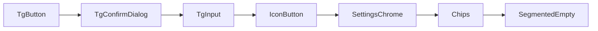

# TG UI Primitives Standardization

## Context (what already exists)

| Existing | Role for this work |
|---|---|
| [`ui/button.tsx`](frontend/src/components/ui/button.tsx), [`ui/loading-button.tsx`](frontend/src/components/ui/loading-button.tsx) | **Admin only** — keep; do not force TG onto these tokens |
| [`ui/input.tsx`](frontend/src/components/ui/input.tsx), [`ui/label.tsx`](frontend/src/components/ui/label.tsx), [`ui/badge.tsx`](frontend/src/components/ui/badge.tsx) | Admin/shadcn; TG shell barely uses them |
| [`ui/dialog.tsx`](frontend/src/components/ui/dialog.tsx) | Keep as Radix shell; TG confirms will wrap it with shared chrome |
| [`ui/tg-tooltip.tsx`](frontend/src/components/ui/tg-tooltip.tsx), [`ui/tg-sonner.tsx`](frontend/src/components/ui/tg-sonner.tsx) | Reuse; do not wrap toast further |
| [`logs/LogEmptyState.tsx`](frontend/src/components/logs/LogEmptyState.tsx), [`logs/LogCardActions.tsx`](frontend/src/components/logs/LogCardActions.tsx) | Reuse patterns; migrate actions onto IconButton later |
| [`channel-grid/select-trigger-class.ts`](frontend/src/components/channel-grid/select-trigger-class.ts) | Keep as-is (select, not button) |

**Corpus:** ~170 raw `<button>`s in TG shell components; ~0 shadcn `Button`/`LoadingButton` usages. Dominant recipe: `app-ink` / mono / uppercase / `tracking-widest`.

**Placement convention:** new files as `frontend/src/components/ui/tg-*.tsx` (matches `tg-tooltip` / `tg-sonner`). Use `cva` + `cn` like admin button, but with TG tokens and shared focus ring: `focus-visible:outline-none focus-visible:ring-2 focus-visible:ring-app-ink/30`.

**Unit test placement (repo convention):** colocated next to source — e.g. `frontend/src/components/ui/tg-button.test.tsx` (same pattern as `setting-groups-panel.test.ts`, `lib/**/*.test.ts`).

## Locked decisions (2026-07-18)

| # | Choice | Locked as |
|---|---|---|
| 1 | A | **7 stacked PRs**, one per phase |
| 2 | A | Unit per primitive + **targeted Playwright** |
| 3 | A | Variants: `primary \| secondary \| ghost \| danger \| dangerSoft` |
| 4 | C | `loading` + optional **`loadingLabel`** (e.g. “Saving…”) |
| 5 / 15 | 5B then **15A wins** | Confirm modals + Discover/Logs `window.confirm`; **SyncSection stays inline** (TgButton only); MigrationPrompt not restyled onto confirm shell |
| 6 | A | Palette confirm: **TgButton/footer styles only**; keep panel + keyboard chrome |
| 7 | A | `TgInput` variants `settings \| muted`; separate textarea; optional `TgFieldLabel` |
| 8 | A | `TgIconButton`: `ghost \| frosted \| danger \| soft` + optional `tooltip` |
| 9 | B | `TgSelectionChip` + `TgMetaChip` + **`TgFilterChip`** (PostFilter / Discover pills) |
| 10 | A | Settings chrome: Ai/Network/Sync/Appearance + BotManagement; DB/Telemetry only if exact match |
| 11 | A | Segmented Diagnostics/Sync/Network; Appearance if fits; HeroEmpty Post/History/Chat; keep LogEmptyState |
| 12 | B | **Playwright theme toggle** asserting class/style presence on sample controls |
| 13 | C | Colocated `tg-*.test.tsx` (existing convention) |
| 14 | B | **Hard CI fail** on phase left-behind duplicate class greps |
| 15 | A | Sync inline confirm does **not** become a modal |

**PR split (locked):** one stacked PR per phase (7 PRs). Land in order; each PR must compile, migrate call sites, add/adjust tests, and pass that phase’s left-behind grep CI gate.

---

## Out of scope (explicit)

- Redesign / new visual language; admin `/_layout` migration
- Forcing TG onto shadcn `Button` / `Input` / `Card`
- Further toast/sonner wrappers
- Componentizing: ChannelCard body layout, PostFeed layout, command-palette chrome/keyboard shell, Discover empty action wiring, ChannelGridBody empty illustration
- **SyncSection inline confirm layout** — keep inline; migrate buttons to `TgButton` only (not `TgConfirmDialog`)
- **MigrationPrompt** as a special dialog type (buttons via `TgButton` only)
- One-off textareas: Paste/Chat/Summary compose boxes (different density)
- LogTabBar, Chat mode toggles (not the Diagnostics/Sync/Network segmented track)
- TagView one-line empties, NetworkTelemetry table-cell empty (<3 / domain-unique)

---

## Phase 1 — `TgButton` (+ loading)

### Inventory (grep-backed)

- ~110–140 labeled TG action buttons across ~25 files
- High-churn: [`HistoryView.tsx`](frontend/src/components/HistoryView.tsx) (17), [`SummaryView.tsx`](frontend/src/components/SummaryView.tsx) (12), [`NetworkSection.tsx`](frontend/src/components/settings/NetworkSection.tsx) (11), [`DatabaseManagement.tsx`](frontend/src/components/DatabaseManagement.tsx) (9), [`BotManagement.tsx`](frontend/src/components/BotManagement.tsx) / [`ChatView.tsx`](frontend/src/components/ChatView.tsx) / [`SyncSection.tsx`](frontend/src/components/settings/SyncSection.tsx) / [`ChannelGridDialogs.tsx`](frontend/src/components/channel-grid/ChannelGridDialogs.tsx) (8 each), plus Channel toolbar/bulk/card, Discover, Tag, Paste, Migration, SettingGroups, PostFilter, Appearance, LogFilterBar
- Primary filled pattern (`bg-app-ink text-app-bg`): ~23–36 sites
- Loading already hand-rolled in many places (`Loader2` + disable); gaps: ChannelGrid confirm buttons, CommandConfirm confirm, History delete confirm, Tag Apply, Bot Save*, SettingGroups Save/Delete/Create, Discover Follow, Summary metadata Save, Sync “Running…” text-only

### Work items

1. Add [`tg-button.tsx`](frontend/src/components/ui/tg-button.tsx):
   - Variants: `primary` | `secondary` | `ghost` | `danger` | `dangerSoft` (mono soft-red used by confirms)
   - Sizes: `sm` | `md` | `lg` (map existing `h-8` / `py-2` / `py-3` densities; allow `className` for width)
   - Props: `loading?: boolean`, optional `loadingLabel?: string` → spinner + `disabled` + `aria-busy`; when `loadingLabel` set, show it instead of (or beside) children while busy
   - Shared hover/focus/disabled that is visible in light and dark (prefer `hover:bg-app-ink/5` / invert fills over opacity-only fades where current buttons already do that)
2. Migrate **all** labeled TG action buttons in scope (not icon-only — those wait for Phase 4).
3. Wire `loading` on async actions listed above so busy state is on the button (not only toast).
4. Replace ad-hoc `Loader2` + class soup where TgButton absorbs it; keep domain icons as children when meaningful (e.g. Sync `RefreshCw`).

### Migration strategy

- File-by-file within the PR, starting with Channel toolbar/dialogs → Settings (Network/Sync/Bots/DB) → Summary/History/Chat/Tag/Discover → leftovers.
- Preserve `data-testid`s and accessible names used by [`frontend/tests/summarizer.spec.ts`](frontend/tests/summarizer.spec.ts) (`getByRole("button", { name: ... })`, palette confirm testids).

### DoD

- Primitive exported; **zero** remaining labeled buttons in TG shell using the old primary/secondary/ghost/danger class recipes (allow true one-offs with a one-line comment).
- Long-running actions in inventory show in-button loading.
- Unit tests for variants/`loading`/`loadingLabel`/disabled/`aria-busy` pass; existing Playwright button-name flows still pass; at least one new loading assertion (e.g. Sync or Summarize shows busy on the button); Playwright theme toggle asserts hover/focus classes on a sample primary+ghost button.

### Risks

- High churn in History/Summary/Network — review carefully for accidental label/testid changes.
- Do not migrate icon-only rows yet (avoids fighting Phase 4 variants).

---

## Phase 2 — `TgConfirmDialog`

### Inventory

| Call site | File | Notes |
|---|---|---|
| 4 dialogs | [`ChannelGridDialogs.tsx`](frontend/src/components/channel-grid/ChannelGridDialogs.tsx) | Repeated Dialog chrome; mixed button dialects |
| Delete summary | [`HistoryView.tsx`](frontend/src/components/HistoryView.tsx) | Soft-red mono footer |
| Generic confirm modal | [`DatabaseManagement.tsx`](frontend/src/components/DatabaseManagement.tsx) | Best API shape: `{ title, message, onConfirm }` |
| Palette confirm | [`CommandConfirmDialog.tsx`](frontend/src/components/CommandConfirmDialog.tsx) | Keep panel + keyboard chrome; share footer buttons only |
| `window.confirm` | [`DiscoverView.tsx`](frontend/src/components/DiscoverView.tsx), [`LogsView.tsx`](frontend/src/components/LogsView.tsx) | Replace with same dialog UX |

**Defer as full dialog rewrite:** MigrationPrompt (non-destructive migrate UX — already uses Dialog; only its buttons come from Phase 1). **SyncSection inline confirm stays inline** (Phase 1 TgButton only; not converted to `TgConfirmDialog` — locked Q15).

### Work items

1. Add [`tg-confirm-dialog.tsx`](frontend/src/components/ui/tg-confirm-dialog.tsx) wrapping existing `Dialog`:
   - Props: `open`, `onOpenChange`, `title`, `description`, `confirmLabel`, `cancelLabel`, `variant: "default" | "destructive" | "dangerSoft"`, `loading?`, `loadingLabel?`, `onConfirm`, `onCancel`
   - Shared header/footer chrome (`p-0`, border header/footer, muted footer bg)
2. Collapse ChannelGrid’s four near-duplicate Dialogs onto it.
3. Migrate History + Database confirms.
4. CommandConfirmDialog: use TgButton (and shared footer class helper if useful); **do not** replace palette panel with Radix Dialog.
5. Replace Discover + Logs `window.confirm` with controlled `TgConfirmDialog` state.

### DoD

- No duplicate confirm shell markup in ChannelGrid/History/Database.
- `window.confirm` count in `frontend/src/components` = **0**.
- Destructive confirms support `loading` when confirm is async.
- New unit tests for open/confirm/cancel/loading/destructive; new Playwright coverage for Discover bulk-follow confirm (≥5), Logs clear-all confirm, and palette confirm (existing testids preserved).

### Risks

- Discover bulk-follow confirm is sync today — keep behavior, improve UX.
- Replacing `window.confirm` removes dialog dismiss via browser chrome — ensure Esc/Cancel/`onOpenChange` parity.

---

## Phase 3 — `TgInput` / textarea (+ cheap field label)

### Inventory

- **Settings mono field** (exact string family): BotManagement **7**, AiSection **4**, Network cousins ~5, Sync ~3–4 → ~19 sites
- **Muted toolbar inputs:** ChannelGridToolbar **3**, ChannelBulkActions **2**, ChannelGridFilterBar **1** → **6**
- History/PostFilter muted fields: related but slightly different radius — include only if they match `muted` variant without fighting layout

### Work items

1. Add [`tg-input.tsx`](frontend/src/components/ui/tg-input.tsx) (+ textarea export or `as="textarea"`):
   - Variants: `settings` (mono uppercase field), `muted` (toolbar/filter)
   - Shared focus ring; disabled opacity
2. Optional thin `TgFieldLabel` in same file if it removes the repeated `opacity-60` + uppercase label row (used heavily next to settings fields).
3. Migrate all Cluster A + Cluster B call sites; leave Paste/Chat compose textareas alone.

### DoD

- Exact settings mono class string and muted toolbar class string have **no** remaining raw duplicates in migrated files.
- shadcn `ui/input` still unused by TG (intentional).
- Unit tests for `settings`/`muted` variants, disabled, focus-visible class; Playwright smoke that channel toolbar search and a settings field still accept input.

### Risks

- Selects that reuse the same class string should either use a `tgFieldClassName` export or stay on native `<select>` with the shared class — one API, two elements.

---

## Phase 4 — `IconButton` (+ tooltip convenience)

### Inventory

- PostCard: ~4 `p-1.5 rounded-full` actions
- HistoryView: ~5–7 `p-1.5 rounded-md` actions
- ChannelCard: ~3 frosted `w-8 h-8 rounded-full` actions
- logs: [`LogCardActions.tsx`](frontend/src/components/logs/LogCardActions.tsx) + PublishLogsTab leftover

**Challenge:** three dialects exist. Extract **one** `TgIconButton` with variants — not three components — only because call sites clearly exceed the <3 threshold once dialects are parameterized.

### Work items

1. Add [`tg-icon-button.tsx`](frontend/src/components/ui/tg-icon-button.tsx):
   - Variants: `ghost` (Post/History default), `frosted` (ChannelCard), `danger`, `soft` (log opacity-30 border style)
   - Optional `tooltip?: ReactNode` wrapping existing `tg-tooltip` to delete boilerplate
   - Support `loading`, `pressed`/active tint via `className` or `data-active` for star/note toggles
2. Migrate PostCard, HistoryView, ChannelCard icon actions, LogCardActions, PublishLogsTab duplicate.

### DoD

- Icon action rows use the primitive; hover visibly changes background/opacity in light and dark.
- Log expand/delete no longer hand-roll the soft border recipe.
- Unit tests for variants, `disabled`, `loading`, tooltip render; Playwright smoke that a PostCard or History icon action remains clickable (and tooltip appears if asserted).

### Risks

- Active/tinted states (starred, translating) must remain call-site controllable — don’t over-API.

---

## Phase 5 — Settings panel chrome + field label

### Inventory

- Repeated card shell `bg-app-card border … p-6 shadow-sm` + icon header: Appearance **3**, Ai **2**, Network **2**, Sync **1**, BotManagement **3**, plus Database/Telemetry cousins → **~11–16**
- Clear LOC win — **in scope** (meets “only if clearly dedupes”).

### Work items

1. Add [`tg-settings-section.tsx`](frontend/src/components/ui/tg-settings-section.tsx): `{ icon, title, children, className? }`
2. Migrate Ai / Network / Sync / Appearance / BotManagement section wrappers; include Database/Telemetry only if the same shell matches without fights.
3. Finish any label dedupe not completed in Phase 3.

### DoD

- Settings hub sections share one wrapper; section files shrink mechanically.
- No new abstraction for one-off RuntimeConfig layouts unless they match exactly.
- Unit render test (icon + title + children); Playwright smoke that Settings hub still opens Appearance/Network sections.

### Risks

- Low visual risk; watch spacing (`mb-6` header) consistency.

---

## Phase 6 — Meta / status chips + selection chips

### Inventory

- Selection: [`ChannelGroupChips.tsx`](frontend/src/components/channel-grid/ChannelGroupChips.tsx) + [`ChannelTagChips.tsx`](frontend/src/components/channel-grid/ChannelTagChips.tsx) — **identical** selected/partial/idle classes (logic already in [`channel-grid-chips.ts`](frontend/src/lib/channels/channel-grid-chips.ts))
- Meta: ChannelCard ~9 identical meta pills; History ~5 mono meta pills (slightly different type scale)
- PostFilter / Discover action pills — interaction chips; only migrate if they map cleanly to a second primitive

### Work items

1. `TgSelectionChip` — selected | partial | idle (Group/Tag only).
2. `TgMetaChip` — quiet status/meta pill; optional `size: "card" | "history"` rather than one overloaded API.
3. `TgFilterChip` — interactive filter/action pills for [`PostFilter.tsx`](frontend/src/components/PostFilter.tsx) and Discover sort/action pills in [`DiscoverView.tsx`](frontend/src/components/DiscoverView.tsx) (separate API from selection/meta — do not overload).
4. Do **not** merge selection / meta / filter semantics into one chip component.

### DoD

- Group/Tag chip class strings exist once.
- ChannelCard + History meta pills use `TgMetaChip` (prefer size variant over one-offs).
- PostFilter + Discover filter/action pills use `TgFilterChip`.
- Unit tests for selection states, meta sizes, filter selected/idle; Playwright smoke for group/tag chip filter and at least one PostFilter/Discover pill toggle.

---

## Phase 7 — Segmented control + empty state

### Inventory

- Segmented track `flex bg-app-ink/5 p-1 rounded-lg border…`: Diagnostics **1**, Sync **1**, Network **2**, Appearance ~1 near-variant → **4–5**
- Hero empty (icon box + title + body): PostFeed, HistoryView, ChatView → **3**
- LogEmptyState: already shared (**keep**; do not invent a third system)

### Work items

1. `TgSegmentedControl` — options array + value/onChange; size `sm` | `md` for Sync/Network vs Diagnostics.
2. `TgHeroEmptyState` — icon, title, description, optional `children` (Chat prompts).
3. Migrate the four segmented call sites + three hero empties.
4. Appearance theme toggle: use segmented if it fits; else leave with one-line justification.

### DoD

- Segmented track class string not duplicated in Sync/Network/Diagnostics.
- Post/History/Chat empties share one layout component.
- LogEmptyState unchanged and still the log empty standard.
- Unit tests for segmented value change + HeroEmpty render; Playwright smoke for Diagnostics Logs/Telemetry switch and at least one empty-state tab.

---

## Testing strategy (full development cycle)

Goal: catch regressions while primitives land incrementally — not a one-shot after all 7 PRs.

### Layers

| Layer | When | What |
|---|---|---|
| **Unit / component** (`bun run test:unit`) | Every phase PR | Colocated `tg-*.test.tsx` next to each primitive — variants, `disabled`, `loading`/`loadingLabel`/`aria-busy`, confirm open/confirm/cancel, input variants, chip states (incl. filter), segmented onChange, empty render |
| **Left-behind grep CI (hard fail)** | Every phase PR | Script (e.g. `frontend/scripts/check-tg-ui-duplicates.sh` or bun script) fails CI if phase-specific orphan class strings remain; expand patterns as phases land |
| **Playwright** ([`frontend/tests/summarizer.spec.ts`](frontend/tests/summarizer.spec.ts) + focused specs if needed) | Per phase when UX changes | Preserve role/name + `data-testid`s; **add** coverage for confirms, loading, chips, segmented/empty |
| **Playwright light/dark** | Every phase that ships interactive chrome (esp. Button, IconButton, Input, Confirm) | Toggle theme (Appearance or localStorage + reload), assert sample controls expose expected hover/focus **classes** (and/or computed style smoke) in both themes |
| **Typecheck** | Every PR | `tsc` / existing frontend check |

### New tests to add (by phase)

1. **TgButton** — unit: each variant; `loading` + `loadingLabel`; `aria-busy`; disabled. E2E: Sync All or Summarize busy affordance; theme toggle asserts primary/ghost hover/focus classes in light+dark.
2. **TgConfirmDialog** — unit: title/body; confirm/cancel; loading/loadingLabel; destructive vs dangerSoft. E2E: Discover ≥5 follow dialog; Logs clear-all; palette confirm testids; theme smoke on dialog actions.
3. **TgInput** — unit: `settings`/`muted`; disabled; ref. E2E: channel search + one settings field; theme focus-ring class assert.
4. **TgIconButton** — unit: variants; tooltip; loading. E2E: History/Post icon action; theme hover class assert.
5. **TgSettingsSection** — unit: title/children. E2E: Settings section visible.
6. **Chips** — unit: selection + meta + **filter** states. E2E: group/tag filter + PostFilter or Discover pill.
7. **Segmented + HeroEmpty** — unit: value change; empty copy. E2E: Diagnostics switch + one empty tab.

### Guardrails for the series

- Do **not** rewrite all of `summarizer.spec.ts` — only fix selectors when labels intentionally change; prefer stable accessible names.
- No new primitives gallery route required — unit matrix is enough unless Playwright theme tests need a tiny fixture page (prefer testing in-app Appearance toggle).
- After Phase 2: CI grep must fail on any remaining `window.confirm(` under `frontend/src/components`.
- Hard duplicate-class CI starts with Phase 1 patterns and grows; justified one-offs need an allowlist comment + script exception entry.

---

## End-state primitives catalog

| Primitive | Use when |
|---|---|
| `TgButton` | Labeled TG actions; set `loading` for async |
| `TgConfirmDialog` | Modal confirms / destructive confirms; replace `window.confirm` |
| `TgInput` / `TgTextarea` | Settings mono fields + muted toolbar/filter fields |
| `TgFieldLabel` | Uppercase settings field labels |
| `TgIconButton` | Icon-only actions; optional `tooltip` |
| `TgSettingsSection` | Settings/Bots card sections with icon header |
| `TgSelectionChip` | Group/Tag multi-select chips |
| `TgMetaChip` | Read-only status/meta pills |
| `TgFilterChip` | PostFilter / Discover interactive filter or action pills |
| `TgSegmentedControl` | Exclusive option tracks (Diagnostics/Sync/Network) |
| `TgHeroEmptyState` | Full-tab empty heroes (Posts/History/Chat) |
| Existing `LogEmptyState` | Log tab empties only |
| Existing `tg-tooltip` / `TgToaster` | Tooltips / toasts — do not rewrap |

---

## Left-behind checklist (must return zero after full series)

Run from `frontend/src/components` (adjust if a justified one-off remains with comment):

1. Raw primary fill on buttons: ad-hoc `bg-app-ink text-app-bg` + `uppercase` on `<button>` outside `tg-button`
2. Soft-red confirm footer class: `border-red-500/30 bg-red-500/10 … tracking-widest text-red-600` duplicated outside tg-button/confirm
3. `window.confirm(`
4. Exact settings field string: `p-3 text-[10px] font-mono uppercase tracking-widest`
5. Muted toolbar: `bg-app-muted/50 border border-app-ink/10` on inputs outside tg-input
6. Settings card shell duplicated: `bg-app-card border border-app-ink/10 p-6 shadow-sm` outside tg-settings-section
7. Segmented track: `flex bg-app-ink/5 p-1 rounded-lg border border-app-ink/10` outside tg-segmented
8. Icon recipes: `p-1.5 rounded-full text-app-ink/50 hover:bg-app-ink/5` and frosted `w-8 h-8 rounded-full bg-app-bg/90` outside tg-icon-button
9. Filter/action pill recipes in PostFilter/Discover outside `TgFilterChip` (phase 6 patterns)

---

## Success metrics

- **DRY:** orphan class-string greps above → 0 (or documented one-offs)
- **Maintainability:** net LOC down across series (expect largest drops in ChannelGridDialogs, BotManagement, settings sections, History/Post icon rows)
- **UX:** hover/focus visible light+dark (Playwright theme asserts); async actions show button `loading`/`loadingLabel`/`aria-busy`
- **Look:** recognizably the same TG mono/uppercase ink language — no admin primary colors in TG shell
- **Tests:** colocated unit suites; targeted Playwright incl. theme toggle; hard CI left-behind greps; `bun run test:unit` + relevant Playwright green each PR

## Test / review notes

- Prefer stacked PRs; each phase reviewable alone (primitive + migrations + tests + CI grep patterns for that phase).
- High-churn review focus: HistoryView, SummaryView, NetworkSection, ChannelGridDialogs, BotManagement, PostFilter/Discover (filter chips).
- PR must pass: unit + Playwright for that phase + hard duplicate-class CI for landed phases.
