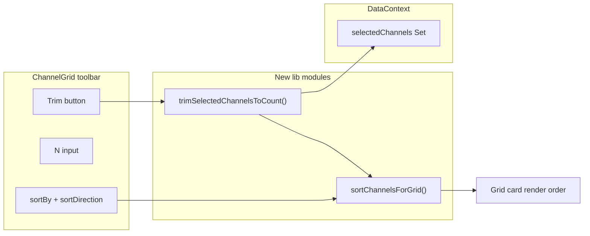

# Trim Channel Selection to N

## Goal

When the user has many channels selected (e.g. 120), let them enter **N** and click **Trim** to keep only the first **N** channels in the current visual sort order, deselecting the rest. Examples:

- Sort **Activity Rate** ascending + Trim **30** → keep 30 least active among selected
- Sort **Activity Rate** descending + Trim **10** → keep 10 most active among selected

Constraints (confirmed via decision review):

- **Shrink only** — never add unselected channels
- **Candidate scope** — all globally selected channels (filter-hidden selections still ranked)
- **Sort order** — same as on-screen grid order via `sortChannelsForGrid` (selected-first tier is harmless)
- **Overflow** — if `N >= selectedCount`, no-op + info toast ("Already N or fewer selected")
- **N = 0 / empty** — invalid; disable Trim (use existing **None** to clear all)
- **UI placement** — sort toolbar row, next to Sort By + direction toggle (not bulk actions bar)
- **Persist N** — yes, `localStorage` key `channelGrid_trimCount`
- **Enter key** — applies Trim immediately from N input
- **Command palette** — include v1 command: "Trim channel selection to N…"
- **Button label** — **Trim**

## Architecture



## 1. Extract shared sort comparator

**New file:** [`frontend/src/lib/channels/sort-channels-for-grid.ts`](frontend/src/lib/channels/sort-channels-for-grid.ts)

Move logic currently inlined in [`ChannelGrid.tsx`](frontend/src/components/ChannelGrid.tsx) (~lines 64–102, 1090–1159):

- Export `ChannelGridSortOption` type (same values as today’s `SortOption`)
- Export `CHANNEL_GRID_SORT_LABELS: Record<ChannelGridSortOption, string>` for toast text
- Move `compareNullableSyncAt`, `getNextAutoSyncAt`, and channel field comparators
- Export `sortChannelsForGrid({ channels, channelStats, selectedChannels, sortBy, sortDirection })` implementing:
  1. Selected → unselected → frozen tier (same as today)
  2. Sort key + direction within tier
  3. Stable tiebreaker: `displayName || name` via `localeCompare`

**Refactor** [`ChannelGrid.tsx`](frontend/src/components/ChannelGrid.tsx):

- Import `sortChannelsForGrid` and replace inline `.sort(...)` in the grid render
- Keep `sortBy` / `sortDirection` state + localStorage keys unchanged (`channelGrid_sortBy`, `channelGrid_sortDirection`)

## 2. Pure trim helper

**New file:** [`frontend/src/lib/channels/trim-selected-channels.ts`](frontend/src/lib/channels/trim-selected-channels.ts)

```ts
export type TrimSelectedChannelsResult =
  | { status: "applied"; previousCount: number; nextCount: number; keptNames: string[] }
  | { status: "noop"; reason: "empty_selection" | "already_within_limit" | "invalid_count"; selectedCount: number }
```

`trimSelectedChannelsToCount({ channels, channelStats, selectedChannels, sortBy, sortDirection, count })`:

1. If `selectedChannels.size === 0` → `noop: empty_selection`
2. If `!Number.isFinite(count) || count < 1` → `noop: invalid_count`
3. Build candidates: `channels.filter(c => selectedChannels.has(c.name))` (full list, **not** `filteredChannels`)
4. Sort candidates with `sortChannelsForGrid(...)` (same visual order)
5. If `count >= candidates.length` → `noop: already_within_limit`
6. `keptNames = sorted.slice(0, count).map(c => c.name)` → return `applied`

Return value only — no side effects. `ChannelGrid` calls `setSelectedChannels(new Set(keptNames))`.

## 3. UI in ChannelGrid

**Location:** In the **sort toolbar row** in [`ChannelGrid.tsx`](frontend/src/components/ChannelGrid.tsx), immediately after the asc/desc toggle (~line 932). Keeps Trim adjacent to the sort controls it depends on.

```
[ Sort By ▾ ] [ ↑/↓ ]  |  [ N ] [ Trim ]
```

**State:**

- `trimCount` — string/number input; persist last value in `localStorage` key `channelGrid_trimCount`
- Default: restore from localStorage on mount, else empty

**Trim handler:**

```ts
const result = trimSelectedChannelsToCount({ ... })
if (result.status === "applied") {
  setSelectedChannels(new Set(result.keptNames))
  toast.success(`Trimmed selection from ${result.previousCount} → ${result.nextCount} (${label}, ${direction})`)
} else if (result.reason === "already_within_limit") {
  toast.info(`Already ${result.selectedCount} or fewer selected`)
}
```

Use `toast` from `sonner` (existing pattern in [`delete-selected.ts`](frontend/src/lib/channels/delete-selected.ts)).

**Disabled states:**

- No selection → disable N input + Trim
- Invalid/empty N (< 1) → disable Trim
- `summarizing` / bulk ops in flight → disable Trim (match existing toolbar guard pattern)

**Enter key:** pressing Enter in the N input applies Trim (same as clicking the button).

**Tooltip on Trim:** *"Keep the first N selected channels by current sort order. Only shrinks selection."*

**Test IDs:** `data-testid="channel-trim-count"`, `data-testid="channel-trim-button"`

## 3b. Command palette

**New command** in [`frontend/src/lib/commands/channel-entities.ts`](frontend/src/lib/commands/channel-entities.ts) or [`extended-commands.ts`](frontend/src/lib/commands/extended-commands.ts):

- Label: **Trim Channel Selection to N…**
- Disabled when `selectedChannels.size === 0`
- Opens numeric prompt (reuse existing palette editor/input pattern if available; otherwise inline number step in command flow)
- Calls same `trimSelectedChannelsToCount` helper + toast feedback
- Uses current `sortBy` / `sortDirection` from context or localStorage (`channelGrid_sortBy`, `channelGrid_sortDirection`)

## 4. Tests

**Unit tests:** [`frontend/src/lib/channels/trim-selected-channels.test.ts`](frontend/src/lib/channels/trim-selected-channels.test.ts)

Cover:

- Activity rate asc → keeps lowest-velocity channels
- Activity rate desc → keeps highest-velocity channels
- `N >= selectedCount` → noop
- `N = 0` / invalid → noop
- Selected channel hidden by grid filter is still ranked (pass full `channels`, not filtered subset)
- Unselected channels never appear in result

Optional small tests for `sortChannelsForGrid` extraction if not fully covered by trim tests.

**E2E (targeted):** add to [`frontend/tests/summarizer.spec.ts`](frontend/tests/summarizer.spec.ts)

1. Seed 5+ channels with distinct `channelStats.velocity` via API
2. Select all
3. Set sort Activity Rate + direction
4. Enter N=2, click Trim
5. Assert selection count = 2 and header/active-channel count updates
6. Click Trim with N >= current selection → info toast, count unchanged

## Out of scope (this iteration)

- Preview modal before apply
- Random sampling mode (Posts tab owns that pattern)

## Files touched

| File | Change |
|------|--------|
| `frontend/src/lib/channels/sort-channels-for-grid.ts` | **New** — extracted comparator |
| `frontend/src/lib/channels/trim-selected-channels.ts` | **New** — trim logic |
| `frontend/src/lib/channels/trim-selected-channels.test.ts` | **New** — unit tests |
| `frontend/src/components/ChannelGrid.tsx` | Refactor sort + add Trim UI next to sort controls |
| `frontend/src/lib/commands/channel-entities.ts` or `extended-commands.ts` | Palette command |
| `frontend/tests/summarizer.spec.ts` | E2E regression |
