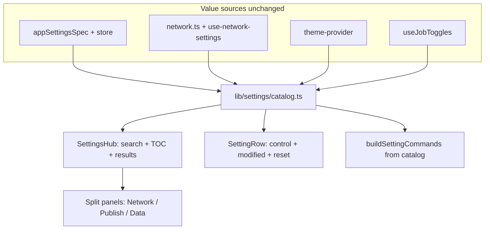

# VS Code–style Settings Hub

## Locked decisions

- **Ship as multi-PR phases** (reviewable on staging).
- **Search:** empty query = TOC browse; non-empty = **flatten matches across categories** (VS Code).
- **Setting Groups:** TOC leaf under **Channels & Sync** (opens existing [`SettingGroupsPanel`](frontend/src/components/SettingGroupsPanel.tsx)).
- **Catalog first:** one registry feeds Settings UI **and** palette; migrate [`settings-schema.ts`](frontend/src/lib/commands/settings-schema.ts) in the same effort; **preserve every existing palette command** (ids, enable/disable/toggle triples, numeric editors, job toggles, navigate-settings, group open).
- **Commonly Used:** static curated list v1 (no affinity yet).
- **Advanced Mode:** **retire entirely** — remove header toggle, `advancedOnly` gating, and UI conditionals in Ai/Network; **show every setting by default**. Search replaces progressive disclosure. Drop `advancedMode` from active schema/context/palette (ignore leftover localStorage).
- **Custom panels:** full **structural rewrite/split** of Network, Publishing, and Data (not register-only). Diagnostics / Runtime Config stay Tools panels (searchable by title); telemetry stays under Diagnostics ([`NetworkTelemetry`](frontend/src/components/NetworkTelemetry.tsx)).

## Out of scope (this effort)

- User/Workspace scopes, pixel-perfect VS Code chrome.
- Admin `/_layout/settings`.
- Making Runtime Config an editable JSON twin of the catalog (keep read-only Tools view).
- Affinity-ranked Commonly Used.
- **AI / embeddings / TF-IDF settings search** — **not in PRs 1–4**, but an **intentional future follow-up** (see below). Do not treat as rejected.

## Future: semantic settings search (planned later)

VS Code layers TF-IDF / embeddings / LLM ranking on top of local string match. We will want the same for natural-language queries (e.g. “how often do channels sync”) once the catalog + local search exist.

**Design constraint for this effort:** keep settings search behind a small provider interface (e.g. `searchSettings(query) → ranked hits`) so PR1 ships **local/string ranking only**, and a later PR can add an embeddings (or TF-IDF) provider without reworking the hub UI, TOC, or catalog schema. Catalog entries should already carry stable `id` + `label` + `description` + `keywords` — that text is the future embedding corpus. No backend/AI wiring in PRs 1–4.

## Architecture

**Catalog owns presentation + search + command generation.** Persistence stays split (`schema` / `network` / `theme` / `jobs`) — catalog references `source`, does not merge stores.

## Target TOC IA

Replace flat [`SETTINGS_TABS`](frontend/src/constants.ts) with a hierarchical TOC (IDs stable for URL `section`):

- **commonly-used** — curated static ids (theme, selectedModel, aiLanguage, syncConcurrency, proxyEnabled, postRetentionDays, …)
- **appearance**
- **channels-sync** — catalog sync knobs + TOC leaf **setting-groups** → panel
- **ai**
- **network** — children: **proxy**, **tor** (split from [`NetworkSection.tsx`](frontend/src/components/settings/NetworkSection.tsx))
- **publishing** — children: **bot-credentials**, **destinations**, **quick-message** (split from [`BotManagement.tsx`](frontend/src/components/BotManagement.tsx))
- **data** — children: **retention**, **table-sizes**, **transfer**, **query**, **danger** (split from [`DatabaseManagement.tsx`](frontend/src/components/DatabaseManagement.tsx))
- **tools** — **diagnostics**, **runtime-config**

URL: keep `?tab=settings&section=<tocId>`; add `?setting=<catalogId>` for deep-link focus/scroll/highlight. Preserve `settingGroup` for groups panel. Update [`navigate.ts`](frontend/src/lib/commands/navigate.ts) + legacy `?tab=network` redirect.

## Search + filters

- Sticky search in hub header; debounce ~200ms; **local string ranking only** for now (reuse / extend [`rank-commands.ts`](frontend/src/lib/commands/rank-commands.ts) over id, label, description, keywords, enum labels).
- Implement search via a small **provider seam** so a future embeddings/TF-IDF provider can plug in without hub rewrites (see Future section).
- Operators v1: `@modified`, `@feature:<group>`, `@id:<id>` (no `@tag:advanced` hiding — all rows visible).
- Funnel / `@` suggestions for operators.
- Panel entries (Setting Groups, Proxy, Tor, Bot sections, Data slices, Diagnostics, Runtime) registered as **searchable panel targets** (match title/keywords → navigate to TOC leaf).

## Setting row UX (catalog-backed knobs)

- Title, short description, TG control ([`TgToggle`](frontend/src/components/ui/tg-toggle.tsx) / [`TgInput`](frontend/src/components/ui/tg-input.tsx) / select / segmented).
- Modified accent when value ≠ default; gear/menu: **Reset to default**, **Copy ID**.
- Instant persist (existing behavior).

---

## PR1 — Catalog, search shell, palette migration, kill Advanced Mode

**Do first; unblocks everything else.**

1. Add [`frontend/src/lib/settings/catalog.ts`](frontend/src/lib/settings/catalog.ts) (+ types/tests): entries for all current palette-editable settings (app + network + theme + jobs) with `id`, `label`, `description`, `keywords`, `group`, `control`, `source`, defaults, command-generation hints.
2. Close palette gaps where schema keys exist but lack editors if they are real user knobs (e.g. `regularSyncIntervalMinutes`, `dynamicSync*`, `syncFailureBackoffMinutes`) — include in catalog **and** generate the same command shapes as other numerics/booleans.
3. Rewrite [`settings-schema.ts`](frontend/src/lib/commands/settings-schema.ts) to **generate** from catalog; snapshot test / explicit allowlist that every previous command **id** still exists (toggle/enable/disable, enums, editors, embeddings, job toggles).
4. Hub search UI in [`SettingsHub.tsx`](frontend/src/components/SettingsHub.tsx): filter/flatten catalog + panel targets; wire `?setting=`.
5. Catalog-driven rows for Appearance / AI / Sync knobs (migrate off hand-rolled bits where straightforward); keep Setting Groups / jobs trigger UI as panels/sections temporarily if needed.
6. **Remove Advanced Mode:** [`SettingsView.tsx`](frontend/src/components/SettingsView.tsx) toggle; unwrap `{advancedMode && …}` in Ai/Network; strip `advancedOnly` / `maybeEnableAdvanced` / `when: advancedMode` in commands; remove from [`schema.ts`](frontend/src/lib/settings/schema.ts) + context + tests.
7. Unit tests: catalog search, `@modified`, command-id parity, advancedMode gone.

**DoD:** Settings searchable; all knobs visible; palette command count/ids preserved (or documented 1:1 renames none); `bun run test:unit` + `test:tg-ui` green.

---

## PR2 — TOC IA + Commonly Used + Setting Groups leaf

1. Replace flat Engine Room list with hierarchical TOC (TG-styled, not shadcn); narrow layout hides TOC, keeps search.
2. Wire new section ids; migrate old section ids (`sync` → `channels-sync`, `db` → `data`, etc.) in `normalizeSettingsSection`.
3. Commonly Used curated static page.
4. Setting Groups as TOC leaf under Channels & Sync (reuse panel; keep `settingGroup` URL).
5. Update navigate palette commands to new labels/ids.
6. Playwright: open settings → search → flatten hit → deep-link `?setting=` → open Setting Groups leaf.

**DoD:** New IA live; old `?section=` aliases work; no Advanced Mode regressions.

---

## PR3 — Network panel rewrite/split

Split [`NetworkSection.tsx`](frontend/src/components/settings/NetworkSection.tsx) (~960 lines) into:

- `settings/network/ProxyPanel.tsx` — enable, URL list, concurrency, overrides, test/clear actions
- `settings/network/TorPanel.tsx` — enable, mode, URLs, rotation, control port, auto-rotate, test/clear

Thin `NetworkSection` or TOC children render these. Catalog rows for boolean/numeric network knobs can sit above custom sub-UI. Preserve existing API calls / toast / log behavior. Colocated tests for any extracted pure helpers.

**DoD:** Proxy and Tor reachable via TOC + search; behavior parity; file sizes maintainable.

---

## PR4 — Publishing + Data panel rewrite/split

**Publishing** — split [`BotManagement.tsx`](frontend/src/components/BotManagement.tsx) (~900 lines):

- `BotCredentialsPanel`
- `DestinationsPanel`
- `QuickMessagePanel`

**Data** — split [`DatabaseManagement.tsx`](frontend/src/components/DatabaseManagement.tsx) (~780 lines):

- `RetentionPanel` (catalog-backed days + reset)
- `TableSizesPanel`
- `TransferPanel` (export/import/migrate)
- `QueryPanel`
- `DangerPanel` (clear-table confirms via `TgConfirmDialog`)

Register each as TOC children under publishing/data + searchable panel targets. Remove stray `console.log` in DatabaseManagement while touching it. Retention stays schema-driven.

**DoD:** All leaves work; search finds “retention”, “destinations”, etc.; confirms/loading still use TG primitives; unit + Playwright smoke.

---

## Testing strategy

- **Unit:** catalog match/rank, parseQuery operators, modified/reset, command-id parity snapshot, section alias normalize.
- **Component:** SettingRow modified/reset; TOC navigation.
- **Playwright:** search flatten, `@modified`, deep-link, Setting Groups leaf, one Network + one Data path after splits.
- Keep **`bun run test:tg-ui`** green; no new orphan button recipes — use existing `tg-*` primitives.

## Docs / memory

- Short section in [`frontend/docs/tg-ui.md`](frontend/docs/tg-ui.md) or new `frontend/docs/settings-catalog.md`: catalog rules, operators, TOC ids.
- After land: sync [`MEMORY.md`](MEMORY.md) (Settings hub IA, advancedMode removed, catalog owns palette).

## Risk notes

- **Command parity** is the highest risk in PR1 — treat id snapshot as a gate.
- **Panel splits (PR3–4)** are behavior-preserving refactors; avoid logic changes beyond structure + TOC wiring.
- Section URL renames need aliases so bookmarks/palette don’t break.
