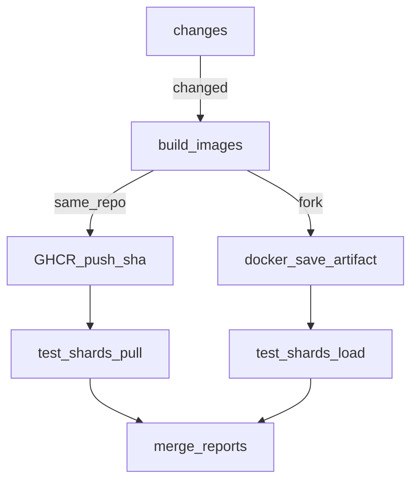

# CI speed plan

Status: Proposed (refined)
Constraint: standard `ubuntu-latest` / existing self-hosted deploys only — **no larger runners, no paid Actions compute**. Repo stays public → Actions minutes stay free.
Goal: cut **wall-clock** to merge-green; secondary goal is fewer 30–40 min flake/cold-build outliers.

Progress legend: `[ ]` todo · `[~]` in progress · `[x]` done · `[-]` cancelled / deferred

## Critique of the first draft

The earlier draft was directionally right but overbuilt and under-committed:

1. Open D1–D4 stalled execution — **locked below**.
2. Phase 1 was one mega-change (GHCR + forks + drop client regen + split specs + 4 shards) — **split into workstreams A→C with measure gates**.
3. Bare `docker compose build` builds unused `frontend` (multi-stage, expensive cache) and redundant `prestart`/`worker` tags. E2E only needs **`backend` + `playwright`**.
4. Host `uv` / `bun` / `generate-client` on every shard only regenerates a **committed** client — drop from Playwright CI.
5. Path filters + coverage diet were delayed behind registry work — they land first (A).
6. Backend 3-way matrix was premature — **conditional (D)** after measurement.
7. Stretch phase removed — **stop when S1–S5 met**.

## Locked decisions

| Topic | Lock |
|---|---|
| Image share (same-repo) | **GHCR** `ghcr.io/<owner>/<repo>/{backend,playwright}:<sha>`. Build **only** those two services. |
| Image share (forks) | **Build job + `docker save` artifact → shards `docker load`** (no `packages:write`). |
| Backend matrix | **Not default.** Add 3-way `api` / `services` / `rest` + per-job DBs only if backend wall-clock still > ~6 min after A–C. |
| Coverage HTML | **`main` only.** PRs: text `coverage report --fail-under=70` without `dynamic_context`. |

## Baseline (measured 2026-09-08)

| Signal | Value |
|---|---|
| Green PR wall-clock | ~12 min (Playwright critical path) |
| Backend | ~9.5 min (`2391 passed in 503s` under coverage) |
| Playwright (warm cache) | ~12 min: ~3 min docker build ×2 shards + 6–8 min tests |
| Playwright (cold/contended cache) | build alone **18–20 min** on one shard |
| Failed Playwright | 27–42 min (cold build + retries) |
| Runner-min / green PR | ~34 (free while public) |

Critical path today: **Playwright ≈ Backend ≈ 10–12 min**.

## Non-negotiables

1. Playwright `workers: 1` until per-worker users/DBs exist (parallelism already measured as worse).
2. No naive `pytest-xdist` on one shared `app_test` (truncate races).
3. No larger / macOS / Windows hosted runners.
4. Do not weaken architecture guards to go faster.
5. Client drift stays on pre-commit `generate-frontend-sdk` + conform files — Playwright is not the SDK check.
6. Playwright still reports on `main` pushes, but image builds and browser
   shards follow the runtime-input classifier; a classifier failure fails the
   required summary instead of silently skipping the suite.

## Target shape

```
PR / push
├── zizmor          (.github/workflows only)     ~15s
├── pre-commit      (always on PR)               ~1m
├── frontend-unit   (frontend paths)             ~30s
├── backend         (backend paths; lighter)     ~3–6m → leave critical path
├── docker-smoke    (compose/Dockerfiles only)   ~1m
└── playwright
    ├── changes?
    ├── build-images once → GHCR :sha (or artifact on forks)
    ├── test shards (pull/load only, workers=1)
    └── merge reports
```

Green wall-clock target (**revised after measurement**): **p50 ≤ 12 min**, **p95 ≤ 15 min**
on warm GHCR with the current architecture (build ≈5 min + slowest shard ≈5–6 min).
Original ≤6 / ≤10 deferred until image reuse when the Docker context is unchanged.

---

## Tasks

### A — Quick wins (one PR)

- [ ] A.0 Complete (exit: green PR; durations in logs; path filters skip unrelated work)
  - [ ] A.1 Path-filter [`test-backend.yml`](../../.github/workflows/test-backend.yml) (`backend/**`, root lockfiles / `pyproject.toml`, `compose*.yml`, own workflow)
  - [ ] A.2 Add `pytest --durations=30` to backend CI
  - [ ] A.3 Drop `dynamic_context=test_function` on CI; keep `--fail-under=70`
  - [ ] A.4 Upload `htmlcov` on `main` only
  - [ ] A.5 Path-filter [`test-docker-compose.yml`](../../.github/workflows/test-docker-compose.yml); add buildx + [`compose.cache.yml`](../../compose.cache.yml)
  - [ ] A.6 Path-filter [`zizmor.yml`](../../.github/workflows/zizmor.yml) to `.github/workflows/**`
  - [ ] A.7 Playwright: drop host `uv` / `bun` / `generate-client`; build only `backend playwright`
  - [ ] A.8 Create [`results.md`](results.md); record post-A wall-clock
  - [ ] A.9 Leave [`pre-commit.yml`](../../.github/workflows/pre-commit.yml) always-on for PRs

### B — Shared image build (biggest win)

- [ ] B.0 Complete (exit: shards spend ~0 on `compose build`; cold path = one build)
  - [ ] B.1 Split [`playwright.yml`](../../.github/workflows/playwright.yml): `changes` → `build-images` (sole GHA cache writer via `compose.cache.yml`)
  - [ ] B.2 Same-repo: push `backend` + `playwright` to GHCR as `:<sha>` (`packages: write`)
  - [ ] B.3 Shards: `docker pull` + set `DOCKER_IMAGE_*` / `TAG` — **no** `compose build`
  - [ ] B.4 Forks: `docker save` artifact from build job → shards `docker load`
  - [ ] B.5 Keep `workers: 1`; keep merge-reports + `alls-green`; update required checks if job names change
  - [ ] B.6 Do **not** raise shard count in this PR
  - [ ] B.7 Record warm (+ cold if available) wall-clock in `results.md`

### C — Balance + more shards

- [ ] C.0 Complete (exit: slowest shard tests ~3–4 min; PW wall-clock ≈ build + that)
  - [ ] C.1 Split [`frontend/tests/summarizer.spec.ts`](../../frontend/tests/summarizer.spec.ts) into 3–4 files by feature
  - [ ] C.2 Raise matrix 2 → **4** shards
  - [ ] C.3 Confirm file-level balance in shard logs; record in `results.md`
  - [ ] C.4 Keep `workers: 1`

### D — Backend parallelism (conditional)

- [ ] D.0 Gate: after A–C, if backend wall-clock still > ~6 min on backend-touching PRs → do D; else mark `[-]`
  - [ ] D.1 Matrix 3 legs with **separate DBs** (`app_test_api`, `app_test_services`, `app_test_rest`)
  - [ ] D.2 `coverage run --parallel-mode` per leg + combine job + fail-under
  - [ ] D.3 Record wall-clock in `results.md`
  - [ ] D.4 Do **not** enable naive xdist on one DB

### E — Flake tax (after wall-clock is honest)

- [ ] E.0 Complete (exit: failed-run time ≈ green + one retry, not +20 min docker)
  - [ ] E.1 After B, inventory flaky titles from last ~20 failed Playwright runs
  - [ ] E.2 Fix root causes (shared account / channel-list / timing) — no retry inflation
  - [ ] E.3 Keep `--fail-on-flaky-tests`
  - [ ] E.4 Optionally `retries` 2 → 1 once flake rate is near zero (data-gated)
  - [ ] E.5 Record failure outlier times in `results.md`

### Success criteria

- [x] S1′ — Green PR wall-clock p50 ≤ **12 min** (warm GHCR; measured ~11)
- [x] S2′ — No Playwright shard `docker compose build` (shared `build-images` only)
- [x] S3′ — Backend ≤ ~5 min on backend-touching PRs (measured ~4.5)
- [x] S4′ — Still $0 Actions minutes on public standard runners; GHCR packages public
- [-] S1/S2 original (p50 ≤ 6 / p95 ≤ 10) — **deferred**; needs Docker-context image reuse

**Stop when S1′–S4′ are met.** Do not invent stretch work in this PR.

---

## Workstream detail

### A — Quick wins

Edit workflows only. No GHCR yet; still dual-shard builds, but each builds **only** `backend` + `playwright` (drops unused frontend multi-stage).

**Exit:** green PR; durations visible; frontend-only / docs-only PRs skip backend, smoke, and zizmor when paths allow.

### B — Shared image build



Compose already parameterizes `${DOCKER_IMAGE_BACKEND}:${TAG}` — shards point those at the sha tags. Playwright image is named via compose override build; retag/pull consistently in the workflow.

**Exit:** shard jobs never rebuild; dual-writer 18–20 min spikes gone.

### C — Balance + more shards

Playwright shards by **file**. `summarizer.spec.ts` (~54 tests / ~1900 LOC) is the long pole — split before raising shard count, otherwise 4 shards still wait on one fat file.

### D — Backend parallelism (only if needed)

`conftest.py` uses one `app_test` + per-test truncate → xdist races. Matrix with **separate database names per job** is the safe parallelism. Skip entirely if A’s coverage diet + path filters already leave backend under Playwright.

### E — Flakes

Failed 27–42 min runs mixed cold builds with retries. Fix inventory **after B** so build noise does not dominate the list.

---

## Out of scope

| Idea | Why not |
|---|---|
| Playwright `workers: 2+` without isolation | Measured regression |
| Naive `pytest-xdist` on one `app_test` | Truncate races |
| Larger runners / paid compute | Violates free constraint |
| Deleting architecture-guard tests | Wrong trade |
| Skipping Playwright on `main` | `main` must stay honest |
| Folding smoke into Playwright | Defer until A–B stable; not on the critical path once PW is ~4–6 min |

## Sequencing

| Stream | Touches | Effect | Gate |
|---|---|---|---|
| A | workflows, coverage config | fewer skips wasted; smaller PW builds; durations | none — do first |
| B | `playwright.yml`, GHCR | **12 → ~6–8 min**; kills build races | after A |
| C | `summarizer.spec.ts`, shard matrix | PW tests ~3–4 min wall | after B green |
| D | `test-backend.yml`, DBs | backend ≤ ~3–5 min | only if still > ~6 min |
| E | e2e specs | failure outliers | after B |

Tick boxes in this file as work lands (`[ ]` → `[~]` → `[x]`). Implementation starts with **A** when this plan is accepted.
