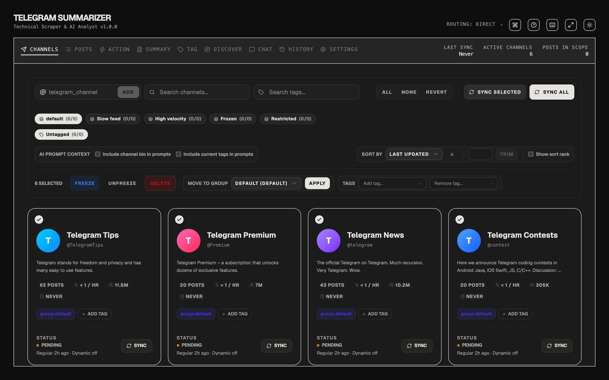
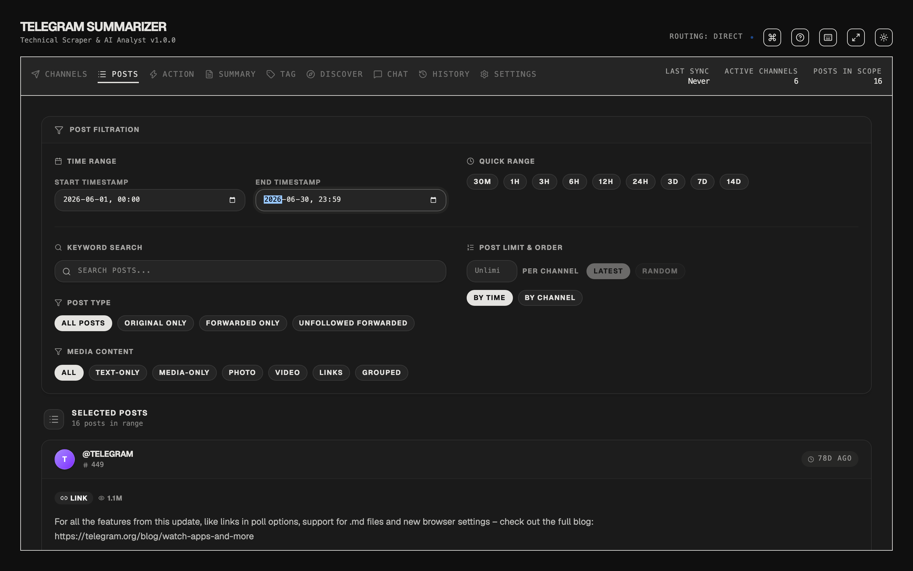

# tg-workspace

A self-hosted workspace for public Telegram channels. It follows the channels you
care about, syncs their posts into PostgreSQL, and runs AI over whatever slice of
them you select: summaries, a chat you can ask questions of, automatic tagging,
and discovery of channels you are not following yet.

It reads Telegram's public web view (`t.me/s/<channel>`). No account, no API
credentials, no MTProto.



<sub>Screenshots are a local instance seeded from the committed test fixtures, which
are captures of Telegram's own public channels.</sub>

**Not a supported product.** I built this for myself and I am not supporting
deployments of it. Issues are open and I read them, but expect no SLA. It needs
PostgreSQL with pgmq, and its sync tier is pinned to a single replica on purpose.

MIT licensed.

## What it does

You **Follow** channels. A background worker walks each one's page history and
stores every **Post**. You then pick a **Scope**, which is a set of channels
crossed with a date range and a set of filters, and produce one of four
**Artifacts** from it:

| Artifact | What it is |
|---|---|
| Summary | AI prose about the posts in the scope, optionally published back to a Telegram channel |
| Chat | A conversation about those posts, either full-scope or retrieval-backed over embeddings |
| Tag run | AI-proposed channel tags, with execution state, because it can fail |
| Discovery report | Channels found by scanning your posts for outward references |



Every artifact freezes the scope it was made from, so reopening one restores that
selection rather than reinterpreting it against today's data. The vocabulary above
is precise and enforced; [`CONTEXT.md`](CONTEXT.md) is the glossary.

## Why the repo might interest you

The interesting part of this codebase is not the Telegram features. It is that
roughly 182,000 lines of Python and TypeScript were built almost entirely through
agent-assisted development, and that the architecture is held together by
executable guards rather than by documentation nobody rereads.

There are 1,693 backend test functions across 180 files, plus 118 frontend test
files. A large share of them assert *architectural* claims rather than behaviour:
that every service module declares one of five kinds, that no route returns an
untyped dict, that every mounted operation is probed for cross-account leakage or
excused with a typed reason, that a fix applied to one of two twin modules also
covers the twin. [`CLAUDE.md`](CLAUDE.md) indexes every one of those invariants
with a pointer to the test that enforces it.

The reasoning is on disk too, not just the results. [`.scratch/`](.scratch/) holds
the ticket-by-ticket plan for the multi-account programme.
[`docs/`](docs/) holds the architecture decision records and the performance
investigations, including the one where a scheduled job was found burning 69
minutes of database time every 10 hours computing statistics it discarded.

If you want to see what building this way actually looks like, including the parts
that went wrong, those directories are the reason the repo is public.

## Architecture in one screen

Two processes. The API serves requests; a separate worker owns the scheduler and
drains the queue. Sync work is enqueued one message per channel across six pgmq
lanes, drained strictly between priority tiers and weighted 3:2:1 within one, so a
trickle of interactive work never starves auto-sync. One sync per channel at a
time, claimed by a row rather than by process memory, so a second request coalesces
onto the first instead of duplicating it.

Every request to Telegram leaves through an acquired Lane, which is one proxy with
a concurrency limit. A worker binds to its proxy for a whole channel walk and never
hops, including on retry, because moving a struggling proxy's load onto healthy ones
is the worst thing to do exactly when Telegram is pushing back. Rate limiting is
adaptive per proxy and distinguishes seven outcomes, because a 404 is Telegram
answering, not a proxy fault.

Row visibility has one seam. Every table is classified as user-owned,
follow-scoped, or shared corpus, and dispatch is by model class rather than by
hand-written `where` clauses. Over-quota degrades an account to a slower lane
rather than refusing it; past a hard ceiling nothing runs.

## Stack

Backend is FastAPI, SQLModel, Alembic, PostgreSQL with pgmq, and APScheduler,
managed by uv. Embeddings live in an ordinary table and are searched with numpy
rather than a vector extension. Frontend is React 19, Vite, TanStack Query and
Router, managed by bun, with an OpenAPI-generated client. AI providers are
pluggable and Gemini is the one implemented.

## Running it

```bash
cp .env.example .env      # every tunable is documented in there
docker compose watch      # frontend :5173, API :8000, docs :8000/docs
```

Native development, tests, migrations and the Playwright suite are in
[development.md](development.md). Traefik, the production compose stack and the
deploy workflow are in [deployment.md](deployment.md).

## Documentation

| Where | What |
|---|---|
| [CONTEXT.md](CONTEXT.md) | The glossary. Start here if a term looks overloaded |
| [CLAUDE.md](CLAUDE.md) | Every architectural invariant, with the test that enforces it |
| [docs/migration/](docs/migration/) | Architecture decision records |
| [docs/](docs/) | Performance investigations and design plans |
| [.scratch/](.scratch/) | The multi-account programme, ticket by ticket |
| [docs/pr-archive/](docs/pr-archive/) | All 176 pull requests, one written rationale per change |

The documentation still calls the product "TG Summarizer" in places. The repository
was renamed because a summary is only one of the four artifacts; the docs will
catch up.

## Credit

Built on [fastapi/full-stack-fastapi-template](https://github.com/fastapi/full-stack-fastapi-template).
