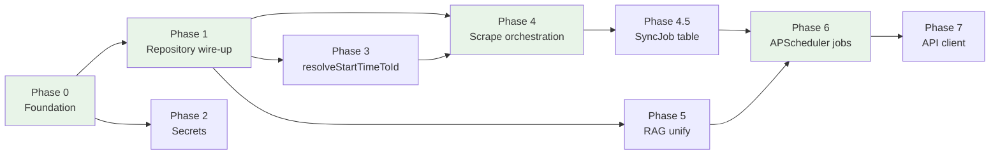

# Implementation Plan

**Date:** 2026-06-08
**Locked decisions:** [DECISIONS.md](./DECISIONS.md)

Phased migration from browser-first TG-Summarizer (IndexedDB + Express) to FastAPI + PostgreSQL with hybrid read-through cache. Critical path: **Phase 0 → 1 → 4 → 6**.
**Migration complete (Phases 0–7), 2026-06-08.** IndexedDB is a read-through cache; Postgres, server jobs, and unified `frontend/src/api/` are in place. See phase completion tables below.

> **Historical document — read principle 1 with care.** As of 2026-08-01 the read-through cache
> is being retired: [ADR-009](./ADR-009-server-authoritative-data.md) supersedes ADR-003, making
> PostgreSQL authoritative with TanStack Query as the only client cache. "PostgreSQL is
> authoritative" still holds; "IndexedDB is a read-through cache" no longer does. The rest of
> this document is kept as written, describing the migration as executed.

---

## Goal and principles

From [TARGET-ARCHITECTURE.md](./TARGET-ARCHITECTURE.md) and ADRs:

1. **PostgreSQL is authoritative** — all durable TG data lives in `backend/app/models_tg.py` tables; IndexedDB is a read-through cache ([ADR-003](./ADR-003-hybrid-sync.md)).
2. **Secrets server-side only** — API keys, bot tokens, Tor passwords never in the browser bundle ([SECRETS-MATRIX.md](./SECRETS-MATRIX.md)).
3. **Single-operator, self-hosted** — one backend instance, APScheduler in-process ([ADR-004](./ADR-004-job-runner.md), [ADR-002](./ADR-002-auth.md)).
4. **Behavioral parity** — scrape parsing, summary flows, and publish chunking match `TG-Summarizer/` reference and pytest fixtures ([SPIKE-NOTES.md](./SPIKE-NOTES.md)).
5. **Incremental cutover** — each phase ships independently; no big-bang rewrite.

---

## Current state vs target

| Area | Today | Target |
|------|-------|--------|
| **Data persistence** | IndexedDB via `frontend/src/lib/db.ts`; `DataContext.tsx` reads/writes DB directly | `frontend/src/lib/repository.ts` API-first; cache updated on success |
| **Backend data API** | `backend/app/api/routes/data.py` — channels, posts, summaries, settings; partial import/export | Full CRUD + import/export for all stores including logs |
| **Log tables** | IndexedDB only (`publish_logs`, `sync_logs`, etc.) | Postgres models + API routes (missing today) |
| **`user_id`** | Not present on TG tables | Nullable `user_id` on mutable tables ([DECISIONS.md #1](./DECISIONS.md)) |
| **Bot tokens** | IndexedDB `bot_credentials`; sent per request | Encrypted in Postgres; auto-migrated on login ([DECISIONS.md #2, #3](./DECISIONS.md)) |
| **Scrape orchestration** | `frontend/src/contexts/ScraperContext.tsx` + `App.tsx` 60 s poll | Server jobs; in-memory state Phase 4, `SyncJob` table pre-Phase 6 |
| **`resolveStartTimeToId`** | `frontend/src/services/telegram.ts` (client-side binary search) | Backend endpoint |
| **RAG / embeddings** | `frontend/src/contexts/RAGContext.tsx` — local embed + search | Server `backend/app/api/routes/rag.py` + job backfill |
| **Background jobs** | Browser intervals in `App.tsx`, `AIContext.tsx`, `RAGContext.tsx`, `TranslationContext.tsx` | `backend/app/jobs/scheduler.py` (placeholders today) |
| **API client** | Split: `frontend/src/api/client.ts` (TG routes) + `frontend/src/client/` (generated admin) | Unified hand-written `frontend/src/api/` per [ADR-006](./ADR-006-api-client.md) |
| **Tor** | Env vars always passed in `compose.yml` | Optional feature flag, off by default ([DECISIONS.md #8](./DECISIONS.md)) |
| **Reference tree** | `TG-Summarizer/` Express app | Kept indefinitely for parity diffing ([DECISIONS.md #10](./DECISIONS.md)) |

---

## Execution order

**Critical path (bold):** **0 → 1 → 4 → 4.5 → 6**

Phases 2, 3, 5, and 7 can overlap with the critical path where staffing allows. Phase 2 should complete before production cutover (bot tokens). Phase 3 is a prerequisite for reliable server-side scraping in Phase 4.

---

## Phase 0: Foundation and data migration path

**Objective:** Postgres schema and APIs can hold a full IndexedDB export; import UI can bootstrap server data from existing browser storage.

### Backend

| Task | Files |
|------|-------|
| Add log table models (`PublishLog`, `SyncLog`, `LLMLog`, `EmbeddingLog`, `NetworkLog`) | `backend/app/models_tg.py` |
| Add nullable `user_id: UUID \| None` to mutable TG tables | `backend/app/models_tg.py`, new Alembic revision under `backend/app/alembic/versions/` |
| Complete import for all stores (bots, destinations, logs, embeddings, translations) | `backend/app/api/routes/data.py` (`POST /import`) |
| Complete export mirroring IndexedDB export shape | `backend/app/api/routes/data.py` (`GET /export`) |
| CRUD routes for bot credentials, chat destinations, logs, embeddings, translations | `backend/app/api/routes/data.py` |
| Date-range post query (`GET /posts?channel_names=&start=&end=`) | `backend/app/api/routes/data.py` |

### Frontend

| Task | Files |
|------|-------|
| Expand `repository.ts` stubs to cover all entity types | `frontend/src/lib/repository.ts` |
| Add server import path alongside existing JSONL import | `frontend/src/components/DatabaseManagement.tsx` |
| Wire `exportDB` / `importDB` from `frontend/src/lib/db.ts` to also call `/api/v1/data/import` | `DatabaseManagement.tsx`, `repository.ts` |

### Testing

- Extend `backend/tests/` with import/export round-trip using fixture JSON from `frontend/src/lib/db.test.ts` patterns.
- Verify Alembic upgrade on clean DB creates all `tg_*` tables.

### Risks

| Risk | Mitigation |
|------|------------|
| Large import payloads timeout | Chunked bulk upsert (`/posts/bulk` already exists); stream import in batches |
| Schema drift from `frontend/src/types.ts` | Map camelCase ↔ snake_case in `data.py` `_normalize_body` (existing pattern) |

**Complexity:** Medium — mostly schema + CRUD completion.

### Phase 0 completion (2026-06-08)

| Area | Status | Note |
|------|--------|------|
| Backend — log models, `user_id`, Alembic `b2c3d4e5f6a7` | **Done** | `alembic upgrade head`; `alembic current` → `b2c3d4e5f6a7 (head)` |
| Backend — import/export, CRUD, date-range posts | **Done** | `backend/app/api/routes/data.py`; covered by `backend/tests/api/test_data.py` |
| Frontend — repository stubs, DatabaseManagement import | **Done** | `repository.ts`, `DatabaseManagement.tsx`, `client.ts` |
| Testing — import/export round-trip, clean DB upgrade | **Done** | `test_data.py` passes; migration verified on dev Postgres |

---

## Phase 1: Wire repository — Postgres source of truth

**Objective:** All UI persistence goes through `repository.ts`; PostgreSQL is authoritative; IndexedDB is read-through cache with documented offline and fallback behavior ([DECISIONS.md #4, #5](./DECISIONS.md)).

### Backend

- Ensure `GET /sync-meta` etags drive cache invalidation (already in `data.py`).
- Add health-aware responses; no changes beyond Phase 0 CRUD completeness.

### Frontend

| Task | Files |
|------|-------|
| Refactor `DataContext.tsx` to load/save via `repository.ts`, not `db.ts` directly | `frontend/src/contexts/DataContext.tsx` |
| API-first writes: POST/PUT to API, then update IndexedDB on success | `frontend/src/lib/repository.ts` |
| On API failure: write IndexedDB, show toast/banner warning ([DECISION #4](./DECISIONS.md)) | `repository.ts`, shared `useApiStatus` hook |
| Offline detection: health check on `App.tsx` mount + periodic poll | `frontend/src/App.tsx` |
| When offline: disable sync, scrape, summary, publish actions; allow browse of cache ([DECISION #5](./DECISIONS.md)) | `ScraperContext.tsx`, `AIContext.tsx`, `ChannelGrid.tsx`, `SummaryView.tsx` |
| Read-through: compare local `updated_at` / etag with `sync-meta`; refetch stale resources | `repository.ts` |

### Testing

- Playwright: app loads channels from API when online; shows cached data when backend stopped.
- Unit: `repository.ts` fallback path emits warning flag.

### Risks

| Risk | Mitigation |
|------|------------|
| Stale cache after external DB edit | Etag comparison on every read path ([MIGRATION-RISKS.md](./MIGRATION-RISKS.md)) |
| Dual-write period confusion | Clear UI indicator: "synced" vs "cached locally" |

**Complexity:** High — touches every context and persistence call site.

### Phase 1 completion (2026-06-08)

| Area | Status | Note |
|------|--------|------|
| Backend — `GET /sync-meta` etags | **Done** | No schema changes beyond Phase 0; cache invalidation via existing `data.py` |
| Frontend — repository API-first + read-through cache | **Done** | `repository.ts`, `cache.ts`; `DataContext` and related contexts/components |
| Frontend — offline health poll, write fallback, action gating | **Done** | `App.tsx`, `useApiStatus.ts`, `MigrationPrompt.tsx` |
| Testing — unit + backend suite | **Done** | `cache.test.ts`, `repository.test.ts`; `uv run pytest` → 77 passed |
| Testing — Playwright online/offline | **Pending** | Scenarios in plan above; not run in this sign-off |

---

## Phase 2: Secrets migration

**Objective:** No secrets in browser; bot tokens encrypted at rest; seamless one-time migration from IndexedDB ([DECISIONS.md #2, #3](./DECISIONS.md), [SECRETS-MATRIX.md](./SECRETS-MATRIX.md)).

### Backend

| Task | Files |
|------|-------|
| Add `TOKEN_ENCRYPTION_KEY` to settings | `backend/app/core/config.py`, `.env.example` |
| Encrypt/decrypt `BotCredential.token_encrypted` | New `backend/app/services/crypto.py` |
| Bot credential CRUD using server-side decryption for Telegram calls | `backend/app/api/routes/data.py`, `backend/app/api/routes/telegram.py` |
| `POST /data/bot-credentials/migrate` — accept plaintext once, store encrypted | `data.py` |
| Remove `torControlPassword` from scrape/publish request schemas | `backend/app/schemas/telegram.py`, `telegram.py` |

### Frontend

| Task | Files |
|------|-------|
| On first authenticated load: read `bot_credentials` from IndexedDB, POST migrate, delete local rows on success | `BotManagement.tsx` or `TgProviders.tsx` |
| Stop sending bot tokens in scrape/publish/channel-info bodies | `frontend/src/api/client.ts`, `telegram.ts`, `BotManagement.tsx` |
| Remove `GEMINI_API_KEY` from Vite bundle | `frontend/vite.config.ts` (if still present) |

### Compose

- Document `TOKEN_ENCRYPTION_KEY` in `compose.yml` / `.env.example`.

### Testing

- Round-trip: migrate bot → server calls `bot-info` without client token.
- Assert no token strings in frontend network payloads (Playwright intercept).

### Risks

| Risk | Mitigation |
|------|------------|
| Lost tokens if migrate fails mid-flight | Transactional migrate endpoint; keep IndexedDB until 201 response |
| Key rotation | Document re-encryption procedure; out of scope for v1 |

**Complexity:** Medium.

### Phase 2 completion (2026-06-08)

| Area | Status | Note |
|------|--------|------|
| Backend — `TOKEN_ENCRYPTION_KEY`, Fernet helpers | **Done** | `backend/app/core/config.py`, `backend/app/core/secrets.py`, `.env.example` |
| Backend — encrypted bot CRUD, migrate, Telegram by `credential_id` | **Done** | `data.py`, `telegram.py`, `schemas/telegram.py`; Tor password removed from scrape/publish bodies |
| Frontend — IndexedDB migrate, no client tokens in TG API bodies | **Done** | `useBotCredentialMigration.ts`, `lib/botCredential.ts`, `BotManagement.tsx`, `api/client.ts` |
| Testing — encrypt/migrate/credential-scoped Telegram | **Done** | `backend/tests/api/test_secrets.py`; full suite **94 passed** (2026-06-08) |
| Testing — Playwright: no tokens in network payloads | **Pending** | Intercept scenario in plan above; not run in this sign-off |

---

## Phase 3: `resolveStartTimeToId` to backend

**Objective:** Move channel start-time → post-ID resolution from browser to server so scrape jobs do not depend on an open tab.

### Backend

| Task | Files |
|------|-------|
| Port binary-search logic from `frontend/src/services/telegram.ts` | New `backend/app/services/start_time_resolver.py` |
| `POST /api/v1/telegram/resolve-start-time` endpoint | `backend/app/api/routes/telegram.py` |
| Reuse `scrape_channel` / `get_channel_info` from `backend/app/services/scraper.py` | Existing services |

### Frontend

| Task | Files |
|------|-------|
| Replace local `resolveStartTimeToId` with API call | `frontend/src/services/telegram.ts`, `frontend/src/contexts/ScraperContext.tsx` |
| Remove `torControlPassword` param from resolver call | `telegram.ts` |

### Testing

- Port golden cases from `TG-Summarizer/tests/` or add pytest fixtures under `backend/tests/fixtures/`.
- Parity test: same channel + timestamp → same post ID as frontend implementation.

### Risks

| Risk | Mitigation |
|------|------------|
| Long-running resolution blocks request | Return job ID in Phase 4; synchronous OK for Phase 3 with timeout |

**Complexity:** Low–medium.

### Phase 3 completion (2026-06-08)

| Area | Status | Note |
|------|--------|------|
| Backend — `resolve_start_time_to_id` + endpoint | **Done** | `backend/app/services/scraper.py`, `POST /api/v1/telegram/resolve-start-time` (+ legacy alias) |
| Frontend — API-backed resolver | **Done** | `frontend/src/services/telegram.ts`, `ScraperContext.tsx` |
| Testing — resolver unit + API fixtures | **Done** | `backend/tests/api/test_resolve_start_time.py` |

---

## Phase 4: Server scrape orchestration

**Objective:** Channel sync and scrape pagination run on the server; UI shows job progress. Job state in-memory per [DECISIONS.md #9](./DECISIONS.md).

### Backend

| Task | Files |
|------|-------|
| In-memory job registry (`dict[str, JobState]`) for active scrapes | `backend/app/services/scraper_jobs.py` (new) |
| `POST /api/v1/telegram/sync-channel` — start scrape job | `backend/app/api/routes/telegram.py` |
| `GET /api/v1/telegram/sync-jobs/{id}` — poll status | `telegram.py` |
| Bulk-upsert scraped posts to `/data/posts/bulk` | `data.py` (existing) |
| Auto-sync channel list from `tg_channels` where not frozen | Job tick or dedicated endpoint |

### Frontend

| Task | Files |
|------|-------|
| Remove 60 s auto-sync from `App.tsx` | `frontend/src/App.tsx` |
| `ScraperContext.tsx` triggers server jobs; polls status | `ScraperContext.tsx` |
| Disable scrape UI when offline ([DECISION #5](./DECISIONS.md)) | `ChannelGrid.tsx`, `ScraperContext.tsx` |

### Testing

- Integration: start job → posts appear in Postgres → sync-meta etag updates.
- Rate-limit / soft-block handling matches `backend/tests/test_scrape*.py`.

### Risks

| Risk | Mitigation |
|------|------------|
| Job loss on backend restart | Accepted for Phase 4; `SyncJob` table in Phase 4.5 |
| Concurrent scrapes overload Telegram | Per-channel mutex in job registry |

**Complexity:** High.

### Phase 4 completion (2026-06-08)

| Area | Status | Note |
|------|--------|------|
| Backend — in-memory sync job registry | **Done** | `backend/app/services/scraper_jobs.py` |
| Backend — sync orchestration + bulk post upsert | **Done** | `backend/app/services/sync_orchestrator.py`; `POST/GET/cancel` under `/api/v1/jobs/sync` (`jobs.py`) |
| Backend — channel language on scrape | **Done** | `backend/app/services/language.py` (`langdetect>=1.0.9` in `backend/pyproject.toml`) |
| Frontend — server job start + poll | **Done** | `ScraperContext.tsx`, `frontend/src/api/client.ts` |
| Frontend — offline disables sync UI | **Done** | `useApiStatus.ts`, `ChannelGrid.tsx`, `ScraperContext.tsx` |
| Testing — sync job integration | **Done** | `backend/tests/api/test_sync_jobs.py`; full suite **97 passed**, 1 skipped (**98** collected, 2026-06-08) |
| Frontend — remove tab-only scrape loop | **Partial** | `App.tsx` still runs 60 s client **trigger** when tab is open; scrape executes on server |

---

## Phase 4.5: `SyncJob` Postgres table (pre-Phase 6 gate)

**Objective:** Durable job state before persistent scheduler jobs ([DECISIONS.md #9](./DECISIONS.md)).

### Backend

| Task | Files |
|------|-------|
| `SyncJob` model (id, channel_id, status, started_at, finished_at, error, progress JSON) | `backend/app/models_tg.py` |
| Alembic migration | `backend/app/alembic/versions/` |
| Refactor in-memory registry to read/write `SyncJob` rows | `backend/app/services/scraper_jobs.py` |

**Complexity:** Low. **Blocks Phase 6.**

### Phase 4.5 completion (2026-06-08)

| Area | Status | Note |
|------|--------|------|
| Backend — `SyncJob` model + job schemas | **Done** | `backend/app/models_tg.py`, `backend/app/schemas/sync_jobs.py` |
| Backend — Alembic `c3d4e5f6a7b8`, `d4e5f6a7b8c9` | **Done** | `tg_sync_jobs` + ms timestamp widen; `alembic current` → `d4e5f6a7b8c9 (head)` |
| Backend — registry read/write Postgres rows | **Done** | `backend/app/services/scraper_jobs.py` (in-memory active map + `persist_job`) |
| Testing — sync job start/poll/cancel/persist | **Done** | `backend/tests/api/test_sync_jobs.py`; full suite **103 passed**, 1 skipped (2026-06-08) |

---

## Phase 5: Unify RAG path

**Objective:** Embeddings generated and searched server-side; browser cache updated via repository ([ADR-005](./ADR-005-vector-search.md)).

### Backend

| Task | Files |
|------|-------|
| `POST /api/v1/rag/embed` batch endpoint | `backend/app/api/routes/rag.py` |
| Embedding backfill logic (posts without embeddings) | `rag.py` or `backend/app/jobs/` helper |
| `POST /api/v1/rag/search` — already exists; ensure channel/date filters | `rag.py` |

### Frontend

| Task | Files |
|------|-------|
| Remove local embed generation from `RAGContext.tsx` | `frontend/src/contexts/RAGContext.tsx` |
| Call server search; hydrate posts from repository cache | `RAGContext.tsx`, `frontend/src/services/rag.ts` |
| Remove 60 s embedding backfill interval from browser | `RAGContext.tsx` |

### Testing

- Cosine search results match local numpy baseline for fixture vectors.
- Embedding rows tagged with `provider`, `model`, `dimensions`.

### Risks

| Risk | Mitigation |
|------|------------|
| Provider/model switch invalidates vectors | Re-index job in Phase 6; dimension tags per ADR-005 |

**Complexity:** Medium.

### Phase 5 completion (2026-06-08)

| Area | Status | Note |
|------|--------|------|
| Backend — `POST /rag/embed`, status, search | **Done** | `backend/app/api/routes/rag.py`, `backend/app/services/embeddings.py` |
| Backend — provider/model/dimensions on embeddings | **Done** | Upsert in `embeddings.py`; channel/date filters on search |
| Frontend — server search + manual backfill | **Done** | `RAGContext.tsx`, `frontend/src/services/rag.ts`, `api/client.ts`; `vectorMath.worker.ts` removed |
| Frontend — no browser embedding generation loop | **Done** | 10 s status poll; `forceSync` calls `api.ragEmbed` (Phase 6 scheduler replaces auto backfill) |
| Testing — search, filters, backfill, numpy cosine | **Done** | `backend/tests/api/test_rag.py`; full suite **103 passed**, 1 skipped (2026-06-08) |

---

## Phase 6: APScheduler jobs

**Objective:** Replace all browser background intervals with server jobs ([ADR-004](./ADR-004-job-runner.md)). Requires `SyncJob` table (Phase 4.5).

### Backend — real job implementations in `backend/app/jobs/scheduler.py`

| Job | Replaces | Notes |
|-----|----------|-------|
| `auto_sync` | `App.tsx` 60 s channel sync | Uses Phase 4 scrape orchestration |
| `auto_summary` | `AIContext.tsx` 60 s `autoRegenerate` poll | Respects `autoRegenerate` / `autoPublish` per summary ([DECISION #6](./DECISIONS.md)); reads flags from `Summary.extra` or dedicated columns |
| `embeddings` | `RAGContext.tsx` 60 s backfill | Phase 5 embed endpoint |
| `translation_batch` | `TranslationContext.tsx` debounced batch | Scheduler batch only; hover on-demand deferred ([DECISION #7](./DECISIONS.md)) |
| `retention` | `App.tsx` 6 h data retention | Server-side prune by configured retention days |

| Task | Files |
|------|-------|
| Implement job functions (replace `_placeholder_*`) | `backend/app/jobs/scheduler.py` |
| Expose enable/disable via `GET/POST /api/v1/jobs/status` | `backend/app/api/routes/jobs.py` |
| Publish job uses encrypted bot credentials | `telegram.py`, `backend/app/services/publish.py` |

### Frontend

| Task | Files |
|------|-------|
| Remove browser intervals from `App.tsx`, `AIContext.tsx`, `RAGContext.tsx` | Those files |
| Show job status from `/api/v1/jobs/status` in settings/logs UI | `SettingsView.tsx`, `LogsView.tsx` |
| `autoRegenerate` / `autoPublish` toggles write to server via repository | `HistoryView.tsx` |

### Testing

- Job tick creates summary when `autoRegenerate` true and new posts exist.
- `autoPublish` triggers publish endpoint with correct bot/chat IDs.
- Scheduler survives request cycle; `SyncJob` rows updated on completion.

### Risks

| Risk | Mitigation |
|------|------------|
| Duplicate summary generation | Idempotency key on (summary_id, max_post_timestamp) |
| Long LLM calls block scheduler | Async job execution; status polling |

**Complexity:** High.

### Phase 6 completion (2026-06-08)

| Area | Status | Note |
|------|--------|------|
| Backend — APScheduler job runners | **Done** | `backend/app/jobs/scheduler.py`; `auto_sync`, `auto_summary`, embeddings backfill, `translation_batch`, `retention` |
| Backend — job enable/status/trigger API | **Done** | `backend/app/api/routes/jobs.py`, `backend/app/jobs/settings.py` |
| Backend — auto-publish with encrypted bot credentials | **Done** | `backend/app/jobs/auto_summary.py`, `backend/app/services/publish.py` |
| Frontend — remove browser background job loops | **Done** | No 60 s sync/summary/translation intervals in `App.tsx`, `AIContext.tsx`, `TranslationContext.tsx`; `RAGContext` status poll only |
| Frontend — job status in settings UI | **Done** | `SettingsView.tsx` polls `/api/v1/jobs/status` |
| Frontend — job status in logs UI | **Partial** | `LogsView.tsx` not wired to jobs API yet |
| Testing — scheduler jobs + API | **Done** | `backend/tests/api/test_scheduler_jobs.py`; full suite **112 passed**, 1 skipped (2026-06-08) |

---

## Phase 7: API client consolidation

**Objective:** Single hand-written API module for TG routes + SSE; generated client for admin only ([ADR-006](./ADR-006-api-client.md)).

### Frontend

| Task | Files |
|------|-------|
| Expand `frontend/src/api/` module (move logic from `client.ts`) | `frontend/src/api/client.ts` → `frontend/src/api/index.ts` + domain files |
| Migrate direct `/api/*` callers | Per [INVENTORY.md](./INVENTORY.md): `telegram.ts`, `SettingsView.tsx`, `BotManagement.tsx`, `ChannelGrid.tsx`, `NetworkTelemetry.tsx`, `ScraperContext.tsx` |
| Keep `frontend/src/client/` for template admin routes (`/users`, `/items`) | Unchanged |
| SSE helpers for summary/chat streams | `frontend/src/api/ai.ts` |

### Testing

- Grep CI check: no raw `fetch('/api/` outside `frontend/src/api/`.
- Regenerate OpenAPI client still works: `scripts/generate-client.sh`.

**Complexity:** Medium — mostly mechanical refactor.

### Phase 7 completion (2026-06-08)

| Area | Status | Note |
|------|--------|------|
| Frontend — hand-written `frontend/src/api/` module | **Done** | `base.ts`, `index.ts`, domain files (`data.ts`, `tg.ts`, `jobs.ts`, `rag.ts`, `network.ts`, `ai.ts`); thin `client.ts` re-export |
| Frontend — migrate direct `/api/*` callers | **Done** | Contexts, services, hooks, and key components import `@/api`; no raw `fetch('/api/` outside `frontend/src/api/` |
| Frontend — generated admin client unchanged | **Done** | `frontend/src/client/` for template routes (`/users`, `/items`) |
| Frontend — SSE helpers for AI streams | **Done** | `frontend/src/api/ai.ts`; `services/ai.ts` uses API module |
| Testing — vitest + backend suite | **Done** | **8** vitest passed; **112** pytest passed, 1 skipped (2026-06-08) |

---

## Tor feature flag (cross-cutting, Phase 2–4)

Per [DECISIONS.md #8](./DECISIONS.md) and [ADR-007](./ADR-007-tor-deployment.md):

| Task | Files |
|------|-------|
| `TOR_ENABLED=false` default in settings | `backend/app/core/config.py` |
| Optional `tor` Compose profile (sidecar + env) | `compose.yml` |
| Network routes no-op with 503 when disabled | `backend/app/api/routes/network.py` |
| UI hides Tor controls when disabled | `frontend/src/components/SettingsView.tsx` |

---

## Quick wins vs breaking changes

### Quick wins (low risk, early value)

| Item | Phase | Effort |
|------|-------|--------|
| Complete `data.py` import/export for channels + posts (extend to all stores) | 0 | S |
| Server-side `GET /sync-meta` already works — wire etag checks in repository | 1 | S |
| Remove `GEMINI_API_KEY` from frontend bundle | 2 | S |
| `GET /api/v1/jobs/status` already returns placeholder status — expose in UI | 6 prep | S |
| `POST /api/v1/rag/search` already works — point ChatView search at it | 5 | M |

### Breaking changes (coordinate with operator)

| Item | Phase | Impact |
|------|-------|--------|
| Bot tokens no longer accepted from browser — must migrate | 2 | Existing bots need one login session |
| Browser auto-sync intervals removed — server must be running for sync | 4, 6 | Always-on Compose required |
| IndexedDB no longer authoritative — export before upgrade recommended | 1 | One-time import via `DatabaseManagement.tsx` |
| `TOKEN_ENCRYPTION_KEY` required in production `.env` | 2 | Deploy checklist item |
| Offline writes show warnings; no background queue | 1 | Operator may see transient warnings during outage |

---

## Resolved open questions

All items previously marked TBD in [DATA-MODEL.md](./DATA-MODEL.md), [SECRETS-MATRIX.md](./SECRETS-MATRIX.md), and ADRs are resolved in [DECISIONS.md](./DECISIONS.md). This plan incorporates those choices in the phase where they are implemented.

---

## Related documents

| Doc | Purpose |
|-----|---------|
| [DECISIONS.md](./DECISIONS.md) | Locked choices |
| [TARGET-ARCHITECTURE.md](./TARGET-ARCHITECTURE.md) | End-state layout |
| [INVENTORY.md](./INVENTORY.md) | Browser → server mapping |
| [DATA-MODEL.md](./DATA-MODEL.md) | Schema reference |
| [SECRETS-MATRIX.md](./SECRETS-MATRIX.md) | Secret handling |
| [MIGRATION-RISKS.md](./MIGRATION-RISKS.md) | Risk register |
| [SPIKE-NOTES.md](./SPIKE-NOTES.md) | Phase 0.3 validation |
| ADR-001 … ADR-008 | Architectural decisions |
