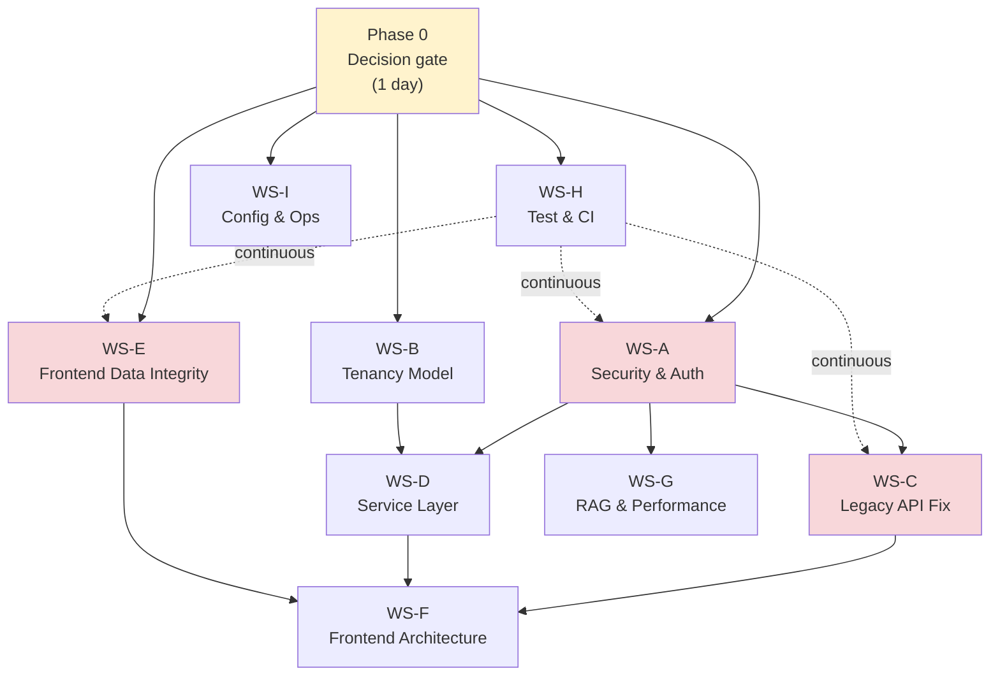

# Remediation Plan

**Date:** 2026-06-09
**Context:** Post-migration security and architecture audit (Phases 0–7 complete per [IMPLEMENTATION-PLAN.md](./IMPLEMENTATION-PLAN.md))
**Related:** [DECISIONS.md](./DECISIONS.md), [ADR-002-auth.md](./ADR-002-auth.md), [ADR-004-job-runner.md](./ADR-004-job-runner.md), [SECRETS-MATRIX.md](./SECRETS-MATRIX.md)

This document turns audit findings into **actionable, parallelizable engineering workstreams**. It does not replace locked migration decisions; it remediates gaps between current code and those decisions.

---

## 1. Overview

### Goals

1. **Close critical security holes** — no unauthenticated AI/RAG/network/jobs/telegram access in production; no plaintext token fallbacks; no broken legacy bypass routes.
2. **Restore data integrity** — PostgreSQL authoritative; frontend reflects server truth; publish/settings/stats/logs behave correctly.
3. **Reduce architectural debt incrementally** — extract service layer, remove legacy surface, improve frontend structure without a rewrite.
4. **Ship with confidence** — tests and startup validation for the remediated paths.

### Principles

- **Minimal blast radius** — prefer targeted fixes over rewrites; reuse existing patterns (`CurrentUser`, `apiWrite`, `AppSetting`, repository cache).
- **Phase 0 gates parallel work** — tenancy depth depends on deployment mode; security hardening starts immediately regardless.
- **Single-operator first** — Mode A (below) is the default path per [DECISIONS.md #1](./DECISIONS.md) and [ADR-002](./ADR-002-auth.md).
- **Behavioral parity preserved** — scrape parsing, publish chunking, summary flows unchanged ([SPIKE-NOTES.md](./SPIKE-NOTES.md)).

### Non-goals

- Full SaaS multi-tenancy UI (unless Mode B chosen).
- Celery/Redis job runner ([ADR-004](./ADR-004-job-runner.md) deferred).
- pgvector/Qdrant migration ([ADR-005](./ADR-005-vector-search.md) deferred unless scale requires it).
- Deleting `TG-Summarizer/` reference tree ([DECISIONS.md #10](./DECISIONS.md)).
- Rewriting all 8 React contexts in one pass.

### Deployment modes (Phase 0 choice)

| | **Mode A — Hardened single-operator** | **Mode B — Optional multi-user** |
|---|--------------------------------------|----------------------------------|
| **Target** | Self-hosted VPS/homelab, one human operator | Shared instance, multiple JWT users |
| **Auth** | Require `API_KEY` in production; `USERS_OPEN_REGISTRATION=false`; JWT for UI | Same + per-user row scoping on all TG tables |
| **Tenancy** | Nullable `user_id` populated for new writes; reads unscoped OK (one user) | All reads/writes filtered by `current_user.id`; composite `AppSetting` PK |
| **Jobs** | Scheduler uses operator's `user_id` / first superuser | Per-user job settings or explicit owner |
| **Complexity** | **S–M** | **L** |
| **When to pick** | Default; matches locked [DECISIONS.md #1](./DECISIONS.md) choice C | Only if operator explicitly needs multiple accounts on one DB |

**Mode A simplification path (recommended):**

- Set `API_KEY`, `TOKEN_ENCRYPTION_KEY`, strong `SECRET_KEY` in production.
- Set `USERS_OPEN_REGISTRATION=false`.
- Document in `deployment.md`: single superuser owns all data; `user_id` columns are forward-compatible metadata.
- Skip WS-B tasks marked **(Mode B only)**.

---

## 2. Workstream map



**Legend:** Solid arrows = hard prerequisite. Dotted = cross-cutting tests run in parallel throughout.

---

## 3. Phase 0: Decision gate (1 day)

| # | Decision | Options | Default | Unblocks |
|---|----------|---------|---------|----------|
| 0.1 | Deployment mode | A (single-operator) / B (multi-user) | **A** | WS-B scope |
| 0.2 | Legacy API strategy | **Remove** `/api/*` after frontend cutover / **Fix+deprecate** 2 sprints / Keep indefinitely | Fix+deprecate | WS-C, WS-F |
| 0.3 | Write-fallback policy | Keep with banner (current) / **Disable in production** / Queue for retry | Keep + improve visibility | WS-E |
| 0.4 | Production auth model | API_KEY required / JWT-only behind reverse proxy / Both | API_KEY + JWT | WS-A |
| 0.5 | RAG scale threshold | Stay Python cosine / Plan pgvector when \>50k embeddings | Stay Python | WS-G timing |

**Deliverable:** Add chosen values to a short `docs/migration/REMEDIATION-DECISIONS.md` (or appendix in this file) and update `.env.example` comments accordingly.

**Exit criteria:** Engineering lead signs off; no open blockers for WS-A and WS-E to start same day.

---

## 4. Parallel workstreams (detailed)

### WS-A: Security & Auth Hardening

| | |
|---|---|
| **Owner/skills** | Backend |
| **Prerequisites** | Phase 0.4 |
| **Complexity** | M |
| **Risks** | Breaking local dev if `API_KEY` required without docs; frontend must send `VITE_API_KEY` |

#### Tasks

- [ ] **Require auth in non-local environments** — `backend/app/middleware/api_key.py`
  - When `ENVIRONMENT != "local"`: reject unauthenticated requests even if `API_KEY` is empty (fail closed).
  - Add `REQUIRE_API_KEY: bool` or derive from `ENVIRONMENT == "production"`.
  - Expand `PUBLIC_PATHS` audit: keep health-check, login; remove or gate `/api/v1/users/signup` when `USERS_OPEN_REGISTRATION=false`.
- [x] **Route-level JWT on sensitive handlers** — add `CurrentUser` to routes that today rely on middleware only:
  - `backend/app/api/routes/ai_routes.py` — all `/ai/*` handlers
  - `backend/app/api/routes/rag.py` — `rag_status`, `rag_embed`, `rag_search` (currently `Depends(get_db)` only)
  - `backend/app/api/routes/network.py` — all `/network/*` handlers
  - `backend/app/api/routes/telegram.py` — `api_scrape`, `api_channel_info`, `api_resolve_start_time` (bot-info/publish already have `CurrentUser`)
  - `backend/app/api/routes/jobs.py` — verify all job trigger/status routes require `CurrentUser`
- [ ] **Production secret guardrails** — `backend/app/core/config.py`
  - Extend `_enforce_non_default_secrets` to validate `TOKEN_ENCRYPTION_KEY` (non-empty, not dev placeholder) in staging/production.
  - Add optional `API_KEY` required check when `ENVIRONMENT == "production"`.
  - Shorten default `ACCESS_TOKEN_EXPIRE_MINUTES` in production docs (config default can stay; document 24h max for prod).
- [ ] **Remove encryption fallbacks** — `backend/app/core/secrets.py`
  - Delete `_LOCAL_DEV_FERNET_KEY` usage outside `ENVIRONMENT == "local"`.
  - Remove plaintext `decrypt_token` fallback; add one-time migration script or admin endpoint to re-encrypt legacy rows (call from `backend/app/api/routes/data.py` bot credential upsert path).
- [ ] **Block raw token on publish/bot-info** — `backend/app/api/routes/telegram.py` `_resolve_bot_token`
  - In non-local: reject `body.token` if `credential_id` absent; return 400 with migration hint.
  - Align with [SECRETS-MATRIX.md](./SECRETS-MATRIX.md).
- [ ] **Sanitize error responses** — `telegram.py`, `ai_routes.py`, `network.py`
  - Replace `detail=str(exc)` / `detail=f"Failed to scrape: {msg}"` with generic client message + server-side `logger.exception`.
- [ ] **Normalize auth status codes** — `backend/app/api/deps.py` `get_current_user`
  - Use 401 for invalid/expired token, 403 for valid token but insufficient privilege (currently mixes 403/401/400 for inactive user).

#### Acceptance criteria

- With `ENVIRONMENT=production`, `API_KEY` unset, and no JWT: all `/api/v1/ai/*`, `/api/v1/rag/*`, `/api/v1/network/*`, `/api/v1/telegram/*`, `/api/v1/jobs/*` return 401.
- `decrypt_token` never returns undecrypted ciphertext in production.
- `POST /api/v1/telegram/publish` with raw `token` field returns 400 in production.
- No stack traces or internal exception strings in JSON error bodies.

#### Tests to add

- `backend/tests/api/test_api_key_middleware.py` — production fail-closed, public paths, JWT bypass.
- `backend/tests/api/test_secrets.py` — extend: no plaintext decrypt fallback; startup validation errors.
- `backend/tests/api/test_telegram_auth.py` — scrape/ai/rag require JWT; raw token rejected in prod.
- `backend/tests/api/test_error_responses.py` — 500 responses do not contain exception class names.

---

### WS-B: Tenancy Model

| | |
|---|---|
| **Owner/skills** | Backend (+ Alembic) |
| **Prerequisites** | Phase 0.1; WS-A started (auth must exist before scoping matters) |
| **Complexity** | **Mode A:** S · **Mode B:** L |
| **Risks** | Mode B migration on existing data; `AppSetting` PK change needs careful Alembic |

#### Mode A tasks (single-operator)

- [ ] **Document single-owner semantics** — `deployment.md`, `backend/README.md`
  - All data belongs to `FIRST_SUPERUSER`; new writes already set `user_id=current_user.id` in `data.py` upsert paths.
- [ ] **Backfill `user_id` on legacy rows** — one-off script `backend/scripts/backfill_user_id.py`
  - Set `user_id` to first superuser for rows where `user_id IS NULL` on `Channel`, `Post`, `Summary`, `BotCredential`, logs.
- [ ] **Scope scheduler to operator** — `backend/app/jobs/auto_sync.py`, `auto_summary.py`, `retention.py`, `translation_batch.py`
  - Replace `select(Channel).where(...)` with filter on superuser's `user_id` (or channels owned by network-setting owner).
  - `retention.py`: delete only posts/logs for that `user_id`.
- [ ] **Global AppSetting ownership** — `backend/app/jobs/settings.py`, `backend/app/services/network_settings.py`
  - On first boot, bind `sync`, `jobs`, `retention`, `translation` settings rows to superuser `user_id`.
  - `load_setting(session, key, defaults, user_id=...)` — Mode A: always load superuser's row.

#### Mode B tasks (multi-user) — skip if Mode A

- [ ] **Composite PK on AppSetting** — `backend/app/models_tg.py`, new Alembic revision
  - Change PK from `key` to `(key, user_id)`; migrate existing rows per owner.
- [ ] **Query scoping helper** — new `backend/app/services/tenancy.py`
  - `scoped_select(model, user_id)`, `assert_owner(row, user_id)`.
- [ ] **Apply scoping to all list/get/mutate in** `backend/app/api/routes/data.py`
  - e.g. `list_channels`: `select(Channel).where(Channel.user_id == current_user.id)` (include NULL legacy rows only for superuser during transition).
- [ ] **Import/export per user** — `data.py` `GET /export`, `POST /import` filter by `current_user.id`.
- [ ] **FK constraints** — Alembic: `user_id` → `user.id` on mutable TG tables (nullable during backfill).

#### Acceptance criteria

- **Mode A:** Scheduler and retention only touch the superuser's channels/posts/logs; backfill script idempotent.
- **Mode B:** User A cannot list/delete User B's channels via API; settings keys isolated per user.

#### Tests to add

- `backend/tests/api/test_tenancy.py` — list isolation (Mode B); scheduler scope (Mode A).
- `backend/tests/services/test_tenancy.py` — scoping helper unit tests.
- Extend `backend/tests/api/test_data.py` — create as user A, assert user B gets empty list (Mode B).

---

### WS-C: Legacy API Removal / Fix

| | |
|---|---|
| **Owner/skills** | Backend + Frontend |
| **Prerequisites** | WS-A (auth on v1 routes); Phase 0.2 |
| **Complexity** | M |
| **Risks** | External scripts still calling `/api/publish`; broken DI if fix is incomplete |

#### Root cause

`backend/app/api/routes/legacy.py` calls `telegram.api_bot_info(body)` and `telegram.api_publish(body)` **without** injecting `SessionDep` / `CurrentUser`. FastAPI DI is bypassed — handlers fail or behave as unauthenticated stubs. Legacy routes also sit **outside** `/api/v1` prefix but are mounted in `backend/app/main.py`.

#### Tasks

- [x] **Immediate fix (Option: Fix+deprecate)** — `legacy.py`
  - Add `session: SessionDep`, `current_user: CurrentUser` to legacy wrappers; pass through to `api_bot_info` / `api_publish`.
  - Apply same pattern to all legacy telegram/network delegates.
  - Add `Deprecation: true` response header or log warning.
- [x] **Frontend cutover** — verify no callers use `/api/*`:
  - `frontend/src/api/tg.ts`, `frontend/src/api/network.ts`, `frontend/src/services/telegram.ts` — all should use `/api/v1/...` via `frontend/src/api/base.ts`.
  - Grep repo for `"/api/publish"`, `"/api/bot-info"`, `"/api/scrape"`.
- [ ] **Remove legacy router** — `backend/app/main.py` — delete `app.include_router(legacy.router)` after cutover + one release cycle.
- [x] **OpenAPI cleanup** — ensure generated client (`frontend/src/client/sdk.gen.ts`) has no legacy paths after regen.

#### Acceptance criteria

- `POST /api/publish` works when called with valid JWT (during deprecation window).
- Zero references to bare `/api/` paths in `frontend/src/` (except comments).
- After removal, `/api/publish` returns 404.

#### Tests to add

- `backend/tests/api/test_legacy.py` — bot-info and publish with JWT; assert deprecation header.
- Update `backend/tests/api/test_resolve_start_time.py` (already has legacy alias test) — add auth requirement test post-WS-A.

---

### WS-D: Service Layer Extraction

| | |
|---|---|
| **Owner/skills** | Backend |
| **Prerequisites** | WS-A begun; WS-B for tenancy helpers (Mode B only) |
| **Complexity** | L |
| **Risks** | Large diff; mitigate by extracting one domain at a time |

#### Problem

Inverted layering: `backend/app/jobs/retention.py` imports `_touch_sync` from `backend/app/api/routes/data.py`. Jobs and services should not depend on route modules.

#### Tasks

- [x] **Create sync meta service** — `backend/app/services/sync_meta.py`
  - Move `_touch_sync`, etag helpers from `data.py`.
  - Update `data.py`, `retention.py`, import paths in jobs to use service.
- [x] **Create data service modules** (extract from `data.py` without changing API contracts):
  - `backend/app/services/channels.py` — list, upsert, stats (`_compute_channel_stats`)
  - `backend/app/services/posts.py` — list, bulk upsert
  - `backend/app/services/summaries.py`
  - `backend/app/services/logs.py` — publish/sync/llm/embedding/network logs
  - `backend/app/services/settings_store.py` — merge `jobs/settings.py` + `data.py` settings routes logic
- [x] **Thin route handlers** — `data.py` routes become: auth → service call → camelCase response.
- [ ] **Job modules call services only** — `auto_sync.py`, `retention.py`, `auto_summary.py`, `translation_batch.py`.
- [ ] **Batch channel stats** — `backend/app/services/channels.py`
  - Add `get_channel_stats_batch(session, channel_names)` to fix N+1 in frontend (`DataContext.loadChannels` loops per channel).

#### Acceptance criteria

- No `from app.api.routes` imports in `backend/app/jobs/` or `backend/app/services/`.
- `data.py` line count reduced; business logic lives in `services/`.
- New endpoint or extended `GET /channels?include_stats=true` returns stats in one round-trip.

#### Tests to add

- Move relevant assertions from `backend/tests/api/test_data.py` to `backend/tests/services/test_channels.py`, etc.
- `backend/tests/services/test_sync_meta.py`.

---

### WS-E: Frontend Data Integrity

| | |
|---|---|
| **Owner/skills** | Frontend (+ small backend for stats endpoint) |
| **Prerequisites** | Phase 0.3; WS-C for publish path stable |
| **Complexity** | M |
| **Risks** | Settings migration may overwrite user prefs if merge order wrong |

#### Tasks

- [ ] **Fix publish success bug** — `frontend/src/services/telegram.ts` `publishSummary`
  - Return `success: data.success ?? true` only after validating `data.results`; if API returns error shape, propagate `success: false`.
  - Check Telegram `ok` field in each result chunk; surface first error message.
  - Update callers: `frontend/src/contexts/AIContext.tsx`, `frontend/src/components/SummaryView.tsx`, `frontend/src/components/BotManagement.tsx`.
- [ ] **Server-backed settings hydration** — `frontend/src/contexts/SettingsContext.tsx`
  - On login, fetch all `AppSetting` keys via `api.getSetting(key)` / new batch endpoint: `sync`, `retention`, `translation`, `jobs`, `ai` (add keys as needed).
  - Server wins on conflict; write merged snapshot back once (mirror network hydration pattern lines 334–374).
  - Stop persisting server-owned keys to `localStorage` (keep only UI prefs: theme, tab state if needed).
  - Map keys to existing setters: `autoSyncEnabled`, `postRetentionDays`, `embeddingsEnabled`, etc.
- [ ] **Backend settings keys** — `backend/app/api/routes/data.py`
  - Ensure `GET/PUT /settings/{key}` used for `sync`, `retention`, `translation`, `jobs`; document key schema in `backend/README.md`.
- [ ] **DB stats from server** — `frontend/src/lib/repository.ts` `getDBStats`
  - Add `GET /api/v1/data/stats` in `data.py` returning counts per table (scoped by user in Mode B).
  - Repository: API-first, cache fallback for offline.
- [ ] **Log delete via API** — `repository.ts` `deleteOldLogs`, `clearNetworkLogs`, etc.
  - Add `DELETE /api/v1/data/logs?older_than_days=` or per-type delete routes in `data.py`.
  - Wire `frontend/src/components/DatabaseManagement.tsx` to repository API paths.
- [ ] **Write-fallback visibility** — `frontend/src/components/TgProviders.tsx`, `repository.ts`
  - Per Phase 0.3: if "disable in production", gate `apiWrite` cache fallback on `import.meta.env.PROD`.
  - Ensure toast always fires (expand `SILENT_FALLBACK_RESOURCES` audit).
- [ ] **Lazy data load** — `frontend/src/contexts/DataContext.tsx`
  - Remove mount `useEffect` that loads all 8 resources (lines 197–207).
  - Load on tab visibility: channels+bots on app init; logs/stats only when History/Settings tab opened (`App.tsx` / route hooks).

#### Acceptance criteria

- Failed Telegram publish shows error in UI; no false `success: true`.
- After login on fresh browser, auto-sync interval matches Postgres `AppSetting` `sync`, not stale localStorage.
- Database Management stats match Postgres counts (± cache lag).
- Log purge deletes server rows, not IndexedDB only.
- Initial page load does not fetch all log types.

#### Tests to add

- `frontend/src/services/telegram.test.ts` — publish failure/success mapping.
- `frontend/src/contexts/SettingsContext.test.tsx` — hydration merge order.
- Backend: `backend/tests/api/test_data.py` — `GET /stats`, log delete routes.

---

### WS-F: Frontend Architecture

| | |
|---|---|
| **Owner/skills** | Frontend |
| **Prerequisites** | WS-E (data layer stable); WS-C (single API surface) |
| **Complexity** | L |
| **Risks** | Context split can break provider order; do incrementally |

#### Tasks

- [ ] **Flatten provider tree** — `frontend/src/components/TgProviders.tsx`
  - Phase 1: Extract `useSettings` consumers into route-level providers where possible.
  - Phase 2: Merge `UIContext` into TanStack Router search params or local state.
  - Target: ≤4 providers (Settings, Data, Scraper+AI bundle, Translation).
- [ ] **URL-based tabs** — `frontend/src/App.tsx`, `frontend/src/routes/_tg/summarizer.tsx`
  - Replace `activeTab` useState with router search param `?tab=summary` or sub-routes (`/summarizer/summary`, etc.).
- [ ] **React Query for server state** — extend `frontend/src/main.tsx` `QueryClientProvider`
  - Add hooks: `frontend/src/hooks/useChannels.ts`, `useSummaries.ts`, `useLogs.ts` with staleTime/refetchOnWindowFocus.
  - Migrate `DataContext` loaders to queries; keep context as thin selector layer initially.
- [ ] **Unify API clients** — per [ADR-006](./ADR-006-api-client.md)
  - Deprecate `frontend/src/client/` generated SDK for TG routes; use `frontend/src/api/` only.
  - Admin/template routes (`users`, `login`) may keep generated client temporarily — document split in `frontend/README.md`.
- [ ] **Deduplicate sync/proxy logic**
  - Single module: `frontend/src/lib/syncSettings.ts` — consumed by `ScraperContext.tsx`, `SettingsContext.tsx`.
  - Proxy/tor flags: read from server settings only post-WS-E.
- [ ] **Fix filter churn** — `frontend/src/contexts/ScraperContext.tsx`
  - Narrow `handleFilterPosts` deps; remove `useEffect(() => { handleFilterPosts(); }, [handleFilterPosts])` full re-run on every dep change.
  - Debounce semantic search filter updates.
- [ ] **Single theme system** — pick one:
  - **Option A:** Remove `SettingsContext` theme; use `frontend/src/components/theme-provider.tsx` only.
  - **Option B:** Remove `ThemeProvider` from `main.tsx`; delegate to SettingsContext.
  - Sync `storageKey` / `localStorage` key to one name.

#### Acceptance criteria

- Tab deep-link works (`/summarizer?tab=settings` opens Settings).
- No imports from `frontend/src/client/sdk.gen.ts` in summarizer features.
- `handleFilterPosts` not invoked more than once per user filter change (verify via dev-only counter or test).
- One theme toggle affects entire app.

#### Tests to add

- `frontend/src/hooks/useChannels.test.ts` — query key and stale behavior.
- Router test for tab search param (if test harness exists).

---

### WS-G: RAG & Performance

| | |
|---|---|
| **Owner/skills** | Backend (+ optional frontend) |
| **Prerequisites** | WS-A (auth on RAG); WS-B (scoped embeddings in Mode B) |
| **Complexity** | M (Python cosine) · L (pgvector) |
| **Risks** | pgvector adds ops burden; Python scan OK until ~50k vectors per ADR-005 |

#### Tasks (near term)

- [ ] **Auth on RAG** — covered in WS-A (`rag.py`).
- [ ] **Scope embedding search** — `backend/app/api/routes/rag.py` `rag_search`
  - Filter `PostEmbedding` by user's channel names or `user_id` column.
  - Limit max rows scanned (`limit` param, default 5000).
- [ ] **Embedding backfill job scope** — `backend/app/services/embeddings.py` `backfill_embeddings`
  - Filter posts by operator's channels (same as WS-B scheduler scope).
- [ ] **Frontend RAG context** — `frontend/src/contexts/RAGContext.tsx`
  - Ensure all embed/search calls go through `frontend/src/api/rag.ts` (server-only); remove any local cosine fallback if present.

#### Tasks (deferred — when Phase 0.5 triggers)

- [ ] Enable pgvector per [ADR-005](./ADR-005-vector-search.md): Alembic extension, `vector` column, SQL `<=>` query.
- [ ] Benchmark script `backend/scripts/bench_rag_search.py`.

#### Acceptance criteria

- RAG search returns only posts from operator's channels.
- Search latency p95 \< 2s at 20k embeddings (Python path) or \< 500ms with pgvector.

#### Tests to add

- Extend `backend/tests/api/test_rag.py` — scoping, limit param, auth required.

---

### WS-H: Test & CI Hardening

| | |
|---|---|
| **Owner/skills** | Fullstack / DevOps |
| **Prerequisites** | Phase 0; runs continuously alongside other WS |
| **Complexity** | M |
| **Risks** | Flaky integration tests if external APIs not mocked |

#### Tasks

- [x] **Security regression suite** — new marker `@pytest.mark.security` for WS-A tests.
- [ ] **Frontend unit tests in CI** — ensure `npm test` runs in GitHub Actions for `frontend/src/services/`, `contexts/`.
- [ ] **Coverage thresholds** — prioritize:
  - `backend/app/middleware/api_key.py`
  - `backend/app/core/secrets.py`
  - `backend/app/api/routes/telegram.py`
  - `frontend/src/services/telegram.ts`
  - `frontend/src/lib/repository.ts`
- [ ] **Smoke test production config** — `backend/tests/scripts/test_backend_pre_start.py`
  - Assert startup fails when `ENVIRONMENT=production` and secrets missing.
- [ ] **E2E publish path** — mock Telegram HTTP; assert publish failure surfaces correctly (ties WS-E + WS-C).

#### Acceptance criteria

- CI fails on security regressions (unauthenticated AI route).
- Coverage on critical files \> 70% lines.

#### Tests to add

- As listed in WS-A, WS-C, WS-E; plus CI workflow edits.

---

### WS-I: Config & Ops

| | |
|---|---|
| **Owner/skills** | Backend / DevOps |
| **Prerequisites** | Phase 0; parallel with WS-A |
| **Complexity** | S |
| **Risks** | Operators miss new required env vars without clear startup error |

#### Tasks

- [x] **Startup validation module** — `backend/app/core/startup_checks.py`
  - Called from `backend/app/main.py` lifespan before scheduler start.
  - Validate: secrets, `API_KEY` in prod, `TOKEN_ENCRYPTION_KEY`, `USERS_OPEN_REGISTRATION` warning.
- [ ] **Update `.env.example`** — document Mode A production block:
  ```env
  ENVIRONMENT=production
  API_KEY=<generate>
  TOKEN_ENCRYPTION_KEY=<fernet key>
  USERS_OPEN_REGISTRATION=false
  SECRET_KEY=<strong random>
  ```
- [ ] **Update `deployment.md`** — production checklist, single-operator semantics, reverse-proxy auth option ([ADR-002](./ADR-002-auth.md)).
- [ ] **Scheduler multi-instance guard** — `backend/app/jobs/scheduler.py`
  - Log prominent warning if `SCHEDULER_ENABLED` and multiple replicas detected (env `INSTANCE_ID` optional).
  - Document single-replica requirement in [ADR-004](./ADR-004-job-runner.md).
- [ ] **Distributed lock (optional)** — if multi-replica ever needed: Postgres advisory lock in `_run_guarded` before job execution.

#### Acceptance criteria

- Backend refuses to start in production with `changethis` secrets or missing `TOKEN_ENCRYPTION_KEY`.
- `deployment.md` lists all required env vars with generation commands.

#### Tests to add

- `backend/tests/core/test_startup_checks.py`.

---

## 5. Dependency matrix

| Workstream | Parallel with | Must wait for | Blocks |
|------------|---------------|---------------|--------|
| **WS-A** Security | WS-I, WS-H, WS-E (partial) | Phase 0.4 | WS-C, WS-G, WS-B (auth) |
| **WS-B** Tenancy | WS-A (after day 1) | Phase 0.1 | WS-D (Mode B), WS-G scoping |
| **WS-C** Legacy | WS-H | WS-A | WS-F (API unification) |
| **WS-D** Service layer | WS-H | WS-A; WS-B for Mode B | WS-F (optional) |
| **WS-E** FE integrity | WS-H, WS-A | Phase 0.3 | WS-F |
| **WS-F** FE architecture | WS-H | WS-E, WS-C | — |
| **WS-G** RAG/Perf | WS-H | WS-A; WS-B for scoping | — |
| **WS-H** Tests | All | Phase 0 | — |
| **WS-I** Config/Ops | WS-A | Phase 0 | — |

**Maximum parallelization (after Phase 0):** WS-A + WS-I + WS-H + WS-E + WS-B (Mode A subset) can all start Day 1.

---

## 6. Suggested sprint allocation

Assuming ~2-week sprints, 1–2 engineers per stream.

### Sprint 1 — Stop the bleeding (parallel)

| Stream | Focus |
|--------|-------|
| WS-A | Fail-closed middleware, route JWT on ai/rag/network/scrape, secret validation, error sanitization |
| WS-I | Startup checks, `.env.example`, `deployment.md` |
| WS-E | `publishSummary` fix, lazy DataContext load, write-fallback audit |
| WS-C | Fix legacy DI pass-through + deprecation headers |
| WS-H | Security tests, CI wiring |
| WS-B (Mode A) | Backfill script, scheduler/retention scope to superuser |

### Sprint 2 — Data truth & structure (parallel)

| Stream | Focus |
|--------|-------|
| WS-E | Settings server hydration, `/stats`, log delete API |
| WS-D | Extract `sync_meta`, `channels`, `logs` services; batch stats endpoint |
| WS-B | Complete Mode A scoping; start Mode B only if chosen |
| WS-C | Remove legacy router after frontend verification |
| WS-G | RAG auth + channel scoping + scan limits |
| WS-F | URL tabs, React Query for channels/summaries |

### Sprint 3 — Architecture & hardening (parallel)

| Stream | Focus |
|--------|-------|
| WS-F | Context flattening, deprecate `frontend/src/client/` for TG, theme unification |
| WS-D | Remaining service extractions; jobs use services only |
| WS-H | E2E publish test, coverage thresholds |
| WS-G | pgvector spike only if embedding count warrants |
| WS-I | Scheduler advisory lock doc/spike |

---

## 7. Quick wins (< 2 hours each)

Do these immediately; no Phase 0 blocker.

| # | Task | File(s) | Impact |
|---|------|---------|--------|
| QW-1 | Fix `publishSummary` always `success: true` | `frontend/src/services/telegram.ts:73-74` | Critical UX/security signal |
| QW-2 | Add `CurrentUser` to `ai_routes.py` handlers | `backend/app/api/routes/ai_routes.py` | Closes unauthenticated AI when middleware bypassed |
| QW-3 | Pass `session`, `current_user` in legacy bot-info/publish | `backend/app/api/routes/legacy.py:54-63` | Fixes broken legacy routes |
| QW-4 | Reject raw `body.token` in production | `backend/app/api/routes/telegram.py` `_resolve_bot_token` | Stops token-in-body publish |
| QW-5 | Set `USERS_OPEN_REGISTRATION=false` in prod `.env.example` comment | `.env.example:24-25` | Reduces attack surface |
| QW-6 | Remove mount eager load of logs | `frontend/src/contexts/DataContext.tsx:197-207` | Performance |
| QW-7 | Log warning when `API_KEY` empty in staging/production | `backend/app/middleware/api_key.py` | Ops visibility |
| QW-8 | Add `DELETE` handler docs to OpenAPI for log tables | `backend/app/api/routes/data.py` | Unblocks WS-E |
| QW-9 | Unify auth error to 401 for bad JWT | `backend/app/api/deps.py:37-39` | Consistency |
| QW-10 | Document single-replica scheduler in README | `backend/README.md`, `ADR-004` | Ops expectation setting |

---

## 8. Definition of Done

Remediation is **complete** when all items below pass.

### Security

- [ ] Production startup fails without `API_KEY`, `TOKEN_ENCRYPTION_KEY`, and strong `SECRET_KEY`.
- [ ] No TG Summarizer route (AI, RAG, network, telegram, jobs, data) accessible without JWT or valid `X-API-Key` in production.
- [ ] Legacy `/api/*` router removed or returns 410 Gone.
- [ ] Raw bot tokens rejected on publish/bot-info in non-local environments.
- [ ] Error responses never leak stack traces or raw exception strings.

### Data integrity

- [ ] Publish success/failure accurately reflected in UI and `PublishLog` rows.
- [ ] Settings (`sync`, `retention`, `translation`, `jobs`, `network`) hydrate from Postgres on login; server is source of truth.
- [ ] DB stats and log deletion operate on Postgres (cache updated secondarily).
- [ ] Write-fallback policy matches Phase 0.3 decision and is user-visible.

### Tenancy (Mode A minimum)

- [ ] Scheduler, retention, and RAG backfill scoped to operator's data.
- [ ] Legacy NULL `user_id` rows backfilled.

### Tenancy (Mode B — if chosen)

- [ ] All `data.py` list endpoints scoped by `current_user.id`.
- [ ] `AppSetting` composite PK deployed; per-user settings isolated.

### Architecture

- [ ] No imports from `app.api.routes` in jobs/services.
- [ ] Frontend summarizer uses `frontend/src/api/` only (no TG calls via generated SDK).
- [ ] Tab state URL-addressable.

### Quality

- [ ] Security test suite green in CI.
- [ ] Critical file coverage thresholds met (WS-H).
- [ ] `deployment.md` and `.env.example` updated for production Mode A.

---

## Appendix: Audit finding → workstream map

| Audit item | Primary WS | Quick win |
|------------|------------|-----------|
| Optional API_KEY leaves routes open | WS-A | QW-7 |
| No tenant scoping in data/jobs/retention | WS-B | — |
| Global AppSetting | WS-B | — |
| Weak SECRET_KEY/TOKEN_ENCRYPTION_KEY guardrails | WS-A, WS-I | QW-5 |
| Legacy routes bypass DI | WS-C | QW-3 |
| Encryption fallbacks | WS-A | — |
| Unauthenticated legacy publish + raw token | WS-A, WS-C | QW-3, QW-4 |
| publishSummary always success | WS-E | QW-1 |
| Settings split-brain | WS-E | — |
| DB stats/log deletes IndexedDB-only | WS-E | — |
| Eager full data load | WS-E | QW-6 |
| Write-fallback forks data | WS-E | — |
| Inverted layering (jobs → data.py) | WS-D | — |
| Single-instance scheduler | WS-I | QW-10 |
| RAG full-table Python cosine | WS-G | — |
| Dual API surface | WS-C | — |
| Sync job all channels | WS-B | — |
| 8 nested god-contexts | WS-F | — |
| Duplicated sync/filter/proxy | WS-F | — |
| Dual API client stacks | WS-F | — |
| Hybrid repository half-migrated | WS-E, WS-F | — |
| No React Query | WS-F | — |
| handleFilterPosts on every dep | WS-F | — |
| App.tsx tab router | WS-F | — |
| Two theme systems | WS-F | — |
| Error handling leaks internals | WS-A | — |
| Auth status code inconsistency | WS-A | QW-9 |
| DB modeling (nullable user_id, no FK) | WS-B | — |
| N+1 channel stats | WS-D | — |
| Thin test coverage | WS-H | — |
| Config defaults | WS-I | QW-5 |
| Legacy artifacts | WS-C, WS-F | — |

---

---

## Appendix B: Sprint 2 implementation log (2026-06-09)

| Workstream | Completed | Deferred |
|------------|-----------|----------|
| **WS-E** | Settings hydration (sync/retention/translation); `GET /data/stats`; `DELETE /data/logs`; repository API-first stats/log deletes; write-fallback toast for all resources | `jobs`/`ai` AppSetting hydration; `embeddingsEnabled` still UI-localStorage; frontend SettingsContext unit test |
| **WS-B (Mode A)** | `backfill_user_id.py`; scheduler scoping (auto_sync, retention, auto_summary, translation_batch); jobs sync channel resolution; AppSetting `user_id` on save | `deployment.md` single-owner doc (Sprint 1 carryover); run backfill in prod manually |
| **WS-D** | `sync_meta`, `channels`, `posts`, `logs`, `stats`, `serialization` services; jobs/services no longer import `app.api.routes` | Full `data.py` thin-handler refactor; `summaries`/`settings_store` modules; batch channel stats endpoint |
| **WS-C** | Legacy DI fixed (Sprint 1); production 410 middleware + conditional router mount; `test_legacy.py` updated | Full legacy router removal in all environments (dev still serves deprecated routes) |
| **WS-H** | `test_stats_logs.py`, `test_tenancy.py`, settings round-trip test; 123 backend tests green; vitest repository/telegram pass | `npm test` (Playwright/bunx) unavailable in CI shell; frontend SettingsContext test |

*Document version: 1.2 — 2026-06-09*

---

## Appendix C: Sprint 3 implementation log (2026-06-09)

| Workstream | Completed | Deferred |
|------------|-----------|----------|
| **WS-F** | React Query hooks (`useChannels`, `useSummaries`, `useLogs`); DataContext migrated to queries; URL tab search params (`/summarizer?tab=`); debounced `handleFilterPosts`; `syncSettings.ts` proxy helper (ScraperContext, AIContext); theme via `theme-provider`; lazy log/stats prefetch; dead App.tsx imports removed; auth handler shared via `@/api/base` | Full provider flattening (≤4 providers); deprecate `@/client` for admin routes; migrate ChannelGrid/SummaryView/BotManagement to `syncSettings`; remove `constants.ts` SYSTEM_PROMPT/CHAT_PROMPT (backend prompts authoritative); SettingsHub settings sub-tab URL params |
| **WS-G** | RAG search scoped to operator channels + SQL filter before cosine; `scanLimit` cap (5000); embedding backfill scoped to operator; RAGContext surfaces search errors; batch channel stats via `GET /channels?includeStats=true` | pgvector migration; embedding status counts still global (not operator-scoped) |
| **WS-D** | `compute_channel_stats_batch`; `includeStats` on list channels | Remaining `data.py` thin-handler refactor; `summaries`/`settings_store` service modules |
| **WS-H** | `test_rag.py` operator-scoping test; `useChannels.test.ts`, `syncSettings.test.ts`; scheduler/tenancy test isolation fixes; **124** backend tests green; **9** vitest tests green | Playwright `npm test` in CI; React Query integration test with MSW |

---

## Appendix D: Optional polish log (2026-06-09)

Mode A locked. Deferred items from Sprints 1–3 appendices B/C addressed where feasible.

| Workstream | Completed (polish) | Still deferred |
|------------|-------------------|------------------|
| **WS-F** | `syncSettings` adopted in ChannelGrid, SummaryView, BotManagement; removed unused `SYSTEM_PROMPT`/`CHAT_PROMPT` from `constants.ts`; deleted deprecated `frontend/src/lib/db.ts` re-export; SettingsHub `section` URL param (`?tab=settings&section=`); `settingsSection.ts` + `useSettingsSection` hook | Full provider flattening (≤4 providers); deprecate `@/client` for admin routes |
| **WS-G** | Operator-scoped embedding status on `GET /rag/status` | pgvector migration |
| **WS-D** | `services/summaries.py`, `services/settings_store.py`; data.py handlers delegate to services | Remaining large `data.py` extractions (bots, import/export) |
| **WS-H** | `settingsSection.test.ts`; Playwright settings tab + section URL flow in `summarizer.spec.ts`; operator-scoped status test in `test_rag.py` | Playwright in CI shell; React Query + MSW integration test |
| **WS-E** | — | `jobs`/`ai` AppSetting hydration; `embeddingsEnabled` UI-localStorage; SettingsContext unit test |

*Document version: 1.3 — 2026-06-09*
